# 线程

## 线程概念

典型的UNIX进程可以看成只有一个控制线程：**一个进程在同一时刻只做一件事情。有了多个控制线程（或简称为线程）以后，在程序设计时可以把进程设计成在同一时刻能够做不止一件事，每个线程处理各自独立的任务。**这种方法有很多好处：

- 通过为每种事件类型的处理分配单独的线程，能够简化处理异步事件的代码。每个线程在进行事件处理时可以采用同步编程模式，同步编程模式要比异步编程模式简单得多。
- 多个进程必须使用操作系统提供的复杂机制才能实现实现内存和文件描述符的共享，而多个线程自动地可以访问相同的存储地址空间和文件描述符。
- 有些问题可以通过将其分解从而改善整个程序的吞吐量。在只有一个控制线程的情况下，单个进程需要完成多个任务时，实际上需要把这些任务串行化；有了多个控制线程，相互独立的任务的处理就可以交叉进行，只需要为每个任务分配一个单独的线程，当然只有在处理过程互不依赖的情况下，两个任务的执行才可以穿插进行。
- 交互的程序同样可以通过使用多线程实现响应时间的改善，多线程可以把程序中处理用户输入输出的部分与其他部分分开。

有些人把多线程的程序设计与多处理器系统联系起来，但是即使程序运行在单处理器上，也能得到多线程编程模型的好处。处理器的数量并不影响程序结构，所以不管处理器的个数是多少，程序都可以通过使用线程得以简化。而且，即使多线程程序在串行化任务时不得不阻塞，由于某些线程在阻塞的时候还有另外一些线程可以运行，所以多线程程序在单处理器上运行仍然能够改善响应时间和吞吐量。

线程包含了表示进程内执行环境必需的信息，其中包括进程中标识线程的线程ID、一组寄存器值、栈、调度优先级和策略、信号屏蔽字、`errno`变量以及线程私有数据。**进程的所有信息对该进程的所有线程都是共享的**，包括可执行的程序文本、程序的全局内存和堆内存、栈以及文件描述符。

我们将要讨论的线程接口来自POSIX.1-2001。**线程接口（也称为“pthread”或“POSIX线程”）**在POSIX.1-2001中是一个可选特征。**POSIX线程的特征测试宏是_POSIX_THREADS**，应用程序可以把这个宏用于#ifdef测试，以在编译时确定是否支持线程；也可以把_SC_THREADS常数用于调用`sysconf`函数，从而在运行时确定是否支持线程。

进程和线程原语的比较：

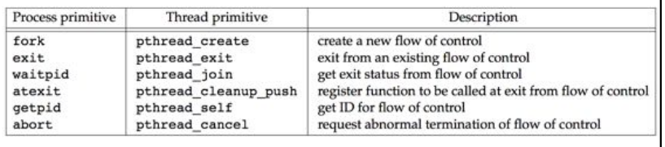

## 线程标识

就像每个进程有一个进程ID一样，**每个线程也有一个线程ID**。进程ID在整个系统中是唯一的，但线程ID不同，**线程ID只在它所属的进程环境中有效**。

进程ID，用pid_t数据类型来表示，是一个非负整数。**线程ID则用pthread_t数据类型来表示**，实现的时候可以用一个结构来代表pthread_t数据类型，所以可移植的操作系统实现不能把它作为整数处理。因此必须使用函数来对两个线程ID进行比较。

```c
#include <pthread.h>
int pthread_equal( pthread_t tid1, pthread_t tid2 );
// 返回值：若相等则返回非0值，否则返回0
```

Linux 2.4.22使用无符号长整型表示pthread_t数据类型。Solaris 9把pthread_t数据类型表示为无符号整数。FreeBSD 5.2.1和Mac OS X10.3用一个指向pthread结构的指针来表示pthread_t数据类型。

用结果表示pthread_t数据类型的后果是不能用一种可移植的方式打印该数据类型的值。

**线程可以通过调用pthread_self函数获得自身的线程ID。**

```c
#include <pthread.h>
pthread_t pthread_self(void);
// 返回值：调用线程的线程ID
```

## 线程创建

在传统的UNIX进程模型中，每个进程只有一个控制线程。从概念上讲，这与基于线程的模型中只包含一个线程是相同的。在POSIX线程（pthread）的情况下，程序开始运行时，它也是以单进程中的单个控制线程启动的，在创建多个控制线程以前，程序的行为与传统的进程并没有什么区别。**新增的线程可以通过调用pthread_create函数创建**。

```c
#include <pthread.h>
int pthread_create(pthread_t *restrict tidp,
                  const pthread_attr_t *restrict attr,
                  void *(*start_rtn)(void *), void *restrict arg);
// 返回值：若成功则返回0，否则返回错误编号
```

**当pthread_create成功返回时，由tidp指向的内存单元被设置为新创建的线程的线程ID**。**attr参数用于定制各种不同的线程属性**。线程属性在以后介绍，眼下暂时把它设置为NULL，创建默认属性的线程。

**新创建的线程从start_rtn函数的地址开始运行**，**该函数只有一个无类型指针参数arg，如果需要向start_rtn函数传递的参数不止一个，那么需要把这些参数放到一个结构中，然后把这个结构的地址作为arg参数传入**。

线程创建时并不能保证哪个线程会先运行：是新创建的线程还是调用线程。新创建的线程可以访问进程的地址空间，并且继承调用线程的浮点环境和信号屏蔽字，但是该线程的未决信号集被清除。

注意`pthread`函数在调用失败时通常会返回错误码，它们并不像其他的POSIX函数一样设置`errno`。每个线程都提供`errno`的副本，这只是为了与使用`errno`的现有函数兼容。在线程中，从函数中返回错误码更为清晰整洁，不需要依赖那些随着函数执行不断变化的全局状态，因而可以把错误的范围限制在引起出错的函数中。

**实例**

虽然没有可移植的方法打印线程ID，但是可以写一个小的测试程序来完成这个任务，以便更深入地了解线程是如何工作的。程序清单11-1中创建了一个线程并且打印进程ID、新线程的线程ID以及初始线程的线程ID。

**程序清单11-1 打印线程ID**

```c
#include "apue.h"
#include <pthread.h>

pthread_t ntid;

void 
printids(const char *s)
{
    pid_t        pid;
    pthread_t    tid;

    pid = getpid();
    tid = pthread_self();
    printf("%s pid %u tid %u (0x%x) \n", s, (unsigned int)pid,
        (unsigned int)tid, (unsigned int)tid);
}

void *
thr_fn(void *arg)
{
    printids("new thread : ");
    return((void *)0);
}

int
main(void)
{
    int    err;    
    
    err = pthread_create(&ntid, NULL, thr_fn, NULL);
    if(err != 0)
        err_quit("can't create thread: %s\n", strerror(err));
    printids("main thread: ");
    sleep(1);
    exit(0);
}
```

pthread 库不是 Linux 系统默认的库，连接时需要使用静态库 libpthread.a，所以在使用pthread_create()创建线程，以及调用 pthread_atfork()函数建立fork处理程序时，需要链接该库。 在编译中要加 -lpthread参数

结果：

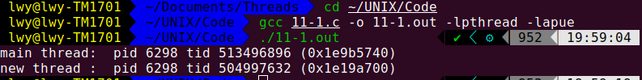

现在我们言归正传，从程序清单11-1运行结果来看，两个线程的进程ID相同，但线程ID不同。不过这不是绝对的，依赖于具体的实现。

这个实例有两个需要注意的地方：

（1）**需要处理主线程和新线程之间的竞争**。首先是主线程需要休眠，如果主线程不休眠，它就可能退出，这样在新线程有机会运行之前整个进程可能就已经终止了。这种行为特征依赖于操作系统中的线程实现和调度算法。

（2）**新线程是通过调用pthread_self函数获取自己的线程ID**，而不是从共享内存中读出或者从线程的启动例程中以参数的形式接收到。回忆pthread_create函数，它会通过第一个参数（tidp）返回新建线程的线程ID。**在本例中，主线程把新线程ID存放在ntid中，但是新建的线程并不能安全地使用它，如果新线程在主线程调用pthread_create返回之前就运行了，那么新线程看到的是未经初始化的ntid的内容**，这个内容并不是正确的线程ID。

## 线程终止

如果进程中的任一线程调用了`exit`、`_Exit`或者`_exit`，那么整个进程就会终止。与此类似，如果信号的默认动作是终止进程，那么，把该信号发送到线程会终止整个进程。

单个线程可以通过下列三种方式退出，在不终止整个进程的情况下停止它的控制流。

（1）线程只是从启动例程中返回，返回值是线程的退出码。

（2）线程可以被同一进程中的其他线程取消(`int pthread_cancel(pthread_t tid)`)。

（3）线程调用`pthread_exit`。

```c
#include <pthread.h>
void pthread_exit(void *rval_ptr);
```

`rval_ptr`是一个无类型指针，与传给启动例程的单个参数类似。进程中的其他线程可以通过调用`pthread_join`函数访问到这个指针。

```c
#include <pthread.h>
int pthread_join(pthread_t thread, void **rval_ptr);
// 返回值：若成功则返回0，否则返回错误编号
```

调用线程将一直阻塞，直到指定的线程调用`pthread_exit`、从启动例程中返回或者被取消。如果线程只是从它的启动例程返回，`rval_ptr`将包含返回码。如果线程被取消，由`rval_ptr`指定的内存单元就置为`PTHREAD_CANCELED`。

可以通过调用`pthread_join`自动把线程置于分离状态，这样资源就可以恢复。如果线程已经处于分离状态，`pthread_join`调用就会失败，返回`EINVAL`。

如果对线程的返回值并不感兴趣，可以把`rval_ptr`置为NULL。在这种情况下，调用`pthread_join`函数将等待指定的线程终止，但并不获取线程的终止状态。

**实例**

程序清单11-2说明了如何获取已终止的线程的退出码。

**程序清单11-2 获得线程退出状态**

```c
#include "apue.h"
#include <pthread.h>

void *
thr_fn1(void *arg)
{
    printf("thread 1 returning\n");
    return((void *)1);
}

void *
thr_fn2(void *arg)
{
    printf("thread 2 exiting\n");
    pthread_exit((void *)2);
}

int 
main(void)
{
    int         err;
    pthread_t    tid1, tid2;
    void        *tret;

    err = pthread_create(&tid1, NULL, thr_fn1, NULL);
    if(err != 0)
        err_quit("can't create thread 1: %s\n", strerror(err));
    err = pthread_create(&tid2, NULL, thr_fn2, NULL);
    if(err != 0)
        err_quit("can't create thread 2: %s\n", strerror(err));
    err = pthread_join(tid1, &tret); //获得线程1的退出状态
    if(err != 0)
        err_quit("can't join with thread 1: %s\n", strerror(err));
    printf("thread 1 exit code %d\n", (int)tret);
    err = pthread_join(tid2, &tret); // 获得线程2的退出状态
    if(err != 0)
        err_quit("can't join with thread 2: %s\n", strerror(err));
    printf("thread 2 exit code %d\n", (int)tret);
    exit(0);
}
```

结果：

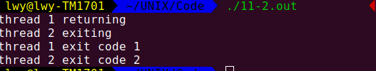

可以看出，当一个线程通过调用pthread_exit退出或者简单地从启动例程中返回时，**进程中的其他线程可以通过调用pthread_join函数获得该线程的退出状态**。

pthread_create和pthread_exit函数的无类型指针参数能传递的数值可以不止一个，该指针可以传递包含更复杂信息的结构的地址，但是注意这个结构所使用的内存在调用者完成调用以后必须仍然是有效的，否则就会出现无效或非法内存访问。

**实例**

程序清单11-3中的程序给出了用自动变量（分配在栈上）作为pthread_exit的参数时出现的问题。

```c
#include "apue.h"
#include <pthread.h>

struct foo {
    int a, b, c, d;
};

void 
printfoo(const char *s, const struct foo *fp)
{
    printf(s);
    printf("   structure at 0x%x\n", (unsigned)fp);
    printf("   foo.a = %d\n", fp->a);
    printf("   foo.b = %d\n", fp->b);
    printf("   foo.c = %d\n", fp->c);
    printf("   foo.d = %d\n", fp->d);
}

void *
thr_fn1(void *arg)
{
    struct foo foo = {1, 2, 3, 4};

    printfoo("thread 1:\n", &foo);
    pthread_exit((void *)&foo);
    printfoo("thread 1:\n", &foo);
}

void *
thr_fn2(void *arg)
{
    printf("thread 2: ID is %d\n", pthread_self());
    pthread_exit((void *)0);
}

int
main(void)
{
    int         err;
    pthread_t    tid1, tid2;
    struct foo    *fp;
    
    err = pthread_create(&tid1, NULL, thr_fn1, NULL);
    if(err != 0)
        err_quit("can't create thread 1: %s\n", strerror(err));
    err = pthread_join(tid1, (void *)&fp);
    if(err != 0)
        err_quit("can't join with thread 1: %s\n", strerror(err));
    sleep(1);
//    printf("parent starting  second thread\n");
        
//    err = pthread_create(&tid2, NULL, thr_fn2, NULL);
//    if(err != 0)
//        err_quit("cant' create thread 2: %s\n", strerror(err));
    sleep(1);
    printfoo("parent: \n", fp);
    exit(0);
}
```

运行程序清单11-3中的程序得到：

情况一：把带注释的行去掉注释也编译进程序中时的运行结果：

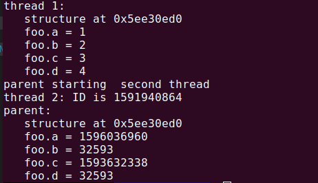

情况二：带注释的行不包括在程序中时的运行结果：

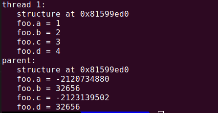

可以看出，当主线程访问这个结构时，结构的内容（在线tid1的栈上分配）已经改变。为了解决这个问题，可以使用全局结构，或者用malloc函数分配结构。

例如，若把`struct foo foo = {1, 2, 3, 4}; `移到函数外，使其成为全局结构，则可得到如下结果：

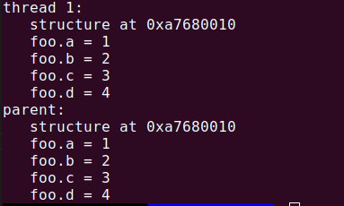

线程可以通过调用pthread_cancel函数来请求取消同一进程中的其他线程。

```c
#include <pthread.h>
int pthread_cancel(pthread_t tid);
// 返回值：若成功则返回0，否则返回错误编号

```

在默认情况下，`pthread_cancel`函数会使得由`tid`标识的线程的行为表现为如同调用了参数为`PTHREAD_CANCELED`的`pthread_exit`函数，但是，线程可以选择忽略取消方式或是控制取消方式。注意，`pthread_cancel`并不等待线程终止，它仅仅提出请求。

线程可以安排它退出时需要调用的函数，这与进程可以用`atexit`函数安排进程退出时需要调用的函数是类似的。这样的函数称为**线程清理处理程序（thread cleanup handler**）。线程可以建立多个清理处理程序。处理程序记录在栈中，也就是说它们的执行顺序与它们注册时的顺序相反。

```c
#include <pthread.h>
void pthread_cleanup_push(void (*rtn)(void *), void *arg);
void pthread_cleanup_pop(int execute);

```

当线程执行以下动作时调用清理函数（调用参数为`arg`，清理函数`rtn`的调用顺序是由`pthread_cleanup_push`函数来安排的）：

- 调用`pthread_exit`时。
- 相应取消请求时。
- 用非零`execute`参数调用`pthread_cleanup_pop`时。

如果`execute`参数置为0，清理函数将不被调用。无论哪种情况，`pthread_cleanup_pop`都将删除上次`pthread_cleanup_push`调用建立的清理处理程序。

这些函数有一个限制，由于它们可以实现为宏，所以必须在与线程相同的作用域中以匹配对的形式使用，`pthread_cleanup_push`的宏定义可以包含字符`{`，在这种情况下对应的匹配字符`}`就要在`pthread_cleanup_pop`定义中出现。

**实例**

程序清单11-4显示了如何使用线程清理处理程序。需要把`pthread_cleanup_pop`调用和`pthread_cleanup_push`调用匹配起来，否则，程序编译可能通不过。

```c
#include "apue.h"
#include <pthread.h>

void 
cleanup(void *arg)
{
    printf("cleanup: %s\n", (char *)arg);
}

void *
thr_fn1(void *arg)
{
    printf("thread 1 start\n");
    pthread_cleanup_push(cleanup, "thread 1 first hanlder");    
    pthread_cleanup_push(cleanup, "thread 1 second handler");
    printf("thread 1 push complete\n");
    if(arg)
        return((void *)1);
    pthread_cleanup_pop(0);
    pthread_cleanup_pop(0);
    return((void *)1);
}

void *
thr_fn2(void *arg)
{
    printf("thread 2 start\n");
    pthread_cleanup_push(cleanup, "thread 2 first handler");
    pthread_cleanup_push(cleanup, "thread 2 second handler");
    printf("thread 2 push complete\n");
    if (arg)
        pthread_exit((void *)2);
    pthread_cleanup_pop(0);
    pthread_cleanup_pop(0);
    pthread_exit((void *)2);
}

int
main(void)
{
    int        err;    
    pthread_t    tid1, tid2;
    void        *tret;

    err = pthread_create(&tid1, NULL, thr_fn1, (void *)1);
    if(err != 0)
        err_quit("can't create thread 1: %s\n", strerror(err));
    err = pthread_create(&tid2, NULL, thr_fn2, (void *)1);
    if(err != 0)
        err_quit("can't create thread 2: %s\n", strerror(err));
    err = pthread_join(tid1, &tret);
    if(err != 0)
        err_quit("can't join with thread 1: %s\n", strerror(err));
    printf("thread 1 exit code %d\n", (int)tret);
    err = pthread_join(tid2, &tret);
    if(err != 0)
        err_quit("can't join with thread 2: %s\n", strerror(err));
    printf("thread 2 exit code %d\n", (int)tret);
    exit(0);
}

```

结果：

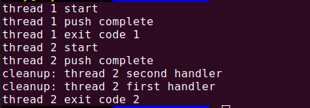

输出结果可以看出，两个线程都正确地启动和退出了，但是只调用了第二个线程的清理处理程序，所以如果线程是通过从它的启动例程中返回而终止的话，那么它的清理处理程序就不会被调用，还要注意清理处理程序是按照与它们安装时相反的顺序被调用的。

现在可以开始看出线程函数和进程函数之间的相似之处。

在默认情况下，线程的终止状态会保存一直等到对该线程调用`pthread_join`。**如果线程已经处于分离状态，线程的底层存储资源可以在线程终止时立即被收回**。

在任何一个时间点上，线程是可结合的（joinable），或者是分离的（detached）。一个可结合的线程能够被其他线程收回其资源和杀死；在被其他线程回收之前，它的存储器资源（如栈）是不释放的。相反，一个分离的线程是不能被其他线程回收或杀死的，它的存储器资源在它终止时由系统自动释放。

线程的分离状态决定一个线程以什么样的方式来终止自己。线程的默认属性，即为非分离状态（即可结合的，joinable，需要回收），这种情况下，原有的线程等待创建的线程结束；只有当`pthread_join()`函数返回时，创建的线程才算终止，才能释放自己占用的系统资源。而分离线程不是这样子的，它没有被其他的线程所等待，自己运行结束了，线程也就终止了，马上释放系统资源。程序员应该根据自己的需要，选择适当的分离状态。

当线程被分离时，并不能用`pthread_join`函数等待它的终止状态。对分离状态的线程进行`pthread_join`的调用会产生失败，返回`EINVAL`。`pthread_detach`调用可以用于使线程进入分离状态。

```c
#include <pthread.h>
int pthread_detach(pthread_t tid);
// 返回值：若成功则返回0，否则返回错误编号

```

## 线程同步

当多个控制线程共享相同的内存时，需要确保每个线程看到一致的数据视图。如果每个线程使用的变量都是其他线程不会读取或修改的，那么就不会存在一致性问题。同样地，如果变量是只读的，多个线程同时读取该变量也不会有一致性问题。但是，当某个线程可以修改变量，而其他线程也可以读取或修改这个变量的时候，就需要对这些线程进行同步，以确保它们在访问变量的存储内容时不会访问到无效的数值。

当一个线程修改变量时，其他线程在读取这个变量的值时就可能会看到不一致的数据。在变量修改时间多于一个存储器访问周期的处理器结构中，当存储器读与存储器写这两个周期交叉时，这种潜在的不一致性就会出现。当然，这种行为是与处理器结构相关的，但是可移植性程序并不能对使用何种处理器结果作出假设。

下图描述了两个线程读写相同变量的假设例子。在这个例子中，线程A读取变量然后给这个变量赋予一个新的值，但写操作需要两个存储器周期。当线程B在这两个存储器写周期中间读取这个相同的变量时，它就会得到不一致的值。

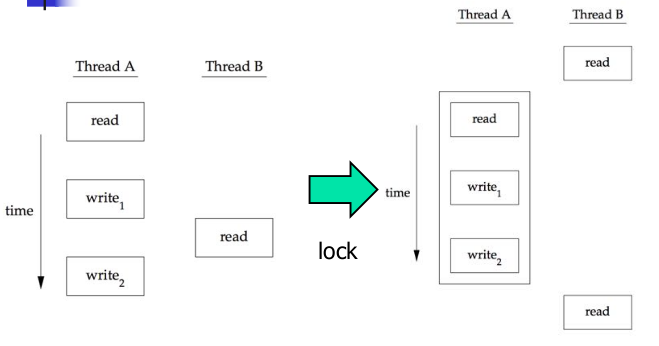

为了解决这个问题，线程不得不使用锁，在同一时间只允许一个线程访问该变量。上图描述了这种同步。如果线程B希望读取变量，它首先要获取锁；同样地，当线程A更新变量时，也需要获取这把同样的锁。因而线程B在线程A释放锁以前不能读取变量。

当两个或多个线程试图在同一时间修改同一变量时，也需要进行同步。考虑变量递增操作的情况（下图），增量操作通常可分为三步：

（1）从内存单元读入寄存器。

（2）在寄存器中进行变量值的增加。

（3）把新的值写回内存单元

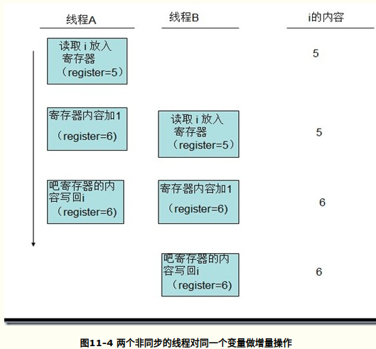

如果两个线程试图在几乎同一时间对同一变量做增量操作而不进行同步的话，结果就可能出现不一致。变量可能比原来增加了1，也有可能比原来增加了2，具体是1还是2取决于第二个线程开始操作时获取的数值。如果第二个线程执行第一步要比第一个线程执行第三步早，第二个线程读到的初始值就与第一个线程一样，它为变量加1，然后再写回去，事实上没有实际的效果，总的来说变量只增加了1。

如果修改操作是原子操作，那么就不存在竞争。在前面的例子中，如果增加1只需要一个存储器周期，那么就没有竞争存在。如果数据总是以顺序一致的方式出现，就不需要额外的同步。**当多个线程并不能观察到数据的不一致时，那么操作就是顺序一致的**。在现代计算机系统中，存储访问需要多个总线周期，多处理器的总线周期通常在多个处理器上是交叉的，所以无法保证数据是顺序一致的。

在顺序一致的环境中，可以把数据修改操作解释为运行线程的顺序操作步骤。可以把这样的情形描述为“线程A对变量增加了1，然后线程B对变量增加了1，所以变量的值比原来的大2”，或者描述为“线程B对变量增加了1，然后线程A对变量增加了1，所以变量的值比原来的大2”。这两个线程的任何操作顺序都不可能让变量出现除了上述值以外的其他数值。

除了计算机体系结构的因素以外，程序使用变量的方式也会引起竞争，也会导致不一致的情况发生。例如，可能会对某个变量加1，然后基于这个数值作出某种决定。增量操作这一步和作出决定这一步两者的组合并非原子操作，因而给不一致情况的出现提供了可能。

### 互斥量

可以通过使用pthread的互斥接口保护数据，确保同一时间只有一个线程访问数据。**互斥量（mutex**）**从本质上说是一把锁，在访问共享资源前对互斥量进行加锁，在访问完成后释放互斥量上的锁。**对互斥量进行加锁以后，任何其他试图再次对互斥量加锁的线程将会被阻塞直到当前线程释放该互斥锁。如果释放互斥锁时有多个线程阻塞，所有在该互斥锁上的阻塞线程都会变成可运行状态，第一个变为运行状态的线程可以对互斥量加锁，其他线程将会看到互斥锁依然被锁住，只能回去再次等待它重新变为可用。在这种方式下，每次只有一个线程可以向前执行。

**在设计时需要规定所有的线程必须遵守相同的数据访问规则，只有这样，互斥机制才能正常工作。**操作系统并不会做数据访问的串行化。如果允许其中的的某个线程在没有得到锁的情况下也可以访问共享资源，那么即使其他的线程在使用共享资源前都获取了锁，也还是会出现数据不一致的问题。

**互斥变量用`pthread_mutex_t`数据类型表示**，**在使用互斥变量以前，必须首先对它进行初始化**，可以把它置为常量`PTHREAD_MUTEX_INITIALIZER`（只对静态分配的互斥量），也可以通过调用`pthread_mutex_init`函数进行初始化。如果动态地分配互斥量（例如通过调用`malloc`函数），那么在释放内存前需要调用`pthread_mutex_destroy`。

```c
#include <pthread.h>
int pthread_mutex_init(pthread_mutex_t *restrict mutex, 
                       const pthread_mutexattr_t *restrict attr);
int pthread_mutex_destroy(pthread_mutex_t *mutex);
// 返回值：若成功则返回0，否则返回错误编号

```

要用默认的属性初始化互斥量，只需把`attr`设置为NULL。

**对互斥量进行加锁，需要调用`pthread_mutex_lock`**，如果互斥量已经上锁，调用线程将阻塞直到互斥量被解锁。**对互斥量解锁，需要调用`pthread_mutex_unlock`。**

```c
#include <pthread.h>
int pthread_mutex_lock(pthread_mutex_t *mutex);
int pthread_mutex_trylock(pthread_mutex_t *mutex);
int pthread_mutex_unlock(pthread_mutex_t *mutex);
// 返回值：若成功则返回0，否则返回错误编号

```

**如果线程不希望被阻塞，它可以使用`pthread_mutex_trylock`尝试对互斥量进行加锁**。如果调用`pthread_mutex_trylock`时互斥量处于未锁住状态，那么`pthread_mutex_trylock`将锁住互斥量，不会出现阻塞并返回0，否则`pthread_mutex_trylock`就会失败，不能锁住互斥量，而返回`EBUSY`。

**实例**

程序清单11-5描述了用于保护某个数据结构的互斥量。当多个线程需要访问动态分配的对象时，可以在对象中嵌入引用计数，确保在所有使用该对象的线程完成数据访问之前，该对象内存空间不会被释放。

```c
#include <stdlib.h>
#include <pthread.h>

struct foo {
    int       　　　　　f_count;
    pthread_mutex_t    f_lock;
    /* more stuff here */
};

struct foo *
foo_alloc(void)    /* allocate the object */
{
    struct foo *fp;

    if((fp = malloc(sizeof(struct foo))) != NULL)
    {
        fp->f_count = 1;
        if(pthread_mutex_init(&fp->f_lock, NULL) != 0)
        {
            free(fp);
            return(NULL);
        }    
        /* continue initialization */
    }
    return(fp);
}

void 
foo_hold(struct foo *fp) /* add a reference to the object */
{
    pthread_mutex_lock(&fp->f_lock);
    fp->f_count++;
    pthread_mutex_unlock(&fp->f_lock);
}

void
foo_rele(struct foo *fp) /* release a reference to the object */
{
    pthread_mutex_lock(&fp->f_lock);
    if(--fp->f_count == 0)    /* last reference */
    {
        pthread_mutex_unlock(&fp->f_lock);
        pthread_mutex_destroy(&fp->f_lock);
        free(fp);
    }
    else
    {
        pthread_mutex_unlock(&fp->f_lock);
    }
}

```

在使用该对象前，线程需要对这个对象的引用计数加1，当对象使用完毕时，需要对引用计数减1。当最后一个引用被释放时，对象所占的内存空间就被释放。在对引用计数加1、减1以及检查引用计数是否为0这些操作之前需要锁住互斥量。

### 避免死锁

如果线程试图对同一个互斥量加锁两次，那么它自身就会陷入死锁状态，使用互斥量时，还有其他更不明显的方式也能产生死锁。例如，程序中使用多个互斥量时，如果允许一个线程一直占有第一个互斥量，并且在试图锁住第二个互斥量时处于阻塞状态，但是拥有第二个互斥量的线程也在试图锁住第一个互斥量，这时就会发生死锁。因为两个线程都在相互请求另一个线程拥有的资源，所以这两个线程都无法向前运行，于是就产生死锁。

**可以通过小心地控制互斥量加锁的顺序来避免死锁的发生**。例如，假设需要对两个互斥量A和B同时加锁，如果所有线程总是在对互斥量B加锁之前锁住互斥量A，那么使用这两个互斥量不会产生死锁（当然在其他资源上仍可能出现死锁）；类似地，如果所有的线程总是在锁住互斥量A之前锁住互斥量B，那么也不会发生死锁。只有在一个线程试图以与另一个线程相反的顺序锁住互斥量时，才可能出现死锁。

有时候应用程序的结果使得对互斥量加锁进行排序是很困难的，如果涉及了太多的锁和数据结构，可用的函数并不能把它转换成简单的层次，那么就需要采用另外的方法。**可以先释放占有的锁，然后过一段时间再试。**这种情况可以使用`pthread_mutex_trylock`接口避免死锁。如果已经占有某些锁而且`pthread_mutex_trylock`接口返回成功，那么就可以前进；但是，如果不能获取锁，可以先释放已经占有的锁，做好清理工作，然后过一段时间重新尝试。

**实例**

程序清单11-6（修改自程序清单11-5）用以描述两个互斥量的使用方法。当同时使用两个互斥量时，总是让它们以相同的顺序加锁，以避免死锁。第二个互斥量维护着一个用于跟踪foo数据结构的散列列表。这样hashlock互斥量保护foo数据结构中的fh散列表和f_next散列链字段。foo结构中的f_lock互斥量保护对foo结构中的其他字段的访问。

**程序清单11-6 使用两个互斥量**

```c
#include <stdlib.h>
#include <pthread.h>

#define NHASH    29
#define    HASH(fp)    (((unsigned long)fp)%NHASH)
struct foo *fh[NHASH];

pthread_mutex_t hashlock = PTHREAD_MUTEX_INITIALIZER;

struct foo {
    int        f_count;
    pthread_mutex_t    f_lock;
    struct foo    *f_next;    /* protected by hashlock */
    int        f_id;
    /* more stuff here */
};

struct foo *
foo_alloc(void)    /* allocate the object */
{
    struct foo *fp;
    int        idx;

    if((fp = malloc(sizeof(struct foo))) != NULL)
    {
        fp->f_count = 1;
        if(pthread_mutex_init(&fp->f_lock, NULL) != 0)
        {
            free(fp);
            return(NULL);
        }
        idx = HASH(fp);
        pthread_mutex_lock(&hashlock);
        fp->f_next = fh[idx];
        fh[idx] = fp;
        pthread_mutex_lock(&fp->f_lock);
        pthread_mutex_unlock(&hashlock);
        /* continue initialization */
        pthread_mutex_unlock(&fp->f_lock);
    }
    return(fp);
}

void
foo_hold(struct foo *fp)    /* add a reference to the object */
{
    pthread_mutex_lock(&fp->f_lock);
    fp->f_count++;
    pthread_mutex_unlock(&fp->f_lock);
}

struct foo *
foo_find(int id)    /* find an existing object */
{
    struct foo    *fp;
    int           idx;

    idx = HASH(fp);
    pthread_mutex_lock(&hashlock);
    for(fp = fh[idx]; fp != NULL; fp = fp->f_next)
    {
        if(fp->f_id == id)
        {
            foo_hold(fp);
            break;    
        }
    }
    pthread_mutex_unlock(&hashlock);
    return(fp);
}

void
foo_rele(struct foo *fp)    /* release a reference to the object */
{
    struct foo     *tfp;
    int            idx;

    pthread_mutex_lock(&fp->f_lock);
    if(fp->f_count == 1) /* last reference */
    {
        pthread_mutex_unlock(&fp->f_lock);
        pthread_mutex_lock(&hashlock);
        pthread_mutex_lock(&fp->f_lock);
        /* need to recheck the condition */
        if(fp->f_count != 1)
        {
            fp->f_count--;
            pthread_mutex_unlock(&fp->f_lock);
            pthread_mutex_unlock(&hashlock);
            return;
        }
        /* remove from list */
        idx = HASH(fp);
        tfp = fh[idx];
        if(tfp == fp)
        {
            fh[idx] = fp->f_next;
        }
        else
        {
            while(tfp->f_next != fp)
            tfp = tfp->f_next;
            tfp->f_next = fp->f_next;
        }
        pthread_mutex_unlock(&hashlock);
        pthread_mutex_unlock(&fp->f_lock);
        pthread_mutex_destroy(&fp->f_lock);
        free(fp);
    }
    else
    {
        fp->f_count--;
        pthread_mutex_unlock(&fp->f_lock);
    }
}

```

比较程序清单11-6和程序清单11-5，可以看出分配函数现在锁住散列列表锁，把新的结构添加到散列存储桶中，在对散列列表的锁解锁之前，先锁住新结构中的互斥量。因为新的结构是放在全局列表中的，其他线程可以找到它，所以在完成初始化之前，需要阻塞其他试图访问新结构的线程。

foo_find函数锁住散列列表锁，然后搜索被请求的结构。如果找到了，就增加其引用计数并返回指向该结构的指针。注意加锁的顺序是先在foo_find函数中锁定散列列表锁，然后再在foo_hold函数中锁定foo结构中的f_clock互斥量。

现在有了两个锁以后，foo_rele函数变得更加复杂。如果这是最后一个引用，因为将需要从散列列表中删除这个结构，就要先对这个结构互斥量进行解锁，才可以获取散列列表锁。然后重新获取结构互斥量。从上一次获得结构互斥量以来可能处于被阻塞状态，所以需要重新检查条件，判断是否还需要释放这个结构。如果其他线程在我们为满足锁顺序而阻塞时发现了这个结构并对其引用计数加1，那么只需要简单地对引用计数减1，对所有的东西解锁然后返回。

如此加、解锁太复杂，所以需要重新审视原来的设计。也可以使用散列列表锁来保护引用计数，使事情大大简化，结构互斥量可以用于保护foo结构中的其他任何东西。程序清单11-7反应了这种变化。

```c
#include <stdlib.h>
#include <pthread.h>

#define NHASH 29
#define HASH(fp)    (((unsigned long)fp)%NHASH)

struct foo *fh[HASH];
pthread_mutex_t hashlock = PTHREAD_MUTEX_INITIALIZER;

struct foo {
    int            f_count;    /* protected by hashlock */
    pthread_mutext_t    f_lock;
    struct foo        *f_next;    /* protected by hashlock */
    int            f_id;
    /* more stuff here */
};

struct foo *
foo_alloc(void)    /* allocate the object */
{
    struct foo     *fp;
    int        idx;

    if((fp = malloc(sizeof(struct foo))) != NULL)
    {
        fp->f_count = 1;
        if(pthread_mutex_init(&fp->f_lock, NULL) != 0)
        {
            free(fp);
            return(NULL);
        }    
        idx = HASH(fp);
        pthread_mutex_lock(&hashlock);
        fp->f_next = fh[idx];
        fh[idx] = fp;
        pthread_mutex_lock(&fp->f_lock);
        pthread_mutex_unlock(&hashlock);
        /* continue initialization */
    }
    return(fp);    
}

void 
foo_hold(struct foo *fp)    /* add a reference to the object */
{
    pthread_mutex_lock(&hashlock);
    fp->f_count++;
    pthread_mutex_unlock(&hashlock);
}

struct foo *
foo_find(int id)    /* find a existing object */
{
    struct foo     *fp;    
    int        idx;
        
    idx = HASH(fp);
    pthread_mutex_lock(&hashlock);
    for(fp = fh[idx]; fp != NULL; fp = fp->f_next)
    {
        if(fp->f_id == id)
        {
            fp->f_count++;
            break;                                    }
    }

    pthread_mutex_unlock(&hashlock);
    return(fp);
}

void
foo_rele(struct foo *fp)    /* release a reference to the object */
{
    struct foo     *tfp;
    int        idx;
        
    pthread_mutex_lock(&hashlock);
    if(--fp->f_count == 0)    /* last reference, remove from list */
    {
        idx = HASH(fp);
        tfp = fh[idx];
        if(tfp == fp)
        {
            fh[idx] = fp->f_next;        
        }
        else
        {    
            while(tfp->f_next != fp)
                tfp = tfp->f_next;
            tfp->f_next = fp->f_next;
        }

        pthread_mutex_unlock(&hashlock);
        pthread_mutex_destroy(&fp->f_lock);
        free(fp);
    }
    else
    {
        pthread_mutex_unlock(&hashlock);
    }
}

```

注意，与程序清单11-6中的程序相比，程序清单11-7中的程序简单得多。两种用途使用相同的锁时，围绕散列列表和引用计数的锁的排序问题就随之不见了。多线程的软件设计经常要考虑这类折中处理方案。**如果锁的粒度太粗，就会出现很多线程阻塞等待相同的锁，源自并发性的改善微乎其微。如果锁的粒度太细，那么过多的锁开销会使系统性能受到影响，而且代码变得相当复杂。**作为一个程序员，需要在满足锁需求的情况下，在代码复杂性和优化性能之间找到好平衡点。

对`fp->f_next = fh[idx]; fh[idx] = fp;`的理解： <http://bbs.csdn.net/topics/330092120>

### pthread_mutex_timedlock函数

当请求一个已经加锁的互斥量时，如果我们想要限定线程阻塞的时间（时间到了就不再阻塞等待），这时需要使用`pthread_mutex_timedlock`函数。`pthread_mutex_timedlock`函数类似于`pthread_mutex_lock`，只不过一旦设置的超时值到达，`pthread_mutex_timedlock`函数会返回错误代码ETIMEDOUT，线程不再阻塞等待。

```c
#include <pthread.h>
#include <time.h>

int pthread_mutex_timedlock( pthread_mutex_t *restrict mutex,
                             const struct timespec *restrict tsptr );

// 返回值：若成功则返回0，失败则返回错误代

```

超时值指定了我们要等待的时间，它使用绝对时间（而不是相对时间：我们指定线程将一直阻塞等待直到时刻X，而不是说我们将要阻塞X秒钟。）。该时间值用`timespec`结构表示：秒和纳秒。

```c
#include "apue.h"
#include <pthread.h>
#include <sys/time.h>
#include <time.h>

int 
main(void)
{
    int                err;
    struct    timespec tout;
    struct     tm     *tmp;
    char        buf[64];
    pthread_mutex_t lock = PTHREAD_MUTEX_INITIALIZER;

    pthread_mutex_lock(&lock);
    printf("mutex is locked\n");
    clock_gettime(CLOCK_REALTIME, &tout);
    tmp = localtime(&tout.tv_sec);
    strftime(buf, sizeof(buf), "%r", tmp);
    printf("current time is %s\n", buf);
    tout.tv_sec += 10;    /* 10 seconds from now */
    /* caution: this could lead to deadlock */
    err = pthread_mutex_timedlock(&lock, &tout);
    clock_gettime(CLOCK_REALTIME, &tout);
    tmp = localtime(&tout.tv_sec);
    strftime(buf, sizeof(buf), "%r", tmp);
    printf("the time is now %s\n", buf);
    if(err == 0)
        printf("mutex locked again!\n");
    else    
        printf("can't lock mutex again: %s\n", strerror(err));
    exit(0);
}

```

结果如下：


### 读写锁

读写锁与互斥量类似，不过读写锁允许更高的并行性。互斥量要么是锁住状态要么是不加锁状态，而且一次只有一个线程可以对其加锁。**读写锁可以有三种状态：读模式下加锁状态，写模式下加锁状态，不加锁状态。一次只有一个线程可以占有写模式的读写锁，但是多个线程可以同时占有读模式的读写锁**。

**当读写锁是写加锁状态时，在这个锁被解锁之前，所有试图对这个锁加锁的线程都会被阻塞**。**当读写锁在读加锁状态时，所有试图以读模式对它进行加锁的线程都可以得到访问权，但是如果线程希望以写模式对此锁进行加锁，它必须阻塞直到所有的线程释放读锁**。虽然读写锁的实现各不相同，但**当读写锁处于读模式锁住状态时，如果有另外的线程试图以写模式加锁，读写锁通常会阻塞随后的读模式锁请求。这样可以避免读模式锁长期占用，而等待的写模式锁请求一直得不到满足**。

**读写锁非常适合于对数据结构读的次数远大于写的情况**。当读写锁在写模式下时，它所保护的数据结构就可以被安全地修改，因为当前只有一个线程可以在写模式下拥有这个锁。当读写锁在读模式下时，只要线程获取了读模式下的读写锁，该锁所保护的数据结构可以被多个获得读模式锁的线程读取。

**读写锁也叫做共享-独占锁**，当读写锁以读模式锁住时，它是以共享模式锁住的；当它以写模式锁住时，它是以独占模式锁住的。

与互斥量一样，读写锁在使用之前必须初始化，在释放它们底层的内存前必须销毁。

```c
#include <pthread.h>
int pthread_rwlock_init(pthread_rwlock_t *restrict rwlock,
                        const pthread_rwlockattr_t *restrict attr);
int pthread_rwlock_destroy(pthread_rwlock_t *rwlock);
// 两者的返回值都是：若成功则返回0，否则返回错误编号

```

**读写锁通过调用pthread_rwlock_init进行初始化**。如果希望读写锁有默认的属性，可以传一个空指针给attr。

**在释放读写锁占用的内存之前，需要调用`pthread_rwlock_destroy`做清理工作**。如果`pthread_rwlock_init`为读写锁分配了资源，`pthread_rwlock_destroy`将释放这些资源。如果在调用`pthread_rwlock_destroy`之前就释放了读写锁占用的内存空间，那么分配给这个锁的资源就丢失了。

**要在读模式下锁定读写锁，需要调用`pthread_rwlock_rdlock`**；**要在写模式下锁定读写锁，需要调用`pthread_rwlock_wrlock`**。不管以何种方式锁住读写锁，都可以**调用`pthread_rwlock_unlock`进行解锁**。

```c
#include <pthread.h>
int pthread_rwlock_rdlock(pthread_rwlock_t *rwlock);
int pthread_rwlock_wrlock(pthread_rwlock_t *rwlock);
int pthread_rwlock_unlock(pthread_rwlock_t *rwlock);
// 所有的返回值都是：若成功则返回0，否则返回错误编号

```

在实现读写锁的时候可能会对共享模式下可获取的锁的数量进行限制，所以需要检查`pthread_rwlock_rdlock`的返回值。即使`pthread_rwlock_wrlock`和`pthread_rwlock_unlock`有错误的返回值，如果锁设计合理的话，也不需要检查其返回值。错误返回值的定义只是针对不正确地使用读写锁的情况，例如未经初始化的锁，或者试图获取已拥有的锁从而可能产生死锁这样的错误返回等。

Single UNIX Specification同样定义了有条件的读写锁原语的版本。

```c
#include <pthread.h>
int pthread_rwlock_tryrdlock(pthread_rwlock_t *rwlock);
int pthread_rwlock_trywrlock(pthread_rwlock_t *rwlock);
两者的返回值都是：若成功则返回0，否则返回错误编号

```

可以获取锁时，函数返回0，否则，返回错误EBUSY。这些函数可以用于遵循某种锁层次但还不能完全避免死锁的情况。

 **实例**

程序清单11-8中的程序解释了读写锁的使用。作业请求队列由单个读写锁保护。实现多个工作线程获取由单个主线程分配给它们的作业。

**程序清单11-8 使用读写锁**

```c
#include <stdlib.h>
#include <pthread.h>

struct job {
    struct job *j_next;
    struct job *j_prev;
    pthread_t  j_id;    /* tells which thread handles this job */
    /* more stuff here */
};

struct queue {
    struct job        *q_head;
    struct job         *q_tail;
    //pthread_rwlock_init
    pthread_rwlock_t   q_lock;
};

/*
* Initialize a queue. 
*/
int
queue_init(struct queue *qp)
{
    int err;
    
    qp->q_head = NULL;
    qp->q_tail = NULL;
    err = pthread_rwlock_init(&qp->q_lock, NULL);
    if(err != 0)
        return(err);

    /* continue initializationn */

    return(0);
}

/*
* Insert a job at the head of the queue.
*/
void
job_insert(struct queue *qp, struct job *jp)
{
    pthread_rwlock_wrlock(&qp->q_lock);
    jp->j_next = qp->q_head;
    jp->j_prev = NULL;
    if(qp->q_head != NULL)
        qp->q_head->j_prev = jp;
    else
        qp->q_tail = jp;    /* list was empty */
    qp->q_head = jp;
    pthread_rwlock_unlock(&qp->q_lock);
}

/*
* Append a job on the tail of the queue.
*/
void 
job_append(struct queue *qp, struct job *jp)
{
    pthread_rwlock_wrlock(&qp->q_lock);
    jp->j_next = NULL;
    jp->j_prev = qp->q_tail;
    if(qp->q_tail != NULL)
        qp->q_tail->j_next = jp;
    else    
        qp->q_head = jp; /* list was empty */
    qp->q_tail = jp;
    pthread_rwlock_unlock(&qp->q_lock);
}
    
/*
* Remove the  given job from a queue.
*/
void
job_remove(struct queue *qp, struct job *jp)
{
    pthread_rwlock_wrlock(&qp->q_lock);
    if(jp == qp->q_head)
    {
        qp->q_head = jp->j_next;
        if(qp->q_tail == jp)
            qp->q_tail = NULL;
    }
    else if (jp == qp-q_tail)
    {
        qp->q_tail = jp->j_prev;
        if(qp->q_head == jp)
            qp->q_head = NULL;
    }
    else
    {    
        jp->j_prev->j_next = jp->j_next;
        jp->j_next->j_prev = jp->j_prev;    
    }
    pthread_rwlock_unlock(&qp->q_lock);
}

/*
* Find a job for the given thread ID.
*/
struct job *
job_find(struct queue *qp, pthread_t id)
{
    struct job *jp;
    
    if(pthread_rwlock_rdlock(&qp->q_lock) != 0)
        return(NULL);

    for(jp = qp->q_head; jp != NULL; jp = jp->j_next)
        if(pthread_equal(jp->j_id, id))
            break;

    pthread_rwlock_unlock(&qp->q_lock);
    return(jp);
}

```

在这个例子中，不管什么时候需要增加一个作业到队列中或者从队列中删除作业，都用写模式锁住队列的读写锁。不管何时搜索队列，首先需要获取读模式下的锁，允许所有的工作线程并发地搜索队列。在这种情况下，只有线程搜索队列的频率远远高于增加或删除作业时，使用读写锁才能改善性能。

工作线程只能从队列中读取与它们的线程ID匹配的作业。既然作业结构同一时间只能由一个线程使用，所以不需要额外加锁。

### 带超时限制的读写锁

```c
#include <pthread.h>
#include <time.h>

int pthread_rwlock_timedrdlock( pthread_rwlock_t *restrict rwlock,
               const struct timespec *restrict tsptr );

int pthread_rwlock_timedwrlock( pthread_rwlock_t *restrict rwlock,
                const struct timespec *restrict tsptr );

// 返回值：若成功则返回0，失败则返回错误代码

```

同`pthread_mutex_timedlock`与`thread_mutex_lock`的区别完全一样。

### 条件变量

条件变量是线程可用的另一种同步机（<http://www.cnblogs.com/feisky/archive/2010/03/08/1680950.html>）。条件变量给多个线程提供了一个会合的场所。条件变量与互斥量一起使用时，允许线程以无竞争的方式等待特定的条件发生。（条件变量基本概念和原理：<http://hipercomer.blog.51cto.com/4415661/914841>）

（[线程同步:条件变量的使用细节分析](http://blog.chinaunix.net/uid-28852942-id-3757186.html)：<http://blog.chinaunix.net/uid-28852942-id-3757186.html>）

**条件本身是由互斥量保护的**。**线程在改变条件状态前必须首先锁住互斥量，其他线程在获得互斥量之前不会察觉到这种改变，因为必须锁定互斥量以后才能计算条件**。

**条件变量使用之前必须首先进行初始化**，**`pthread_cond_t`数据类型代表的条件变量可以用两种方式进行初始化，可以把常量PTHREAD_COND_INITIALIZER赋给静态分配的条件变量，但是如果条件变量是动态分配的，可以使用`pthread_cond_init`函数进行初始化。**

在释放底层的内存空间之前，**可以使用`pthread_cond_destroy`函数对条件变量进行去除初始化（`deinitialize`**）。

```c
#include <pthread.h>

int pthread_cond_init( pthread_cond_t *restrict cond,
           pthread_condattr *restrict attr );

int pthread_cond_destroy( pthread_cond_t *cond );

// 两者的返回值都是：若成功则返回0，否则返回错误代码

```

除非需要创建一个非默认属性的条件变量，否则`pthread_cond_init`函数的attr参数可以设置为NULL。

**使用`pthread_cond_wait`等待条件变为真**，如果在给定的时间内条件不能满足，那么会生成一个代码出错码的返回值。

```c
#include <pthread.h>

int pthread_cond_wait( pthread_cond_t *restrict cond,
             pthread_mutex_t *restrict mutex );

int pthread_cond_timedwait( pthread_cond_t *restrict cond,
                     pthread_mutex_t *restrict mutex,
                     const struct timespec *restrict timeout );

// 两者的返回值都是：若成功则返回0，否则返回错误编号

```

**传递给`pthread_cond_wait`的互斥量对条件进行保护，调用者把锁住的互斥量传给函数**。**函数把调用线程放到等待条件的线程列表上，然后对互斥量解锁，这两个操作是原子操作。**这样就关闭了条件检查和线程进入休眠状态等待条件改变这两个操作之间的时间通道，这样线程就不会错过条件的任何变化。**`pthread_cond_wait`返回时，互斥量再次被锁住。**

**`pthread_cond_timedwait`函数的工作方式与`pthread_cond_wait`函数相似，只是多了一个timeout。timeout值指定了等待的时间，它是通过`timespec`结构指定。**时间值用秒数或者分秒数来表示，分秒数的单位是纳秒。

```c
struct timespec {
    time_t    tv_sec;    /* seconds */
    long      tv_nsec;   /* nanoseconds */
};

```

使用这个结构时，需要指定愿意等待多长时间，时间值是一个绝对数而不是相对数。例如，如果能等待3分钟，就需要把当前时间加上3分钟再转换到`timespec`结构，而不是把3分钟转换成`timespec`结构。

可以使用gettimeofday获取用timeval结构表示的当前时间，然后把这个时间转换成timespec结构。要得到timeout值的绝对时间，可以使用下面的函数：

```c
void 
maketimeout( struct timespec *tsp, long minutes )
{
    struct timeval now;

    /* get the current time */
    gettimeofday( &now );
    tsp->tv_sec = now.tv_sec;
    tsp->tv_nsec = now.tv_usec * 1000;    /* usec to nsec */
    /* add the offset to get timeout value */
    tsp->tv_sec += minutes * 60;
}

```

**如果时间值到了但是条件还是没有出现，`pthread_cond_timedwait`将重新获取互斥量，然后返回错误ETIMEDOUT**。**从`pthread_cond_wait`或者`pthread_cond_timedwait`调用成功返回时，线程需要重新计算条件，因为其他的线程可能已经在运行并改变了条件。**

有两个函数可以用于通知线程条件已经满足。**`pthread_cond_signal`函数将唤醒等待该条件的某个线程，而`pthread_cond_broadcast`函数将唤醒等待该条件的所有线程。**

POSIX规范为了简化实现，允许`pthread_cond_signal`在实现的时候可以唤醒不止一个线程。

```c
#include <pthread.h>

int pthread_cond_signal( pthread_cond_t *cond );

int pthread_cond_broadcast( pthread_cond_t *cond );

// 两者的返回值都是：若成功则返回0，否则返回错误编号

```

调用`pthread_cond_signal`或者`pthread_cond_broadcast`，也称为向线程或条件发送信号。**必须注意一定要在改变条件状态以后再给线程发送信号**。

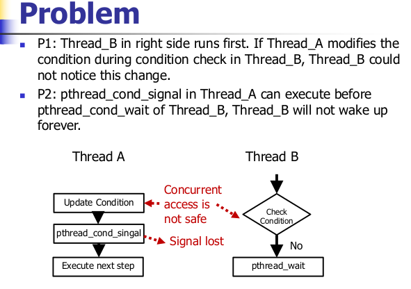

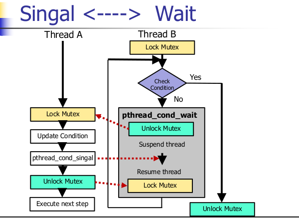

**实例**

**程序清单11-9 使用条件变量**

```c
#include <pthread.h>

struct msg {
    struct msg *m_next;
    /* ... more stuff here ... */
};

struct msg *workq;
pthread_cond_t qready = PTHREAD_COND_INITIALIZER;
pthread_mutex_t qlock = PTHREAD_MUTEX_INITIALIZER;

void
process_msg(void)
{
    struct msg *mp;
    
    for( ; ; )
    {
        pthread_mutex_lock(&qlock);
        while(workq == NULL)      /* 从pthread_cond_wait或者pthread_cond_timedwait调用成功返回时，线程需要重新计算条件 */
        {
            pthread_cond_wait(&qready, &qlock);
        }        
        mp = workq;
        workq = mp->m_next;
        pthread_mutex_unlock(&qlock);
        /* now process the message mp */
    }
}

void
 enqueue_msg(struct msg *mp)
{
    pthread_mutex_lock(&qlock);
    mp->m_next = workq;
    workq = mp;
    pthread_mutex_unlock(&qlock);
    pthread_cond_signal(&qready);  /* 在改变条件状态以后再给线程发送信号 */
}

```

### 自旋锁

自旋锁与互斥量类似，区别是：若线程不能获取锁，**互斥量是通过休眠的方式（线程被暂时取消调度，切换至其他可运行的线程）来阻塞线程；而自旋锁则是通过忙等（busy-waiting，spinning）的方式（线程不会被取消调度，一直在处于运行状态）来阻塞线程。**自旋锁适于用这样的情况：锁被其他线程短期持有（很快会被释放），而且等待该锁的线程不希望在阻塞期间被取消调度，因为这会带来一些开销。

自旋锁通常被用作实现其他类型的锁的低级原语。当一个线程在自旋等待一个锁的时候，CPU不能做其他任何事了，这就浪费了CPU资源。这就是为什么要求自旋锁只能被短期保持的原因。

自旋锁在非抢占式内核中是非常有用的：除了提供互斥机制外，自旋锁可以（以自旋的方式）阻塞中断，这样中断处理程序就不会由于试图获取一个已经被锁住的自旋锁而使系统死锁。在这些非抢占式的内核中，中断处理程序是不能休眠的，所以它们唯一可以使用的同步原语只有自旋锁。

然而，在用户级，自旋锁并不是十分有用，除非你在一个不允许抢占的实时调度类中运行。在分时调度类中运行的用户级线程可以被取消调度：当它的时间片用完或者一个更高有效级的线程到来的时候。在这种情况下，如果被取消调度的线程原来持有一个自旋锁，那么在该自旋锁上阻塞的其他线程将会自旋比原来更长的时间。

自旋锁接口与互斥量接口类似。我们可以通过`pthread_spin_init`函数初始化一个自旋锁。使用`pthread_spin_destroy`函数对一个自旋锁取消初始化。

```c
#include <pthread.h>

int pthread_spin_init( pthread_spinlock_t *lock, int pshared );

int pthread_spin_destroy( pthread_spinlock_t *lock );

// 两个函数的返回值：若成功则返回0，失败则返回错误代码

```

自旋锁只有一个属性，并且只有平台支持线程进程共享同步选项（Thread Process-Shared Synchronization option）该属性才有效。参数pshared代表进程共享（process shared）属性，它指示了自旋锁如何取得。如果把pshared设置为PTHREAD_PROCESS_SHARED，那么自旋锁可以被访问该锁的底层内存的线程获得，即使这些线程来自于不同的进程。如果把pshared设置为PTHREAD_PROCESS_PRIVATE，那么自旋锁只能本进程内初始化的线程获取。

要给自旋锁加锁，我们可以调用pthread_spin_lock（在获得锁之前，线程会一直自旋），或者pthread_spin_trylock（如果自旋锁不能立即获得，而是返回错误EBUSY，注意，此时线程不自旋）。无论调用哪个函数进行加锁，我们都可以调用pthread_spin_unlock进行解锁。

```c
#include <pthread.h>
int pthread_spin_lock( pthread_spinlock_t *lock );
int pthread_spin_trylock( pthread_spinlock_t *lock );
int pthread_spin_unlock( pthread_spinlock_t *lock );
// 返回值：若成功则返回0，失败则返回出错代码

```

注意，如果自旋锁当前还没有加锁，那么调用pthread_spin_lock可直接对该自旋锁加锁而不会自旋。如果线程已经对自旋锁加了锁，现在又调用pthread_spin_lock对其加锁，那么结果是未定义的。如果我们对一个没有加锁的自旋锁进行解锁，其结果也是未定义的。

pthread_spin_lock或者pthread_spin_trylock函数返回0，则自旋锁被加上了锁。我们应该小心，不要调用会在持有自旋锁期间休眠的函数，否则将可能会浪费大量的CPU资源。

### 屏障(Barriers)

**关卡是一种同步机制，它可以协调并行工作的多个线程。关卡使每一个线程等待直到所有合作的线程都到达了同一点，然后再从这一点开始继续执行。**其实我们之前已经见过一种形式的关卡——pthread_join函数，它使一个线程等待另一个线程的结束。

关卡比pthread_join函数更一般化。它允许任意数量的线程等待，直到所有的线程完成处理，但这些线程不一定退出。当所有的线程都到达这个关卡的时候它们可以继续执行工作。

我们可以**使用pthread_barrier_init函数初始化一个关卡，使用pthread_barrier_destroy函数对一个关卡进行去除初始化**。

```c
#include <pthread.h>

int pthread_barrier_init( pthread_barrier_t *restrict barrier,
             　　　　　　　　const pthread_barrierattr_t *restrict attr,
             　　　　　　　　unsigned int count );

int pthread_barrier_destroy( pthread_barrier_t *barrier );

两个函数的返回值：若成功则返回0，失败则返回出错代码

```

当我们初始化一个关卡的时候，使用参数count指定在允许所有线程继续运行之前必须达到该关卡的线程的个数。使用参数attr指定关卡的属性，我们暂时先把attr设为NULL，初始化一个带有默认属性的关卡。如果调用pthread_barrier_init函数时给关卡分配了资源，这些资源会在调用pthread_barrier_destroy函数时释放。

如果一个线程率先完成了它的工作（到达关卡），该线程可以**调用pthread_barrier_wait函数来等待其他所有的线程来赶上它**。

```c
#include <pthread.h>

int pthread_barrier_wait( pthread_barrier_t *barrier );

// 返回值：若成功则返回0或PTHREAD_BARRIER_SERIAL_THREAD，失败则返回错误编号

```

如果没有达到初始化函数中指定的count个数目的线程全部到达关卡，那么调用pthread_barrier_wait函数的线程会休眠。当count个线程中的最后一个线程调用pthread_barrier_wait函数时，所有的线程会被唤醒。

To one arbitrary thread, it will appear as if the pthread_barrier_wait function 
returned a value of PTHREAD_BARRIER_SERIAL_THREAD. The remaining threads see 
a return value of 0. This allows one thread to continue as the master to act on the results 
of the work done by all of the other threads.（意思好像是说：有一个线程调用pthread_barrier_wait函数的返回值是PTHREAD_BARRIER_SERIAL_THREAD，而剩余的其他所有线程调用pthread_barrier_wait都返回0，返回PTHREAD_BARRIER_SERIAL_THREAD的那个线程就成为主线程，它负责处理所有线程完成的工作的结果。）

一旦count个线程都达到了关卡，并且所有线程都被唤醒。这个关卡就可以被再次使用，但是count不能被改变，除非我们调用pthread_barrier_destroy，然后再调用pthread_barrier_init重新初始化一个count。

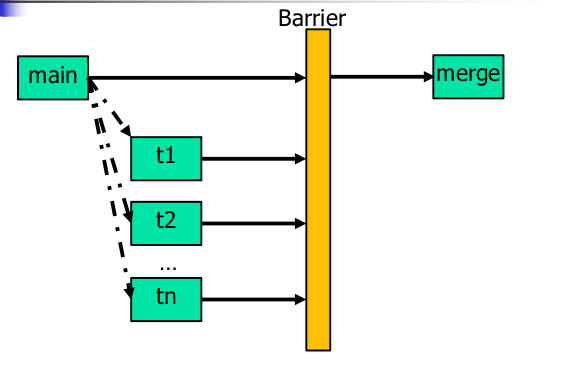

**实例：下面的程序展示了使用关卡来同步在单一作业上合作的多个线程**

```c
#include "apue.h"
#include <pthread.h>
#include <limits.h>
#include <sys/time.h>

#define NTHR      8                /* number of threads */
#define NUMNUM    8000000L         /* number of numbers to sort */
#define TNUM      (NUMNUM/NTHR)    /* number to sort per thread */

long nums[NUMNUM];
long snums[NUMNUM];

pthread_barrier_t b;

#ifdef SOLARIS
#define heapsort qsort
#else
extern int heapsort(void *, size_t, size_t, int (*)(const void *, const void *));
#endif
/*
* Compare two long integers (helper function for heapsort)
*/
int 
complong(const void *arg1, const void *arg2)
{
    long l1 = *(long *)arg1;
    long l2 = *(long *)arg2;

    if(l1 == l2)
        return 0;
    else if(l1 < l2)
        return -1;
    else
        return 1;
}
/*
* Worker thread to sort a portion of the set of numbers.
*/
void *
thr_fn(void *arg)
{
    long    idx = (long)arg;

    heapsort(&num[idx], TNUM, sizeof(long), complong);
    pthread_barrier_wait(&b);
    /*
    * Go off and perform more work ...
    */
    return((void *)0);
}
/*
* Merge the results of the individual sorted ranges.
*/
void
merge()
{
    long    idx[NTHR];
    long    i, minidx, sidx, num;
    
    for(i = 0; i < NTHR; i++ )
        idx[i] = i * TNUM;
    for(sidx = 0; sidx < NUMNUM; sidx++ )
    {
        num = LONG_MAX;
        for( i = 0; i < NTHR; i++ )
        {    
            if((idx[i] < (i+1)*TNUM) && (nums[idx[i]] < num ))
            {
                num = nums[idx[i]];
                minidx = i;
            }
        }        
        snums[sidx] = nums[idx[minidx]];
        idx[minidx]++;
    }
}

int main()
{
    unsigned long     i;
    struct timeval    start, end;
    long long         startusec, endusec;
    double            elapsed;
    int               err;
    pthread_T         tid;

    /*
    * Create the initial set of numbers to sort 
    */
    srandom(1);
    for(i = 0; i < NUMNUM; i++ )
        nums[i] = random();
    
    /*
    * Create 8 threads to sort the numbers.
    */
    gettimeofday(&start, NULL);
    pthread_barrier_init(&b, NULL, NTHR+1);
    for(i = 0; i < NTHR; i++)
    {
        err = pthread_create(&tid, NULL, thr_fn, (void *)(i * TNUM));
        if(err != 0)
            err_exit(err, "can't create thread");
    }
    pthread_barrier_wait(&b);
    merge();
    gettimeofday(&end, NULL);
    /*
    * Print the sorted list. 
    */
    startusec = start.tv_sec * 1000000 + start.tv_usec;
    endusec = end.tv_sec * 1000000 + end.tv_usec;
    elapsed = (double)(endusec - startusec) / 1000000.0;
    printf("sort took %.4f seconds\n", elapsed);
    for( i = 0; i < NUMNUM; i++ )
        printf("%ld\n", snums[i]);
    exit(0);
}

```

这个例子给出了多个线程执行一个任务时，使用屏障的简单情况。在更加实际的情况下，工作线程在调用`pthread_barrier_wait`函数返回后会接着执行其他的活动。

在这个实例中，使用8个线程分解了800万个数的排序工作。每个线程用堆排序算法对100万个数进行排序（详细算法参见Knuth[1998]）。然后主线程调用一个函数对这些结果进行合并。

并不需要使用`pthread_barrier_wait`函数中的返回值`PTHEAD_BARRIER_SERIAL_THREAD`来决定哪个线程执行结果合并操作，因为我们使用了主线程来完成这个任务。这也是把屏障计数设为工作线程数加1的原因，主线程也作为其中的一个候选线程。