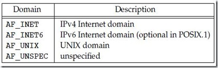
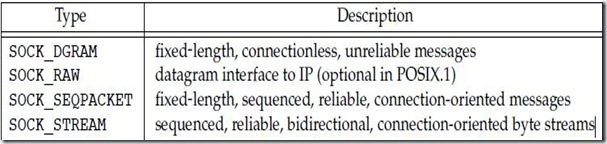
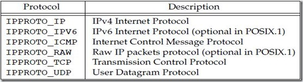
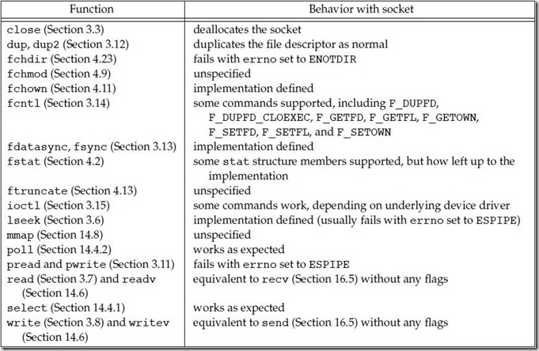
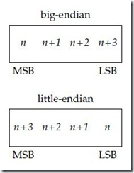
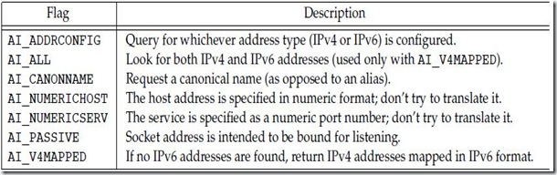
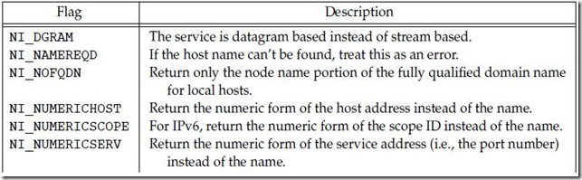
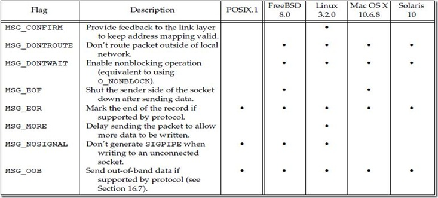
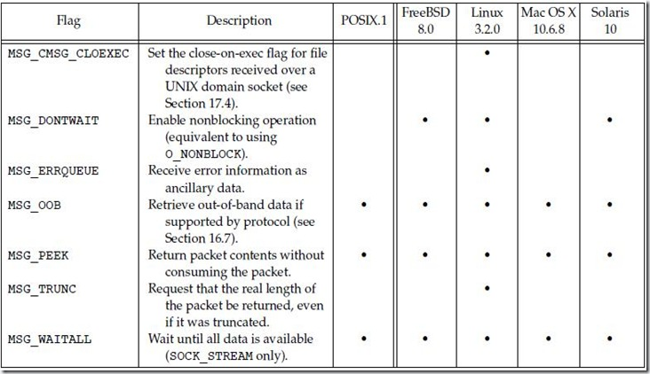
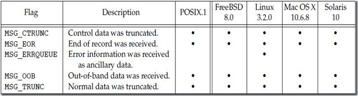

# 网络IPC:套接字

**网络进程间通信（network IPC）：**不同计算机（通过网络相连）上运行的进程相互通信的机制。

**套接字网络IPC接口：**进程能够使用该接口和其他进程通信。通过该接口，其他进程运行位置是透明的，它们可以在同一台计算机上也可以在不同的计算机上。实际上这正是套接字接口的目标之一：同样的接口既可以用于计算机间通信又可以用于计算机内通信。

## 网络IPC：套接字之套接字描述符

**套接字是通信端点的抽象**。与应用程序要使用文件描述符访问文件一样，访问套接字也需要套接字描述符。套接字描述符在UNIX系统是用文件描述符实现的。事实上，许多处理文件描述符的函数（如read和write）都可以处理套接字描述符。

**要创建一个套接字，可以调用socket函数。**

```c
#include <sys/socket.h>
int socket(int domain, int type, int protocol);
// 返回值：若成功则返回文件（套接字）描述符，若出错则返回-1
```

**参数domain（域）确定通信的特性**，包括地址格式。下表总结了由POSIX.1指定的各个域。各个域有自己的格式表示地址，而表示各个域的常数都以AF_开头，意指**地址族（address family**）。



多数系统还会定义AF_LOCAL域，这是AF_UNIX的别名。AF_UNSPEC域可以代表任何域。历史上，有些平台支持其他网络协议（如AF_IPX为NetWare协议族），但这些协议的域常数没有在POSIX.1标准中定义。

**参数type确定套接字的类型，进一步确定通信特征**。下表总结了由POSIX.1定义的套接字类型，但在实现中可以自由增加对其他类型的支持。



**参数protocol通常是0，表示按给定的域和套接字类型选择默认协议。**当对同一域和套接字类型支持多个协议时，可以使用protocol参数选择一个特定协议。在AF_INET通信域中套接字类型SOCK_STREAM的默认协议是TCP（传输控制协议）。在AF_INET通信域中套接字类型SOCK_DGRAM的默认协议是UDP（用户数据报协议）。下表（摘自apue第3版）列出了为因特网域套接字定义的协议：



对于数据报（SOCK_DGRAM）接口，与对方通信时是不需要逻辑连接的。只需要送出一个报文，其地址是一个对方进程所使用的套接字。

因此数据报提供了一个无连接的服务。另一方面，字节流（SOCK_STREAM）要求在交换数据之前，在本地套接字和与之通信的远程套接字之间建立一个逻辑连接。

**数据报是一种自包含报文。发送数据报近似于给某人邮寄信件。**可以邮寄很多信，但不能保证投递的次序，并且可能有些信件丢失在路上。每封信件包含接收者的地址，使这封信件独立于所有其他信件。每封信件可能送达不同的接收者。

**相比之下，使用面向连接的协议通常就像与对方打电话。**首先，需要通过电话建立一个连接，连接建立好之后，彼此能双向地通信。每个连接是端到端的通信信道。会话中不包含地址信息，就像呼叫的两端存在一个点对点的虚拟连接，并且连接本身暗含特定的源和目的地。

对于SOCK_STREAM套接字，应用程序意识不到报文界限，因为套接字提供的是字节流服务。这意味着当从套接字读出数据时，它也许不会返回所有由发送者进程所写的字节数。最终可以获得发送过来的所有数据，但也许要通过若干次函数调用得到。

SOCK_SEQPACKET套接字和SOCK_STREAM套接字很类似，但从该套接字得到的是基于报文的服务而不是字节流服务。这意味着从SOCK_SEQPACKET套接字接收的数据量与对方发送的一致。流控制传输协议（Stream Control Transimission Portocol, SCTP）提供了因特网域上的顺序数据包服务。

SOCK_RAW套接字提供一个数据报接口用于直接访问下面的网络层（在因特网域中为IP）。使用这个接口时，应用程序负责构造自己的协议首部，这是因为传输协议（TCP和UDP等）被绕过了。当创建一个原始套接字时需要有超级用户特权，用以防止恶意程序绕过内建安全机制来创建报文。

调用socket与调用open相类似。在两种情况下，均可获得用于输入/输出的文件描述符。当不再需要该文件描述符时，调用close来关闭对文件或套接字的访问，并且释放该描述符以便重新使用。

虽然套接字描述符本质上是一个文件描述符，但不是所有参数为文件描述符的函数都可以接受套接字描述符。下表总结了到目前为止所讨论的大多数使用文件描述符的函数处理套接字描述符时的行为。未规定的和由实现定义的行为通常意味着函数不能处理套接字描述符。例如，lseek不处理套接字，因为套接字不支持文件偏移量的概念。



**套接字通信是双向的。可以采用函数shutdown来禁止套接字上的输入/输出。**

```c
#include <sys/socket.h>
int shutdown(int sockfd, int how);
// 返回值：若成功则返回0，出错则返回-1
```

如果how是SHUT_RD（关闭读端），那么无法从套接字读取数据；如果how是SHUT_WR（关闭写端），那么无法使用套接字发送数据；使用SHUT_RDWR则将同时无法读取和发送数据。

能够使用close关闭套接字，为何还要使用shutdown呢？理由如下：首先，close只有在最后一个活动引用被关闭时才释放网络端点。这意味着如果复制一个套接字（例如采用dup），套接字直到关闭了最后一个引用它的文件描述符之后才会被释放。而shutdown允许使一个套接字处于不活动状态，无论引用它的文件描述符数目多少。其次，有时只关闭套接字双向传输中的一个方向会很方便。例如，如果想让所通信的进程能够确定数据发送何时结束，可以关闭该套接字的写端，然而通过该套接字读端仍可以继续接收数据。

## 套接字之寻址

在学习用套接字做一些有意义的事情之前，需要知道如何确定一个目标通信进程。

进程的标识有两个部分：**计算机的网络地址**可以帮助标识网络上想与之通信的计算机，而**服务**可以帮助标识计算机上特定的进程。

### **地址格式**

**地址标识了特定通信域中的套接字端点**，地址格式与特定的通信域相关。**为使不同格式地址能够被传入到套接字函数，地址被强制转换成通用的地址结构sockaddr**表示：

```c
struct sockaddr {
    sa_family_t    sa_family;        /* address family */
    char           sa_data[];        /* variable-length address */
    ......    
};
```

套接字实现可以自由地添加额外的成员并且定义sa_data成员的大小。例如在Linux中，该结构定义如下：

```c
struct sockaddr {
    sa_family_t    sa_family;        /* address family */
    char           sa_data[14];    /* variable-length address */
};
```

Each protocol define its own Socket Address Structure(IPv4, IPv6....)

因特网地址定义在<netinet/in.h>中。**在IPv4因特网域（AF_INET）中，套接字地址用如下结构sockaddr_in**表示：

```c
struct in_addr {
    int_addr_t        s_addr;    /* IPv4 address */
};

struct sockaddr_in {
    sa_family_t       sin_family;      /* address family */
    in_port_t         sin_port;        /* port number */
    struct in_addr    sin_addr;        /* IPv4 address */	
};
```

数据类型in_port_t定义为uint16_t。数据类型in_addr_t定义成uint32_t。这些整数类型在<stdint.h>中定义并指定了相应的位数。与IPv4因特网域（AF_INET）相比较，**IPv6因特网域（AF_INET6）套接字地址用如下结构sockaddr_in6表示：**

```c
struct in6_addr {
    uint8_t    s6_addr[16];    /* IPv6 address */
};

struct sockaddr_in6 {
    sa_family_t        sin6_family;      /* address family */
    in_port_t          sin6_port;        /* port number */
    uint32_t           sin6_flowinfo;    /* traffic class and flow info */
    struct in6_addr    sin6_addr;        /* IPv6 address */
    uint32_t           sin6_scope_id;    /* set of interfaces for scope */
};
```

这些是Single UNIX Specification必须的定义，每个实现可以自由地添加额外的字段。例如，在Linux中，sockaddr_in定义如下：

```c
struct sockaddr_in {
    sa_family_t       sin_family;      /* address family */
    in_port_t         sin_port;        /* port number */
    struct in_addr    sin_addr;        /* IPv4 address */
    unsigned char     sin_zero[8];     /* filler */
};
```

其中成员sin_zero为填充字段，必须全部被置为0。

**注意，尽管sockaddr_in与sockaddr_in6相差比较大，它们均被强制转换成sockaddr结构传入到套接字例程中**。

有时，需要打印出能被人而不是计算机所理解的地址格式。BSD网络软件中包含了函数inet_addr和inet_ntoa，用于在二进制地址格式与点分十进制字符串表示（a.b.c.d）之间相互转换。这些函数仅用于IPv4地址，但功能相似的两个函数inet_ntop和inet_pton支持IPv4和IPv6地址。

```c
#include <arpa/inet.h>

const char *inet_ntop(int domain, const void *restrict addr, char *restrict str, socklen_t size);
// 返回值：若成功则返回地址字符串指针，若出错则返回NULL

int inet_pton(int domain, const char *restrict str, void *restrict addr);
// 返回值：若成功则返回1，若格式无效则返回0，若出错则返回-1
```

**函数inet_ntop将网络字节序的二进制地址转换成文本字符串格式，inet_pton将文本字符串格式转换成网络字节序的二进制地址。参数domain仅支持两个值：AF_INET和AF_INET6。**

对于inet_ntop，参数size指定了用以保存文本字符串的缓冲区（str）的大小。两个常数用于简化工作：INET_ADDRSTRLEN定义了足够大的空间来存放表示IPv4地址的文本字符串，INET6_ADDRSTRLEN定义了足够大的空间来存放表示IPv6地址的文本字符串。

对于inet_pton，如果domain是AF_INET，缓冲区addr需要有足够大的空间来存放32位地址，如果domain是AF_INET6则需要足够大的空间来存放128位地址。

### **字节序**

运行在同一台计算机上的进程相互通信时，一般不用考虑字节的顺序（字节序），字节序是一个处理器架构特性，用于指示像整数这样的大数据类型的内部字节顺序。下图显示一个32位整数内部的字节是如何排序的。



如果处理器架构支持大端（big-endian）字节序，那么最大字节地址对应于数字最低有效字节（LSB）；小端（little-endian）字节序则相反：数字最低字节对应于最小字节地址。**注意，不管字节如何排序，数字最高位总是在左边，最低位总是在右边。**

**网络协议指定了字节序**，因此异构计算机系统能够交换协议信息而不会混淆字节序。**TCP/IP协议栈采用大端字节序**。应用程序交换格式化数据时，字节序问题就会出现。对于TCP/IP，地址用网络字节序表示，所以应用程序有时需要在处理器的字节序与网络字节序之间的转换。

对于TCP/IP应用程序，提供了四个通用函数以实施在**处理器字节序和网络字节序之间的转换**。

```c
#include <arpa/inet.h>

uint32_t htonl(uint32_t hostint32);
// 返回值：以网络字节序表示的32位整型数

uint16_t htons(uint16_t hostint16);
// 返回值：以网络字节序表示的16位整型数

uint32_t ntohl(uint32_t netint32);
// 返回值：以主机字节序表示的32位整型数

uint16_t ntohs(uint16_t netint16);
// 返回值：以主机字节序表示的16位整型数
```

h表示“主机（host）”字节序，

n表示“网络（network）”字节序。

l表示“长（long）”整数（即4个字节），

s表示“短（short）”整数（即2个字节）。

这四个函数定义在<arpa/inet.h>中，也有比较老的系统将其定义在<netinet/in.h>中。

### **地址查询**

理想情况下，应用程序不需要了解套接字地址的内部结构。如果应用程序只是简单地传递类似于sockaddr结构的套接字地址，并且不依赖于任何协议相关的特性，那么可以与提供相同服务的许多不同协议协作。

历史上，BSD网络软件提供接口访问各种网络配置信息。<http://www.cnblogs.com/nufangrensheng/p/3507496.html>中，简要地讨论了网络数据文件和用来访问这种信息的函数。在本节，将更加详细地讨论一些细节，并且引入新的函数来查询寻址信息。

这些函数返回的网络配置信息可能存放在许多地方。它们可以保存在静态文件中（如/etc/hosts，/etc/services等），或者可以由命名服务管理，例如DNS（Domain Name System）或者NIS（Network Information Service）。无论这些信息放在何处，这些函数同样能够访问它们。

通过调用gethostent，可以找到给定计算机的主机信息。

```c
#include <netdb.h>

struct hostent *gethostent(void);
// 返回值：若成功则返回指针，若出错则返回NULL

void sethostent(int stayopen);

void endhostent(void);
```

如果主机数据文件没有打开，gethostent会打开它。函数gethostent返回文件的下一个条目。函数sethostent会打开文件，如果文件已经被打开，那么将其回绕。函数endhostent将关闭文件。

当gethostent返回时，得到一个指向hostent结构的指针，该结构可能包含一个静态的数据缓冲区。每次调用gethostent将会覆盖这个缓冲区。**数据结构hostent**至少包含如下成员：

```c
struct hostent {
    char       *h_name;          /* name of host */
    char      **h_aliases;       /* pointer to alternate host name array */
    int         h_addrtype;      /* address type */
    int         h_length;        /* length in bytes of address */
    char      **h_addr_list;     /* pointer to array of network addresses */
    ...
};

```

返回的地址采用网络字节序。

两个附加的函数gethostbyname和gethostbyaddr，原来包含在hostent函数里面，现在被认为是过时的，马上将会看到其替代函数。

能够采用一套相似的接口来获得网络名字和网络号。

```c
#include <netdb.h>

struct netent *getnetbyaddr(uint32_t net, int type);

struct netent *getnetbyname(const char *name);

struct netent *getnetent(void);

// 以上三个函数的返回值：若成功则返回指针，若出错则返回NULL

void setnetent(int stayopen);

void endnetent(void);
```

**结构netent**至少包含如下字段：

```c
struct netent {
    char       *n_name;        /* network name */
    char      **n_aliases;     /* alternate network name array pointer */
    int         n_addrtype;    /* address type */
    uint32_t    n_net;         /* network number */
    ...
};
```

网络号按照网络字节序返回。地址类型是一个地址族常量（例如AF_INET）。

可以将协议名字和协议号采用以下函数映射。

```c
#include <netdb.h>

struct protoent *getprotobyname(const char *name);

struct protoent *getprotobynumber(int proto);

struct protoent *getprotoent(void);

// 以上所有函数的返回值：若成功则返回指针，出错则返回NULL

void setprotoent(int stayopen);

void endprotoent(void);
```

POSIX.1定义的结构protoent至少包含如下成员：

```c
struct protoent {
    char     *p_name;         /* protocol name */
    char    **p_aliases;      /* pointer to alternate protocol name array */
    int       p_proto;        /* protocol number */
    ...
};
```

**服务是由地址的端口号部分表示的。每个服务由一个唯一的、熟知的端口号来提供**。采用函数getservbyname可以将一个服务名字映射到一个端口号，函数getservbyport将一个端口号映射到一个服务名，或者采用函数getservent顺序扫描服务数据库。

```c
#include <netdb.h>

struct servent *getservbyname(const char *name, const char *proto);

struct servent *getservbyport(int port, const char *proto);

struct servent *getservent(void);

// 以上所有函数的返回值：若成功则返回指针，出错则返回NULL

void setservent(int stayopen);

void endservent(void);
```

**结构servent**至少包含如下成员：

```c
struct servent {
    char      *s_name;         /* service name */
    char     **s_aliases;      /* pointer to alternate service name array */
    int        s_port;         /* port number */
    char      *s_proto;        /* name of protocol */
    ...
};
```

POSIX.1定义了若干新的函数，允许应用程序将一个主机名字和服务名字映射到一个地址，或者相反。这些函数代替老的函数gethostbyname和gethostbyaddr。

**函数getaddrinfo允许将一个主机名字和服务名字映射到一个地址。**（*）

```c
#include <sys/socket.h>
#include <netdb.h>

int getaddrinfo(const char *restrict host,
                const char *restrict service,
                const struct addrinfo *restrict hint,
                struct addrinfo **restrict res);
返回值：若成功则返回0，出错则返回非0错误码

void freeaddrinfo(struct addrinfo *ai);
```

需要提供主机名字、服务名字，或者两者都提供。如果仅仅提供一个名字，另外一个必须是个空指针。主机名字可以是一个节点名或点分十进制记法表示的主机地址。

函数getaddrinfo返回一个结构addrinfo的链表。可以用freeaddrinfo来释放一个或多个这种结构，这取决于用ai_next字段链接起来的结构有多少。

**结构addrinfo**的定义至少包含如下成员：

```c
struct addrinfo {
    int                  ai_flags;         /* customize behavior */
    int                  ai_family;        /* address family */
    int                  ai_socktype;      /* socket type */
    int                  ai_protocol;      /* protocol */
    socklen_t            ai_addrlen;       /* length in bytes of address */
    struct sockaddr     *ai_addr;          /* address */
    char                *ai_canonname;     /* canonical（与aliases相对） name of host */
    struct addrinfo     *ai_next;          /* next in list */
    ...
};
```

根据某些规则，可以提供一个可选的hint来选择地址。hint是一个用于过滤地址的模板，仅使用ai_family、ai_flags、ai_protocol和ai_socktype字段。剩余的整数字段必须设为0，并且指针字段为空。下表总结了在ai_flags中所用的标志，这写标志用来指定如何处理地址和名字。



如果getaddrinfo失败，不能使用perror或strerror来生成错误消息。替代地，调用gai_strerror将返回的错误码转换成错误消息。

```c
#include <netdb.h>
const char *gai_strerror(int error);
// 返回值：指向描述错误的字符串的指针
```

**函数getnameinfo将地址转换成主机名或者服务名。**

```c
#include <sys/socket.h>
#include <netdb.h>

int getnameinfo(const struct sockaddr *restrict addr,
             socklen_t alen, char *restrict host,
             socklen_t hostlen, char *restrict service,
             socklen_t servlen, unsigned int flags);
// 返回值：若成功则返回0，出错则返回非0值
```

套接字地址（addr）被转换成主机名或服务名。如果host非空，它指向一个长度为hostlen字节的缓冲区用于存储返回的主机名。同样，如果service非空，它指向一个长度为servlen字节的缓冲区用于存储返回的服务名。

参数flags指定一些转换的控制方式，下表总结了系统支持的标志。



**实例**

程序清单16-1说明了函数getaddrinfo的使用方法。

**程序清单16-1 打印主机和服务信息**

```c
#include "apue.h"
#include <netdb.h>
#include <arpa/inet.h>
#if defined(BSD) || defined(MACOS)
#include <sys/socket.h>
#include <netinet/in.h>
#endif

void print_family(struct addrinfo *aip)
{
    printf(" family ");
    switch(aip->ai_family)
    {
        case AF_INET:
            printf("inet");
            break;
        case AF_INET6:
            printf("inet6");
            break;
        case AF_UNIX:
            printf("unix");
            break;
        case AF_UNSPEC:
            printf("unspecified");
            break;
        default:
            printf("unknown");
    }
}

void 
print_type(struct addrinfo *aip)
{
    printf(" type ");
    switch(aip->ai_socktype)
    {
        case SOCK_STREAM:
            printf("stream");
            break;
        case SOCK_DGRAM:
            printf("datagram");
            break;
        case SOCK_SEQPACKET:
            printf("seqpacket");
            break;
        case SOCK_RAW:
            printf("raw");
            break;
        default:
            printf("unknown (%d)", aip->ai_socktype);
    }
}

void
print_protocol(struct addrinfo *aip)
{
    printf(" protocol ");
    switch(aip->ai_protocol)
    {
        case 0:
            printf("default");
            break;
        case IPPROTO_TCP:
            printf("TCP");
            break;
        case IPPROTO_UDP:
            printf("UDP");
            break;
        case IPPROTO_RAW:
            printf("raw");
            break;
        default:
            printf("unknown (%d)", aip->ai_protocol);
    }
}

void
print_flags(struct addrinfo *aip)
{
    printf("flags");
    if(aip->ai_flags == 0)
    {
        printf(" 0");
    }
    else
    {
        if(aip->ai_flags & AI_PASSIVE)
            printf(" passive");
        if(aip->ai_flags & AI_CANONNAME)
            printf(" canon");
        if(aip->ai_flags & AI_NUMERICHOST)
            printf(" numhost");
#if defined(AI_NUMERICSERV)
        if(aip->ai_flags & AI_NUMERICSERV)
            printf(" numserv");
#endif
#if defined(AI_V4MAPPED)
        if(aip->ai_flags & AI_V4MAPPED)
            printf(" v4mapped");
#endif
#if defined(AI_ALL)
        if(aip->ai_flags & AI_ALL)
            printf(" all");
#endif
    }
}

int
main(int argc, char *argv[])
{
    struct addrinfo        *ailist, *aip;
    struct addrinfo         hint;
    struct sockaddr_in     *sinp;
    const char             *addr;
    int                     err;
    char                    abuf[INET_ADDRSTRLEN];

    if(argc != 3)
        err_quit("usage: %s nodename service", argv[0]);
    hint.ai_flags = AI_CANONNAME;
    hint.ai_family = 0;
    hint.ai_socktype = 0;
    hint.ai_protocol = 0;
    hint.ai_addrlen = 0;
    hint.ai_canonname = NULL;
    hint.ai_addr = NULL;
    hint.ai_next = NULL;
    if((err = getaddrinfo(argv[1], argv[2], &hint, &ailist)) != 0)
        err_quit("getaddrinfo error: %s", gai_strerror(err));
    for(aip = ailist; aip != NULL; aip = aip->ai_next)
    {
        print_flags(aip);
        print_family(aip);
        print_type(aip);
        print_protocol(aip);
        printf("\n\thost %s", aip->ai_canonname?aip->ai_canonname:"-");
        if(aip->ai_family == AF_INET)
        {
            sinp = (struct sockaddr_in *)aip->ai_addr;
            addr = inet_ntop(AF_INET, &sinp->sin_addr, abuf, INET_ADDRSTRLEN);
            printf(" address %s", addr?addr:"unknown");
            printf(" port %d", ntohs(sinp->sin_port));
        }
        printf("\n");
    }
    exit(0);
}
```

程序在Linux系统上运行输出如下


### **将套接字与地址绑定**

**与客户端的套接字关联的地址没有太大的意义，可以让系统选一个默认的地址。然而，对于服务器，需要给一个接收客户端请求的套接字绑定一个众所周知的地址。**客户端应有一种方法来发现用以连接服务器的地址，最简单的方法就是为服务器保留一个地址并且在/etc/services或者某个名字服务（name service）中注册。

**可以用bind函数将地址绑定到一个套接字。**

```c
#include <sys/socket.h>
int bind(int sockfd, const struct sockaddr *addr, socklen_t len);
// 返回值：若成功则返回0，出错则返回-1
```

对于所能使用的地址有一些限制：

- 在进程所运行的机器上，指定的地址必须有效，不能指定一个其他机器的地址。
- 地址必须和创建套接字时的地址族所支持的格式相匹配。
- 端口号必须不小于1024，除非该进程具有相应的特权（即为超级用户）。
- 一般只有套接字端点能够与地址绑定，尽管有些协议允许多重绑定。

**对于因特网域，如果指定IP地址为INADDR_ANY，套接字端点可以被绑定到所有的系统网络接口。这意味着可以收到这个系统所安装的所有网卡的数据包。**

**可以调用函数getsockname来发现绑定到一个套接字的地址。**

```c
#include <sys/socket.h>
int getsockname(int sockfd, struct sockaddr *restrict addr, socklen_t *restrict alenp);
// 返回值：若成功则返回0，出错则返回-1

```

调用getsockname之前，设置alenp为一个指向整数的指针，该整数指定缓冲区sockaddr的大小。返回时，该整数会被设置成返回地址的大小。如果该地址和提供的缓冲区长度不匹配，则将其截断而不报错。如果当前没有绑定到该套接字的地址，其结果没有定义。

**如果套接字已经和对方连接，调用getpeername来找到对方的地址**。

```c
#include <sys/socket.h>
int getpeername(int sockfd, struct sockaddr *restrict addr, socklen_t *restrict alenp);
// 返回值：若成功则返回0，若出错则返回-1
```

除了返回的是对方的地址之外，函数getpeername和getsockname一样。

## 套接字之建立连接

如果处理的是面向连接的网络服务（SOCK_STREAM或SOCK_SEQPACKET），在开始交换数据以前，需要在请求服务的进程套接字（客户端）和提供服务的进程套接字（服务器）之间建立一个连接。**客户端可以用connect建立一个连接。**

```c
#include <sys/socket.h>
int connect(int sockfd, const struct sockaddr *addr, socklen_t len);
// 返回值：若成功则返回0，出错则返回-1
```

在connect中所指定的地址是想与之通信的服务器地址。如果sockfd没有绑定到一个地址，connect会给调用者绑定一个默认地址。

当连接一个服务器时，出于一些原因，连接可能失败。要连接的机器必须开启并且正在运行，服务器必须绑定到一个想与之连接的地址，并且在服务器的等待连接队列中应有足够的空间。因此，应用程序必须能够处理connect返回的错误，这些错误可能由一些瞬时变化条件引起。

**实例**

程序清单16-2显示了一种如何处理瞬时connect错误的方法。这在一个负载很重的服务器上很有可能发生。

```c
#include "apue.h"
#include <sys/socket.h>

#define MAXSLEEP 128

int
connect_retry(int sockfd, const struct sockaddr *addr, socklen_t len)
{
    int nsec;

    /*
    * Try to connect with exponential backoff.
    */
    for(nsec = 1; nsec <= MAXSLEEP; nsec <<= 1)
    {
        if(connect(sockfd, addr, alen) == 0)
        {
            /*
            * Connection accepted. 
            */
            return(0);
        }
        
        /*
        * Delay before trying again.
        */
        if(nsec <= MAXSEELP/2)
            sleep(nsec);
    }
    return(-1);
}
```

这个函数使用了名为指数补偿（exponential backoff）的算法。如果调用connect失败，进程就休眠一小段时间后再尝试，每循环一次增加每次尝试的延迟，直到最大延迟为2分钟。

如果套接字描述符处于非阻塞模式下，那么在连接不能马上建立时，connect将会返回-1，并且将errno设为特殊的错误码EINPROGRESS。应用程序可以使用poll或select来判断文件描述符何时可写。如果可写，连接完成。

函数connect还可以用于无连接的网络服务（SOCK_DGRAM）。这看起来有点矛盾，实际上却是一个不错的选择。如果在SOCK_DGRAM套接字上调用connect，所有发送报文的目标地址设为connect调用中所指定的地址，这样每次传送报文时就不需要再提供地址。另外，仅能接收来自指定地址的报文。

**服务器调用listen来宣告可以接受连接请求。**

```c
#include <sys/socket.h>
int listen(int sockfd, int backlog);
// 返回值：若成功则返回0，出错则返回-1
```

参数backlog提供了一个提示，用于表示该进程所要入队的连接请求数量。其实际值由系统决定，但上限由<sys/socket.h>中SOMAXCONN指定。

一旦队列满，系统会拒绝多余连接请求，所以backlog的值应该基于服务器期望负载和接受连接请求与启动服务的处理能力来选择。

**一旦服务器调用了listen，套接字就能接收连接请求。使用函数accept获得连接请求并建立连接。**

```c
#include <sys/socket.h>
int accept(int sockfd, struct sockaddr *restrict addr, socklen_t *restrict len);
// 返回值：若成功则返回文件（套接字）描述符，出错则返回-1
```

**函数accept所返回的文件描述符是套接字描述符，该描述符连接到调用connect的客户端**。这个新的套接字描述符和原始套接字（sockfd）具有相同的套接字类型和地址族。传给accept的原始套接字没有关联到这个连接，而是继续保持可用状态并接受其他连接请求。

如果不关心客户端标识，可以将参数addr和len设为NULL；否则，在调用accept之前，应将参数addr设为足够大的缓冲区来存放地址，并且将len设为指向代表这个缓冲区大小的整数的指针。返回时，accept会在缓冲区填充客户端的地址并且更新指针len所指向的整数为该地址的大小。

如果没有连接请求等待处理，accept会阻塞直到一个请求到来。如果sockfd处于非阻塞模式，accept会返回-1并将errno设置为EAGAIN或EWOULDBLOCK。

如果服务器调用accept并且当前没有连接请求，服务器会阻塞直到一个请求到来。另外，**服务器可以使用poll或select来等待一个请求的到来**。在这种情况下，一个带等待处理的连接请求套接字会以可读的方式出现。

**实例**

程序清单16-3显示了一个服务器进程用以分配和初始化套接字的函数。

**程序清单16-3 服务器初始化套接字端点** 

```c
#include "apue.h"
#include <errno.h>
#include <sys/socket.h>

int
initserver(int type, const struct sockaddr *addr, socklen_t alen, int qlen)
{
    int fd;
    int err = 0;
    
    if((fd = socket(addr->sa_family, type, 0)) < 0)
        return(-1);
    if(bind(fd, addr, alen) < 0)
    {
        err = errno;
        goto errout;
    }
    if(type == SOCK_STREAM || type == SOCK_SEQPACKET)
    {
        if(listen(fd, qlen) < 0)
        {
            err = errno;
            goto errout;    
        }
    }
    return(fd);

errout:
    close(fd);
    errno = err;
    return(-1);
}
```

## 套接字之数据传输

既然将套接字端点表示为文件描述符，那么只要建立连接，就可以使用read和write来通过套接字通信。通过在connect函数里设置对方地址，数据报套接字也可以“连接”。在套接字描述符上采用read和write是非常有意义的，因为可以传递套接字描述符到那些原先设计为处理本地文件的函数。而且可以安排传递套接字描述符到执行程序的子进程，该子进程并不了解套接字。

尽管可以通过read和write交换数据，但这就是这两个函数所能做的一切。如果想指定选项、从多个客户端接收数据包或者发送带外数据，需要采用6个传递数据的套接字函数中的一个。

三个函数用来发送数据，三个用来接收数据。首先，考察**用于发送数据的函数**。

最简单的是**send**，它和write很像，但是可以指定标志来改变处理传输数据的方式。

```c
#include <sys/socket.h>
ssize_t send(int sockfd, const void *buf, size_t nbytes, int flags);
// 返回值：若成功则返回发送的字节数，若出错则返回-1
```

类似write，使用send时套接字必须已经连接。参数buf和nbytes与write中的含义一致。

然而，与write不同的是，send支持第四个参数flags。其中3个标志是Single UNIX Specification规定的，但是其他标志通常实现也支持。下表总结了这些标志。



如果send成功返回，并不必然表示连接另一端的进程接收数据。所保证的仅是当send成功返回时，数据已经无错误地发送到网络上。

对于支持为报文设限的协议，如果单个报文超过协议所支持的最大尺寸，send失败并将errno设置为EMSGSIZE；**对于字节流协议，send会阻塞直到整个数据被传输**。

函数**sendto**和send很类似。区别在于sendto允许在无连接的套接字上指定一个目标地址。

```c
#include <sys/socket.h>
ssize_t sendto(int sockfd, const void *buf, size_t nbytes, int flags,
               const struct sockaddr *destaddr, socklen_t destlen);
// 返回值：若成功则返回发送的字节数，若出错则返回-1
```

对于面向连接的套接字，目标地址是忽略的，因为目标地址蕴含在连接中。对于无连接的套接字，不c能使用send，除非在调用connect时预先设定了目标地址，或者采用sendto来提供另外一种发送报文方式。

可以使用不止一个的选择来通过套接字发送数据。可以调用带有msghdr结构的**sendmsg**来指定多重缓冲区传输数据，这和writev很相像（<http://www.cnblogs.com/nufangrensheng/p/3559304.html>）。

```c
#include <sys/socket.h>
ssize_t sendmsg(int sockfd, const struct msghdr *msg, int flags);
// 返回值：若成功则返回发送的字节数，出错则返回-1
```

POSIX.1定义了msghdr结构，它至少应该有如下成员：

```c
struct msghdr {
    void            *msg_name;         /* optional address */
    socklen_t        msg_namelen;      /* address size in bytes */
    struct iovec    *msg_iov;          /* array of I/O buffers */
    int              msg_iovlen;       /* number of elements in array */
    void            *msg_control;      /* ancillary data */
    socklen_t        msg_controllen;   /* number of ancillary bytes */
    int              msg_flags;        /* flags for received message */
    ...
};
```

iovec结构可参考<http://www.cnblogs.com/nufangrensheng/p/3559304.html>。

**下面是用于接收数据的函数。**

函数**recv**和read很像，但是允许指定选项来控制如何接收数据。

```c
#include <sys/socket.h>
ssize_t recv(int sockfd, void *buf, size_t nbytes, int flags);
// 返回值：以字节计数的消息长度，若无可用消息或对方已经按序结束则返回0，出错则返回-1
```

下表总结了flags标志。其中只有三个标志是Single UNIX Specification规定的。



当指定MSG_PEEK标志时，可以查看下一个要读的数据但不会真正取走。当再次调用read或recv函数时会返回刚才查看的数据。

对于SOCK_STREAM套接字，接收的数据可以比请求少。标志MSG_WAITALL阻止这种行为，除非所需数据全部收到，recv才会返回。对于SOCK_DGRAM和SOCK_SEQPACKET套接字，MSG_WAITALL标志没有改变什么行为，因为这些基于报文的套接字类型一次读取就返回整个报文。

如果发送者已经调用shutdown（<http://www.cnblogs.com/nufangrensheng/p/3564695.html>）来结束传输，或者网络协议支持默认的顺序关闭并且发送端已经关闭，那么当所有数据接收完毕后，recv返回0。

如果有兴趣定位发送者，可以使用**recvfrom**来得到数据发送者的源地址。

```c
#include <sys/socket.h>
ssize_t recvfrom(int sockfd, void *restrict buf, size_t len, int flags,
                 struct sockaddr *restrict addr,
                 socklen_t *restrict addrlen);
// 返回值：以字节计数的消息长度，若无可用消息或对方已经按序结束则返回0，若出错则返回-1
```

如果addr非空，它将包含数据发送者的套接字端点地址。当调用recvfrom时，需要设置addrlen参数指向一个包含addr所指的套接字缓冲区字节大小的整数。返回时，该整数设为该地址的实际大小。

因为可以获得发送者的实际地址，recvfrom通常用于无连接套接字。否则recvfrom等同于recv。

为了将接收到的数据送入多个缓冲区（类似于readv（<http://www.cnblogs.com/nufangrensheng/p/3559304.html>）），或者想接收辅助数据，可以使用**recvmsg**。

```c
#include <sys/socket.h>
ssize_t recvmsg(int sockfd, struct msghdr *msg, int flags);
// 返回值：以字节计数的消息长度，若无可用消息或对方已经按序结束则返回0，若出错则返回-1
```

结构msghdr（在sendmsg中见过）被recvmsg用于指定接收数据的输入缓冲区。可以设置参数flags来改变recvmsg的默认行为。返回时，msghdr结构中的msg_flags字段被设为所接收数据的各种特征（进入recvmsg时msg_flags被忽略）。从recvmsg中返回的各种可能值总结在下表中。



#### **实例：面向连接的客户端**

程序清单16-4显示了一个客户端命令，该命令用于与服务器通信以获得系统命令uptime的输出。该服务成为“remote uptime”（简称为“ruptime”）。

**程序清单16-4 用于获取服务器uptime的客户端命令**

```c
#include "apue.h"
#include <netdb.h>
#include <errno.h>
#include <sys/socket.h>

#define MAXADDRLEN    256

#define    BUFLEN        128    

extern int connect_retry(int, const struct sockaddr *, socklen_t);

void 
print_uptime(int sockfd)
{
    int    n;
    char     buf[BUFLEN];
    
    while(( n = recv(sockfd, buf, BUFLEN, 0)) > 0)
        write(STDOUT_FILENO, buf, n);
    if(n < 0)
        err_sys("recv error");
}

int main(int argc, char *argv[])
{
    struct addrinfo *ailist, *aip;
    struct addrinfo hint;
    int        sockfd, err;

    if(argc != 2)
        err_quit("usage: ruptime hostname");
    hint.ai_flags = 0;
    hint.ai_family = 0;
    hint.ai_socktype = SOCK_STREAM;
    hint.ai_protocol = 0;
    hint.ai_addrlen = 0;
    hint.ai_canonname = NULL;
    hint.ai_addr = NULL;
    hint.ai_next = NULL;
    if((err = getaddrinfo(argv[1], "ruptime", &hint, &ailist)) != 0)
        err_quit("getaddrinfo error: %s", gai_strerror(err));
    for(aip = ailist; aip != NULL; aip = aip->ai_next)
    {
        if((sockfd = socket(aip->ai_family, SOCK_STREAM, 0)) < 0)
            err = errno;
        if(connect_retry(sockfd, aip->ai_addr, aip->ai_addrlen) < 0)
        {
            err = errno;
        }
        else
        {
            print_uptime(sockfd);
            exit(0);
        }
    }
    fprintf(stderr, "can't connect to %s: %s\n", argv[1], strerror(err));
    exit(1);
}
```

其中，connect_retry函数见：<http://www.cnblogs.com/nufangrensheng/p/3565858.html>中的程序清单16-2

这个程序连接服务器，读取服务器发送过来的字符串并将其打印到标准输出。既然使用SOCK_STREAM套接字，就不能保证在一次recv调用中会读取整个字符串，所以需要重复调用直到返回0。

如果服务器支持多重网络接口或多重网络协议，函数getaddrinfo会返回不止一个候选地址。轮流尝试每个地址，当找到一个允许连接到服务的地址时便可停止。

编译上面的程序成功后，执行时出现错误：**getaddrinfo error：Servname not supported for ai_socktype，后来经查询在http://blog.163.com/yjie_life/blog/static/16319833720110311528528/找到了解决办法。其原因是我们在getaddrinfo第二个参数传入的服务名“ruptime”还没有分配端口号，我们可以手动为其添加端口号，只需在/etc/services文件中添加一行：ruptime      8888/tcp  其中8888是分配的端口号，需要大于1024且不与其他服务的端口号重复就行，后面的tcp是协议。**

#### **实例：面向连接的服务器**

程序清单16-5显示服务器程序，用来提供uptime命令到程序清单16-4的客户端程序的输出

**程序清单16-5 提供系统uptime的服务器程序**

```c
#include "apue.h"
#include <netdb.h>
#include <errno.h>
#include <syslog.h>
#include <sys/socket.h>

#define BUFLEN    128
#define QLEN    10

#ifndef HOST_NAME_MAX
#define HOST_NAME_MAX    256
#endif

extern int initserver(int, struct sockaddr *, socklen_t, int);

void
serve(int sockfd)
{
    int      clfd;
    FILE    *fp;
    char     buf[BUFLEN];

    for(;;)
    {
        clfd = accept(sockfd, NULL, NULL);
        if(clfd < 0)
        {
            syslog(LOG_ERR, "ruptimed: accept error: %s", strerror(errno));
            exit(1);
        }
        if((fp = popen("/usr/bin/uptime", "r")) == NULL)
        {
            sprintf(buf, "error: %s\n", strerror(errno));
            send(clfd, buf, strlen(buf), 0);
        }
        else
        {
            while(fgets(buf, BUFLEN, fp) != NULL)
                send(clfd, buf, strlen(buf), 0);
            pclose(fp);
        }
        close(clfd);
    }
}

int
main(int argc, char *argv[])
{
    struct addrinfo *ailist, *aip;
    struct addrinfo hint;
    int        sockfd, err, n;
    char        *host;
        
    if(argc != 1)
        err_quit("usage: ruptimed");
#ifdef _SC_HOST_NAME_MAX
    n = sysconf(_SC_HOST_NAME_MAX);
    if(n < 0)    /* best guess */
#endif
        n = HOST_NAME_MAX;
    host = malloc(n);
    if(host == NULL)
        err_sys("malloc error");
    if(gethostname(host, n) < 0)
        err_sys("gethostname error");
    daemonize("ruptimed");
    hint.ai_flags = AI_CANONNAME;
    hint.ai_family = 0;
    hint.ai_socktype = SOCK_STREAM;
    hint.ai_protocol = 0;
    hint.ai_addrlen = 0;
    hint.ai_canonname = NULL;
    hint.ai_addr = NULL;
    hint.ai_next = NULL;
    if((err = getaddrinfo(host, "ruptime", &hint, &ailist)) != 0)
    {
        syslog(LOG_ERR, "ruptimed: getaddrinfo error: %s", gai_strerror(err));
        exit(1);
    }
    for(aip = ailist; aip != NULL; aip = aip->ai_next)
    {
        if((sockfd = initserver(SOCK_STREAM, aip->ai_addr, aip->ai_addrlen, QLEN)) >= 0)
        {
            serve(sockfd);
            exit(0);
        }
    }
    exit(1);
}
```

其中，

initserver函数见：<http://www.cnblogs.com/nufangrensheng/p/3565858.html>中的程序清单16-3

daemonize函数见：<http://www.cnblogs.com/nufangrensheng/p/3544104.html>中的程序清单13-1

为了找到地址，服务器程序需要获得其运行时的主机名字。一些系统不定义_SC_HOST_NAME_MAX常量，因此这种情况下使用HOST_NAME_MAX。如果系统不定义HOST_NAME_MAX就自己定义。POSXI.1规定该值的最小值为255字节，不包括终结符，因此定义HOST_NAME_MAX为256以包括终结符。

通过调用gethostname，服务器程序获得主机名字。并查看远程uptime服务（ruptime）地址。可能会有多个地址返回，但简单地选择第一个来建立被动套接字端点，在这个端点等待到来的连接请求。

#### **实例：另一个面向连接的服务器**

前面说过采用文件描述符来访问套接字是非常有意义的，因为允许程序对联网环境的网络访问一无所知。程序清单16-6中显示的服务器程序版本显示了这一点。为了代替从uptime命令中读取输出并发送到客户端，服务器安排uptime命令的标准输出和标准出错替换为连接到客户端的套接字端点。

**程序清单16-6 用于显示命令直接写到套接字的服务器程序**

```c
#include "apue.h"
#include <netdb.h>
#include <errno.h>
#include <syslog.h>
#include <fcntl.h>
#include <sys/socket.h>
#include <sys/wait.h>

#define QLEN    10

#ifndef HOST_NAME_MAX
#define HOST_NAME_MAX 256
#endif

extern int initserver(int, struct sockaddr *, socklen_t, int);

void
serve(int sockfd)
{
    int      clfd, status;
    pid_t    pid;
    
    for(;;)
    {
        clfd = accept(sockfd, NULL, NULL);
        if(clfd < 0)
        {
            syslog(LOG_ERR, "ruptimed: accept error: %s",
                strerror(errno));
            exit(1);
        }
        if((pid = fork()) < 0)
        {
            syslog(LOG_ERR, "ruptimed: fork error: %s", 
                strerror(errno));
            exit(1);
        }
        else if(pid == 0)    /* child */
        {
            /*
            * The parent called daemonize, so 
            * STDIN_FILENO, STDOUT_FILENO, and STDERR_FILENO
            * are already open to /dev/null. Thus, the call to
            * close doesn't need to be protected by checks that
            * clfd isn't already equal to one of these values.
            */
            if(dup2(clfd, STDOUT_FILENO) != STDOUT_FILENO || 
               dup2(clfd, STDERR_FILENO) != STDERR_FILENO)
            {
                syslog(LOG_ERR, "ruptimed: unexpected error");
                exit(1);
            }
            close(clfd);
            execl("/usr/bin/uptime", "uptime", (char *)0);
            syslog(LOG_ERR, "ruptimed: unexpected return from exec:                 %s", strerror(errno));
        }
        else    /* parent */
        {
            close(clfd);
            waitpid(pid, &status, 0);
        }    
    }
}


int
main(int argc, char *argv[])
{
    struct addrinfo *ailist, *aip;
    struct addrinfo  hint;
    int              sockfd, err, n;
    char            *host;

    if(argc != 1)
        err_quit("usage: ruptimed");
#ifdef _SC_HOST_NAME_MAX
    n = sysconf(_SC_HOST_NAME_MAX);
    if(n < 0)    /* best guess */
#endif
        n = HOST_NAME_MAX;
    host = malloc(n);
    if(host == NULL)
        err_sys("malloc error");
    if(gethostname(host, n) < 0)
        err_sys("gethostname error");
    daemonize("ruptimed");
    hint.ai_flags = AI_CANONNAME;
    hint.ai_family = 0;
    hint.ai_socktype = SOCK_STREAM;
    hint.ai_protocol = 0;
    hint.ai_addrlen = 0;
    hint.ai_canonname = NULL;
    hint.ai_addr = NULL;
    hint.ai_next = NULL;
    if((err = getaddrinfo(host, "ruptime", &hint, &ailist)) != 0)
    {
        syslog(LOG_ERR, "ruptimed: getaddrinfo error: %s", 
            gai_strerror(err));
        exit(1);
    }
    for(aip = ailist; aip != NULL; aip = aip->ai_next)
    {
        if((sockfd = initserver(SOCK_STREAM, aip->ai_addr, 
            aip->ai_addrlen, QLEN)) >= 0)
        {
            serve(sockfd);
            exit(0);
        }
    }
    exit(1);
}
```

以前的方式是采用popen来运行uptime命令，并从连接到命令标准输出的管道读取输出，现在采用fork来创建一个子进程，并使用dup2使子进程的STDIN_FILENO的副本打开到/dev/null、STDOUT_FILENO和STDERR_FILENO打开到套接字端点。当执行uptime时，命令将结果写到标准输出，该标准输出连到套接字，所以数据被送到ruptime客户端命令。

父进程可以安全地关闭连接到客户端的文件描述符，因为子进程仍旧打开着。父进程等待子进程处理完毕，所以子进程不会变成僵死进程。既然运行uptime花费时间不会太长，父进程在接受下一个连接请求之前，可以等待子进程退出。不过，这种策略不适合子进程运行时间比较长的情况。

前面的例子采用面向连接的套接字。但如何选择合适的套接字类型？何时采用面向连接的套接字，何时采用无连接的套接字呢？答案取决于要做的工作以及对错误的容忍程度。

对于无连接的套接字，数据包的到来可能已经没有次序，因此当所有的数据不能放在一个包里时，在应用程序里必须关心包的次序。包的最大尺寸是通信协议的特性。并且对于无连接套接字，包可能丢失。如果应用程序不能容忍这种丢失，必须使用面向连接的套接字。

容忍包丢失意味着两个选择。如果想和对方可靠通信，必须对数据报编号，如果发现包丢失，则要求对方重新传输。既然包可能因延迟而疑似丢失，我们要求重传，但该包却又出现，与重传过来的包重复。因此必须识别重复包，如果出现重复包，则将其丢弃。

另外一个选择是通过让用户再次尝试命令来处理错误。对于简单的应用程序，这就足够；但对于复杂的应用程序，这种处理方式通常不是可行的选择，一般在这种情况下使用面向连接的套接字更为可取。

面向连接的套接字的缺陷在于需要更多的时间和工作来建立一个连接，并且每个连接需要从操作系统中消耗更多的资源。

#### **实例：无连接的客户端**

程序清单16-7中的程序是采用数据报套接字接口的uptime客户端命令版本。

**程序清单16-7 采用数据报服务的客户端命令**

```c
#include "apue.h"
#include <netdb.h>
#include <errno.h>
#include <sys/socket.h>

#define BUFLEN    128
#define TIMEOUT    20

void 
sigalrm(int signo)
{
}

void 
print_uptime(int sockfd, struct addrinfo *aip)
{
    int    n;
    char    buf[BUFLEN];
    
    buf[0] = 0;
    if(sendto(sockfd, buf, 1, 0, aip->ai_addr, aip->ai_addrlen) < 0)
        err_sys("sendto error");
    alarm(TIMEOUT);
    if((n = recvfrom(sockfd, buf, BUFLEN, 0, NULL, NULL)) < 0)
    {
        if(errno != EINTR)
            alarm(0);
        err_sys("recv error");
    }
    alarm(0);
    write(STDOUT_FILENO, buf, 0);
}

int 
main(int argc, char *argv[])
{
    struct addrinfo        *ailist, *aip;
    struct addrinfo         hint;
    int                     sockfd, err;
    struct sigaction        sa;
    
    if(argc != 2)
        err_quit("usage: ruptime hostname");
    sa.sa_handler = sigalrm;
    sa.sa_flags = 0;
    sigemptyset(&sa.sa_mask);
    if(sigaction(SIGALRM, &sa, NULL) < 0)
        err_sys("sigaction error");
    hint.ai_flags = 0;
    hint.ai_family = 0;
    hint.ai_socktype = SOCK_DGRAM;
    hint.ai_protocol = 0;
    hint.ai_addrlen = 0;
    hint.ai_canonname = NULL;
    hint.ai_addr = NULL;
    hint.ai_next = NULL;
    if((err = getaddrinfo(argv[1], "ruptime", &hint, &ailist)) != 0)
        err_quit("getaddrinfo error: %s", gai_strerror(err));

    for(aip = ailist; aip != NULL; aip = aip->ai_next)
    {
        if((sockfd = socket(aip->ai_family, SOCK_DGRAM, 0)) < 0)
        {
            err = errno;
        }
        else
        {
            print_uptime(sockfd, aip);
            exit(0);
        }
    }
    fprintf(stderr, "can't contact %s: %s\n", argv[1], strerror(err));
    exit(1);
}
```

除了为SIGALRM增加了一个信号处理程序以外，基于数据报的客户端main函数和面向连接的客户端中的类似。使用alarm函数来避免调用recvfrom时无限期阻塞。

对于面向连接的协议，需要在交换数据前连接服务器。对于服务器来说，到来的连接请求已经足够判断出所需提供给客户端的服务。但是对于基于数据报的协议，需要有一种方法来通知服务器需要它提供服务。本例中，只是简单地给服务器发送1字节的消息。服务器接收后从包中得到地址，并使用这个地址来发送响应消息。如果服务器提供多个服务，可以使用这个请求消息来指示所需要的服务，但既然服务器只做一件事情，1字节消息的内容是无关紧要的。

如果服务器不在运行状态，客户端调用recvfrom便会无限期阻塞。对于面向连接的例子，如果服务器不运行，connect调用会失败。为了避免无限期阻塞，调用recvfrom之前设置警告时钟。

#### **实例：无连接服务器**

程序清单16-8中的程序是数据报版本的uptime服务器程序。

**程序清单16-8 基于数据报提供系统uptime的服务器程序**

```c
#include "apue.h"
#include <netdb.h>
#include <errno.h>
#include <syslog.h>
#include <sys/socket.h>

#define BUFLEN        128
#define    MAXADDRLEN    256

#ifndef    HOST_NAME_MAX
#define HOST_NAME_MAX    256
#endif

extern int initserver(int, struct sockaddr *, socklen_t, int);

void
serve(int sockfd)
{
    int          n;
    socklen_t    alen;
    FILE        *fp;    
    char         buf[BUFLEN];
    char         abuf[MAXADDRLEN];

    for(;;)
    {
        alen = MAXADDRLEN;
        if((n = recvfrom(sockfd, buf, BUFLEN, 0,
            (struct sockaddr *)abuf, &alen)) < 0)
        {
            syslog(LOG_ERR, "ruptimed: recvfrom error: %s", 
                strerror(errno));
            exit(1);
        }
        if((fp = popen("/usr/bin/uptime", "r")) == NULL)
        {
            sprintf(buf, "error: %s\n", strerror(errno));
            sendto(sockfd, buf, strlen(buf), 0,
                (struct sockaddr *)abuf, alen);
        }
        else
        {
            if(fgets(buf, BUFLEN, fp) != NULL)
                sendto(sockfd, buf, strlen(buf), 0,
                    (struct sockaddr *)abuf, alen);
            pclose(fp);
        }
    }    
}


int
main(int argc, char *argv[])
{
    struct addrinfo *ailist, *aip;
    struct addrinfo  hint;
    int              sockfd, err, n;
    char            *host;
    
    if(argc != 1)
    {
        err_quit("usage: ruptimed");        
    }
#ifdef _SC_HOST_NAME_MAX
    n = sysconf(_SC_HOST_NAME_MAX);
    if(n < 0)    /* best guess */
#endif
        n = HOST_NAME_MAX;
    host = malloc(n);
    if(host == NULL)
        err_sys("malloc error");
    if(gethostname(host, n) < 0)
        err_sys("gethostname error");
    daemonize("ruptimed");
    hint.ai_flags = AI_CANONNAME;
    hint.ai_family = 0;
    hint.ai_socktype = SOCK_DGRAM;
    hint.ai_protocol = 0;
    hint.ai_addrlen = 0;
    hint.ai_canonname = NULL;
    hint.ai_addr = NULL;
    hint.ai_next = NULL;
    if((err = getaddrinfo(host, "ruptime", &hint, &ailist)) != 0)
    {
        syslog(LOG_ERR, "ruptimed: getaddrinfo error: %s",
            gai_strerror(err));
        exit(1);
    }
    for(aip = ailist; aip != NULL; aip = aip->ai_next)
    {
        if((sockfd = initserver(SOCK_DGRAM, aip->ai_addr, 
            aip->ai_addrlen, 0)) >= 0)
        {
            serve(sockfd);
            exit(0);
        }
    }
    exit(1);
}
```

**服务器在recvfrom中阻塞等待服务请求。当一个请求到达时，保存请求者地址**并使用popen来运行uptime命令。采用sendto函数将输出发送到客户端，其目标地址就设为刚才的请求者地址。