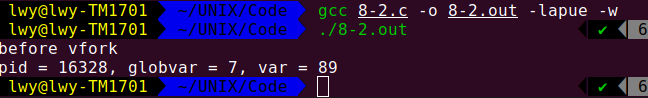
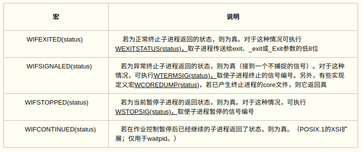
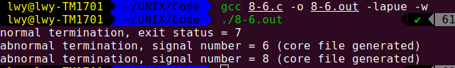
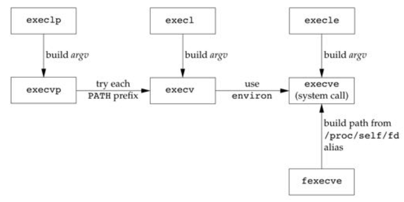
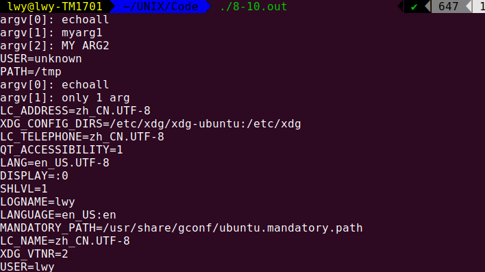
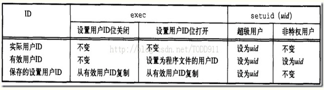
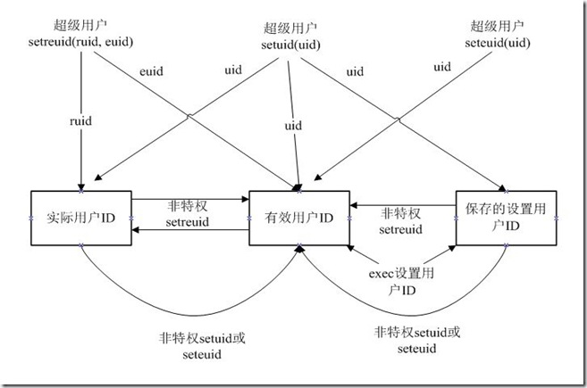
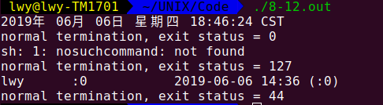
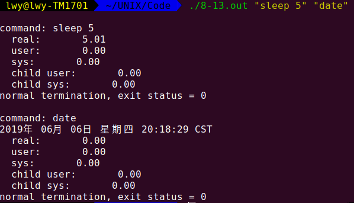

# 进程控制

本文介绍UNIX系统的进程控制，包括创建新进程(`fork`)、执行程序(`exec`)、和进程终止。还将说明进程属性的各种ID——实际、有效和保存的用户ID和组ID，以及它们如何受到进程控制原语的影响。还有`system`函数的介绍。<!--more-->

## 进程标识

每个进程都有一个非负整型表示唯一的进程ID。虽然是唯一的，但是进程ID是可复用的。当一个进程终止后，其进程ID就成为复用的候选者。系统中有一些专用进程，但具体细节随实现而不同。ID为0通常表示调度进程，即交换进程(swapper)，是内核的一部分，也称为系统进程，不执行任何磁盘操作。ID为1的进程为`init`进程，`init`进程不会终止，他是一个普通的用户进程（非内核中的系统进程），需要超级用户特权运行。获取标识符函数如下：

```c
#include <sys/types.h>
#include <unistd.h>

pid_t getpid(void);		//返回进程的进程ID
pid_t getppid(void);	//返回调用进程的父进程ID
gid_t getgid(void);     //返回调用进程的实际组ID
gid_t getegid(void);    //返回调用进程的有效组ID
uid_t getuid(void);     //返回调用进程的实际用户ID
uid_t geteuid(void);    //返回调用进程的有效用户ID
```

上述函数都没有出错返回。

## 函数fork

一个现有的进程可以调用`fork`函数创建一个新进程

```c
#include <sys/types.h>
#include <unistd.h>

pid_t fork(void);
// 子进程返回0，父进程返回子进程ID，若出错返回-1.调用一次返回两次
```

将子进程ID返回给父进程的理由:因为一个进程的子进程可以有多个，并且没有一个函数使一个进程可以获得其所有的子进程的进程ID。

使得子进程得到返回值0的理由:一个进程只会有一个父进程，所以子进程总是可以调用`getppid`以获得其父进程的进程ID（进程ID0总是由内核交换进程使用，所以一个子进程的进程ID不可能为0）。

由于在`fork`之后经常跟随着`exec`，所以现在的很多实现并不执行一个父进程数据段、栈和堆的完全复制。作为替代，使用了写时复制（Copy-On-Write，COW）技术。这些区域由父、子进程共享，而且内核将它们的访问权限改变为只读的。如果父、子进程中的任一个试图修改这些区域，则内核只为修改区域的那块内存制作一个副本，通常是虚拟存储器系统中的一“页”。

Linux 2.4.22提供了另一种新进程创建函数——`clone（2）`系统调用。这是一种`fork`的泛型，它允许调用者控制哪些部分由父、子进程共享。 创建新进程成功后，系统中出现两个基本完全相同的进程，这两个进程执行没有固定的先后顺序，哪个进程先执行要看系统的进程调度策略。

下列程序演示了`fork`函数

```c
#include "apue.h"

int globvar = 6; //external variable in initialized data
char buf[] = "a write to stdout\n";

int main(void){
    int var; //automatic variable on the stack
    pid_t pid;
    var = 88;
    if(write(STDOUT_FILENO,buf,sizeof(buf)-1)!=sizeof(buf)-1){
        err_sys("write error");
    }
    printf("before fork\n");
    if((pid=fork())<0){
        err_sys("fork error");
    }else if(pid==0){  //子进程
        globvar++;
        var++;
    }else{  // 父进程
        sleep(2);
    }
    printf("pid = %d, globvar = %d, var = %d\n",getpid(), globvar, var);
    exit(0);
}
```

结果：


当写到标准输出时，我们将`buf`长度减去1作为输出字节数，这是为了避免将终止`null`字节写出。`strlen`计算不包括终止`null`字节的字符串长度，而`sizeof`则计算包括终止`null`字节的缓冲区长度。两者之间的另一个差别是，使用`strlen`需进行一次函数调用，而对于`sizeof`而言，因为缓冲区已用已知字符串进行了初始化，其长度是固定的，所以`sizeof`在编译时计算缓冲区长度。

注意程序中`fork`与I/O函数之间的交互关系。`write`函数是不带缓冲的。因为在`fork`之前调用`write`，所以其数据写到标准输出一次。但是标准I/O库是带缓冲的（这里用到了标准I/O库的`printf`函数）。如果标准输出连到终端设备，则它是行缓冲的，否则它是全缓冲的。当以交互方式运行该程序时（此时是行缓冲的），只得到该`printf`输出的行一次，其原因是标准输出缓冲区在`fork`之前已由换行符冲洗。但是当将标准输出重定向到一个文件时（此时是全缓冲的），却得到`printf`输出行两次。其原因是，在`fork`之前调用了`printf`一次，但当调用`fork`时，该行数据仍在缓冲区中（我们没有用`fflush`冲洗缓冲区），然后在将父进程数据空间复制到子进程中时，该**缓冲区也被复制到子进程中**。**于是那时父、子进程各自有了带该行内容的标准I/O缓冲区**。在`exit`之前的第二个`printf`将其数据添加到现有的缓冲区中。**当每个进程终止时，最终会冲洗其缓冲区中的副本**。

**文件共享**

对上述需注意的另一点是：在重定向父进程的标准输出时，子进程的标准输出也被重定向。实际上，**`fork`的一个特性是父进程的所有打开文件描述符都被复制到子进程中。父、子进程的每个相同的打开描述符共享一个文件表项**。

考虑下述情况，一个进程具有三个不同的打开文件，它们是标准输入、标准输出和标准出错。在从`fork`返回时，我们有了如图所示的结构。


这种共享文件的方式使父、子进程对同一文件使用了一个文件偏移量。如果父、子进程写到同一描述符文件，但又没有任何形式的同步（例如使父进程等待子进程），那么它们的输出就会相互混合（假定所有的描述符是在fork之前打开的）。

**在fork之后处理文件描述符有两种常见的情况**：

- 父进程等待子进程完成。在这种情况下，父进程无需对其描述符做任何处理。当子进程终止后，它曾进行过读、写操作的任一共享描述符的文件偏移量已执行了相应的更新。
- 父、子进程各自执行不同的程序段。在这种情况下，在fork之后，父、子进程各自关闭它们不需要使用的文件描述符，这样就不会干扰对方使用的文件描述符。这种方法是网络服务进程中经常使用的

**父、子进程之间的区别是：**

- `fork`的返回值。
- 进程ID不同。
- 两个进程具有不同的父进程ID：子进程的父进程ID是创建它的进程的ID，而父进程的父进程ID则不变。
- 子进程的`tms_utime`、`tms_stime`、`tms_cutime`已经`tms_ustime`均被设置为0.
- 父进程设置的文件锁不会被子进程继承。
- 子进程的未处理的闹钟（`alarm`）被清除。
- 子进程的未处理信号集设置为空集。

使`fork`失败的两个主要原因是：**系统中已经有了太多的进程（通常意味着某个方面出了问题），或者该实际用户ID的进程总数超过了系统限制（CHILD_MAX）。**

**`fork`有下面两种用法：**

- 一个父进程希望复制自己，使父、子进程同时执行不同的代码段。这在网络服务进程中是常见的——父进程等待客户端的服务请求。当这种请求到达时，父进程调用`fork`，使子进程处理此请求。父进程则继续等待下一个服务请求到达。
- 一个进程要执行一个不同的程序。这对`shell`是常见的情况。在这种情况下，子进程从`fork`返回后立即调用`exec`。

某些操作系统将第二种用法中的两个操作（`fork`之后执行`exec`）组合成一个，并称其为`spawn`。UNIX将这两个操作分开，因为在很多场合需要单独使用`fork`，其后并不跟随`exec`。另外，将这两个操作分开，使得子进程在`fork`和`exec`之间可以更改自己的属性。例如I/O重定向、用户ID、信号安排等。

## 函数vfork

`vfork`函数的调用序列和返回值与`fork`相同，但两者的语义不同。

`vfork`用于创建一个新进程，而新进程的目的是`exec`一个新程序。`vfork`和`fork`一样都创建一个子进程，但是它并不将父进程的地址空间完全复制到子进程中，因为子进程会立即调用`exec`（或`exit`），于是也就不会存访该地址空间。相反，在子进程调用`exec`或`exit`之前，它在父进程的空间中运行。

`vfork`和`fork`之间的另一个区别是：`vfork`保证子进程先运行，在它调用`exec`或`exit`之后父进程才可能被调度运行。（如果在调用这两个函数之前子进程依赖于父进程的进一步动作，则会导致死锁。）

实例程序：

```c
#include "apue.h"
#include <unistd.h>
#include <sys/types.h>
#include <stdio.h>
int globvar = 6;

int main(void){
    int var;
    pid_t pid;
    var = 88;
    printf("before vfork\n");
    if((pid = vfork())<0){
        err_sys("vfork error");
    }else if(pid==0){ //child
        globvar++;   // modify variables
        var++;
        _exit(0);   // child terminates
    }
    // parent continues here
    printf("pid = %d, globvar = %d, var = %d\n",getpid(),globvar,var);
    exit(0);
}
```

程序执行结果为：



子进程最变量`glob`和`var`做增1操作，结果改变了父进程中的变量值。因为子进程在父进程的地址空间中运行。

注意，在该程序中，调用了`_exit`而不是`exit`。`_exit`并不执行标准I/O缓冲的冲洗操作。如果调用的是`exit`而不是`_exit`，则该程序的输出是不确定的。它依赖于标准I/O库的实现，我们可能会见到输出没有发生变化，或者发现没有出现父进程的`printf`输出。

如果子进程调用`exit`，而`exit`的实现只是冲洗所有标准I/O流，那么我们会见到输出与子进程调用`_exit`所产生的输出完全相同，没有任何区别。如果`exit`的实现除了冲洗所有标准I/O流之外，还关闭标准I/O流，那么表示标准输出`FILE`对象的相关存储区将被清0。因为子进程借用了父进程的地址空间，所以当父进程恢复运行并调用`printf`时，也就不会产生任何输出，`printf`返回-1。注意，父进程的`STDOUT_FILENO`仍旧有效，子进程得到的是父进程的文件描述符数组的副本。

建议不要使用`vfork`

## 函数exit

**进程有下面5种正常终止方式：**

（1）在`main`函数内执行`return`语句。这等效于调用`exit`。

（2）调用`exit`函数。此函数由ISO C定义，其操作包括调用各终止处理程序（终止处理程序在调用`atexit`函数时登记），然后关闭所有标准I/O流等。

（3）调用`_exit`或`_Exit`函数。ISO C定义`_Exit`，其目的是为进程提供一种无需运行终止处理程序或信号处理程序而终止的方法。对标准I/O流是否进行冲洗，这取决于实现。在UNIX系统中，`_Exit`和`_exit`是同义的，并不清洗标准I/O流。`_exit`函数由`exit`调用，它处理UNIX特定的细节。在大多数UNIX系统实现中，`exit(3)`是标准C库中的一个函数，而`_exit(2)`则是一个系统调用。

（4）进程的最后一个线程在其启动例程中执行返回语句。但是，该线程的返回值不会用作进程的返回值。当最后一个线程从其启动例程返回时，该进程以终止状态0返回。

（5）进程的最后一个线程调用`pthread_exit`函数。在这种情况下，进程终止状态总是0，这与传送给`pthread_exit`的参数无关。

**三种异常终止方式如下：**

（1）调用`abort`。它产生`SIGABRT`信号，这是下一种异常终止的特例。

（2）当进程接收到某些信号时。信号可由进程自身（例如调用`abort`函数）、其他进程或内核产生。

（3）最后一个线程对“取消”（`cancellation`）请求作出响应。按系统默认，“取消”以延迟方式发生：一个线程要求取消另一个线程，一段时间之后，目标线程终止。

不管进程如何终止，最后都会执行内核中的同一段代码。这段代码为相应进程关闭所有打开描述符，释放它所使用的存储器等。

对于上述任意一种终止情形，我们都希望终止进程能够通知其父进程它是如何终止的。对于三个终止函数（`exit`、`_exit`和`_Exit`），实现这一点的方法是，将其**退出状态（exit status**）作为参数传递给函数。在异常终止情况下，内核（不是进程本身）产生一个指示其异常终止原因的**终止状态（termination status**）。在任意一种情况下，该终止进程的父进程都能用`wait`或`waitpid`函数取得其终止状态。

注意，这里使用了“退出状态”（它是传向`exit`或`_exit`的参数，或`main`的返回值）和“终止状态”两个术语，以表示有所区别。在最后调用`_exit`时，内核将退出状态转换成终止状态。如果子进程正常终止，父进程可以获得子进程的退出状态。

在说明`fork`函数时，显而易见，子进程是在父进程调用`fork`后生成的。上面又说了子进程将其终止状态返回给父进程。但是**如果父进程在子进程之前终止，则将如何呢？**其回答是：对于父进程已经终止的所有进程，它们的父进程都改变为`init`进程。我们称这些进程由`init`进程领养。其操作过程大致如下：在一个进程终止时，内核逐个检查所有活动进程，以判断它是否是正要终止进程的子进程，如果是，则将该进程的父进程ID更改为1（`init`进程的ID）。这种处理方法保证了每个进程都有一个父进程。

另一个我们关心的情况是**如果子进程在父进程之前终止，那么父进程又如何能在做相应检查时得到子进程的终止状态呢？**对此问题的回答是：内核为每个终止子进程保存了一定量的信息，所以当终止进程的父进程调用`wait`或`waitpid`时，可以得到这些信息。这些信息至少包括进程ID、该进程的终止状态、以及该进程使用的CPU时间总量。内核可以释放终止进程所使用的所有存储区，关闭其所有打开文件。在UNIX术语中，一个已经终止，但是其父进程尚未对其进行**善后处理（使用wait获取终止子进程的有关信息，释放它仍占用的资源**）的进程称为**僵死进程（zombie**）。`ps(1)`命令将僵死进程的状态打印为Z。如果编写一个长期运行的程序，它调用`fork`产生了很多子进程，那么除非父进程等待取得子进程的终止状态，否则这些子进程终止后就会变成僵死进程。

最后一个要考虑的问题是：**一个由`init`进程领养的进程终止时会发生什么？它会不会变成一个僵死进程？**对此问题的回答是：“否”，因为`init`被编写成无论何时只要有一个子进程终止，`init`就会调用wait函数取得其终止状态。这样也就防止了在系统中有很多僵死进程。当提及“一个`init`的子进程”时，这指的可能是`init`直接产生的进程，也可能是其父进程已终止，由`init`领养的进程。

## 函数wait和waitpid

一个进程正常或异常终止时，内核就向其父进程发送`SIGCHLD`信号。因为子进程终止是个异步事件（这可以在父进程运行的任何时候发生），所以这种信号也是内核向父进程发的异步通知。父进程可以选择忽略该信号，或者提供一个该信号发生时即被调用执行的函数（信号处理程序）。对于这种信号的系统默认动作是忽略它）。

**调用wait或waitpid的进程可能会发生的情况：**

- 如果其所有子进程都还在运行，则阻塞。
- 如果一个子进程已终止，正等待父进程获取其终止状态，则取得该子进程的终止状态立即返回。
- 如果它没有任何子进程，则立即出错返回。

如果进程由于接收到`SIGCHLD`信号而调用`wait`，则可期望`wait`会立即返回。但是如果在任意时刻调用`wait`，则进程可能会阻塞。

```c
#include <sys/wait.h>

pid_t wait( int *statloc );
// 返回值：若成功则返回已终止子进程ID，若出错则返回-1

pid_t waitpid( pid_t pid, int *statloc, int options );
// 返回值：若成功则返回状态改变的子进程ID，若出错则返回-1，若指定了WNOHANG选项且pid指定的子进程状态没有发生改变则返回0
```

**这两个函数的区别如下：**

- 在一个子进程终止前，`wait`使其调用者阻塞，而`waitpid`有一个选项，可使调用者不阻塞。
- `waitpid`并不等待在其调用之后的第一个终止子进程，它有若干个选项，可以控制它所等待的进程。

如果一个子进程已经终止，并且是一个僵死进程，则`wait`立即返回并取得该子进程的状态，否则`wait`使其调用者阻塞直到一个子进程终止。如果调用者阻塞而且它有多个子进程，则在其一个子进程终止时，`wait`就立即返回。因为`wait`返回终止子进程的进程ID，所以它总能了解是哪一个子进程终止了。

这两个函数的参数`statloc`是一个整型指针。如果`statloc`不是一个空指针，则终止进程的终止状态就存放在它所指向的单元内。如果不关心终止状态，则可将该参数指定为空指针。

依据传统，这两个函数返回的整型状态字是由实现定义的。其中某些位表示退出状态（正常返回），其他位则指示信号编号（异常返回），有一位指示是否产生了一个`core`文件等。`POSIX.1`规定状态用定义在`<sys/wait.h>`中的各个宏来查看。有四个互斥的宏可用来取得进程终止的原因，它们的名字都以`WIF`开始。基于这四个宏中哪一个值为真，就可选用其他宏（下表说明栏中下划线标注的宏）来取得终止状态、信号编号等。这四个互斥的宏示于下表中。



下面函数用表中宏打印进程终止状态的说明。

```c
#include "apue.h"
#include <sys/wait.h>

void 
pr_exit(int status)
{
        if(WIFEXITED(status))
                printf("normal termination, exit status = %d\n",
                        WEXITSTATUS(status));
        else if(WIFSIGNALED(status))
                printf("abnormal termination, signal number = %d%s\n",
                        WTERMSIG(status),
#ifdef  WCOREDUMP
                WCOREDUMP(status) ? " (core file generated)" : "");
#else
                "");
#endif
        else if(WIFSTOPPED(status))
                printf("child stopped, signal number = %d\n",
                        WSTOPSIG(status));
}
```

演示不同的终止状态的各种值：

```c
#include "apue.h"
#include <sys/wait.h>

int main(void)
{
        pid_t   pid;
        int     status;

        if ((pid = fork()) < 0)
                err_sys("fork error");
        else if (pid == 0)
                exit(7);                /* child */

        if (wait(&status) != pid)       /* wait for child */
                err_sys("wait error");
        pr_exit(status);                /* and print its status */

        if ((pid = fork()) < 0)
                err_sys("fork error");
        else if (pid == 0)              /* child */
                abort();

        if (wait(&status) != pid)       /* wait for child */
                err_sys("wait error");
        pr_exit(status);                /* and print its status */

        if ((pid = fork()) < 0)
                err_sys("fork error");
        else if (pid == 0)              /* child */
                status /= 0;            /* divide by 0 generates SIGPE */

        if (wait(&status) != pid)       /* wait for child */
                err_sys("wait error");
        pr_exit(status);                /* and print its status */

        exit(0);
}
```

结果为：



不幸的是，没有一种可移植的方法将`WTERMSIG`得到的信号编号映射为说明性的名字。我们必须查看`<signal.h>`头文件才能知道`SIGABRT`的值是6，`SIGFPE`的值是8.

正如前面所述，如果一个进程有几个子进程，那么只要有一个子进程终止，`wait`就返回。**如果要等待一个指定的进程终止（如果知道要等待进程的ID），那么该如何做呢？**`POSIX.1`定义了`waitpid`函数以提供这种功能（以及其他一些功能）。

对于**`waitpid`函数中`pid`参数**的作用解释如下：

| pid值   | 作用                                                |
| ------- | --------------------------------------------------- |
| pid==-1 | 等待任一子进程。就这一方面而言，waitpid与wait等效。 |
| pid>0   | 等待其进程ID与pid相等的子进程。                     |
| pid==0  | 等待其组ID等于调用进程组ID的任一子进程。            |
| pid<-1  | 等待其组ID等于pid绝对值的任一子进程。               |

`waitpid`函数返回终止子进程的进程ID，并将该子进程的终止状态存放在由`status`指向的存储单元中。对于`wait`，其唯一的出错是调用进程没有子进程（函数调用被一个信号中断时，也可能返回另一种出错）。但是对于`waitpid`，如果指定的进程或进程组不存在，或者参数`pid`指定的进程不是调用进程的子进程则都将出错。

**options参数**使我们能进一步控制`waitpid`的操作。此参数可以是0，或者是下表中常量按位“或”运算的结果。

| 常量       | 说明                                                         |
| ---------- | ------------------------------------------------------------ |
| WCONTINUED | 若实现支持作业控制，那么由pid指定的任一子进程在暂停后已经继续，但其状态尚未报告，则返回其状态 |
| WNOHANG    | 若由pid指定的子进程并不是立即可用的，则waitpid不阻塞，此时其返回值为0 |
| WUNTRACED  | 若某实现支持作业控制，而由pid指定的任一子进程已处于暂停状态，并且其状态自暂停以来还未报告过，则返回其状态。WIFSTOPPED宏确定返回值是否对应于一个暂停子进程 |

**waitpid函数提供了wait函数没有提供的三个功能：**

（1）`waitpid`可等待一个特定的进程，而`wait`则返回任一终止子进程的状态。

（2）`waitpid`提供了一个`wait`的非阻塞版本。有时用户希望取得一个子进程的状态，但不想阻塞。

（3）`waitpid`支持作业控制（利用`WUNTRACED`和`WCONTINUED`选项）。

如果一个进程`fork`一个子进程，但不要等待子进程终止，也不希望子进程处于僵死状态直到父进程终止，实现这一要求的技巧是调用`fork`两次。

```c
#include "apue.h"
#include <sys/wait.h>

int
main(void)
{
        pid_t pid;

        if ((pid = fork()) < 0)
        {
                err_sys("fork error");
        }
        else if (pid == 0)              /* first child */
        {
                if ((pid = fork()) < 0)
                        err_sys("fork error");
                else if (pid > 0)
                        exit(0);        /* parent from second fork == first child */

                /*
                * We're the second child; our parent become init as soon
                * as our real parent calls exit() in the statement above.
                * Here's where we'd continue executing, knowing that when 
                * we're done, init will reap our status.
                */
                sleep(2);
                printf("second child, parent pid = %d\n", getppid());
                exit(0);
        }
        if (waitpid(pid, NULL, 0) != pid)       /* wait for first child */
                err_sys("waitpid error");

        /*
        * We're the parent ( the original process ); we continue executing,
        * knowing that we're not the parent of the second child. 
        */
        exit(0);
}
```

结果：

```shell
$ ./8-8.out
$ second child, parent pid = 1 // 不知道为什么在我的Ubuntu 18.04上进程id不是1。
```

## 函数waitid

Single UNIX Specification的XSI扩展包括了另一个取进程终止状态的函数——`waitid`，此函数类似于`waitpid`，但提供了更多的灵活性。

```c
#include <sys/wait.h>

int waitid( idtype_t idtype, id_t id, siginfo_t *infop, int options );
返回值：若成功则返回0，若出错则返回-1
```

与`waitpid`相似，`waitid`允许一个进程指定要等待的子进程。但它使用单独的参数表示要等待的子进程的类型，而不是将此与进程ID或进程组ID组合成一个参数。id参数的作用与`idtype`的值相关。该函数支持的`idtype`类型列出在下表中。

| 常量   | 说明                                                         |
| ------ | ------------------------------------------------------------ |
| P_PID  | 等待一个特定的进程：id包含要等待子进程的进程ID               |
| P_PGID | 等待一个特定进程组中的任一子进程：id包含要等待子进程的进程组ID |
| P_ALL  | 等待任一子进程：忽略id                                       |

options参数是下表中各标志的按位“或”。这些标志指示调用者关注哪些状态变化。

| 常量       | 说明                                                         |
| ---------- | ------------------------------------------------------------ |
| WCONTINUED | 等待一个进程，它以前曾被暂停，此后又已继续，但其状态尚未报告 |
| WEXITED    | 等待已退出的进程                                             |
| WNOHANG    | 如无可用的子进程退出状态，立即返回而非阻塞                   |
| WNOWAIT    | 不破坏子进程退出状态。该子进程退出状态可由后续的wait、waitid或waitpid调用取得 |
| WSTOPPED   | 等待一个进程，它已经暂停，但其状态尚未报告                   |

`infop`参数是指向`siginfo`结构的指针。该结构包含了有关引起子进程状态改变的生成信号的详细信息。

## wait3 和 wait4

大多数UNIX系统实现提供了另外两个函数`wait3`和`wait4`。它们提供的功能比`POSIX.1`函数`wait`、`waitpid`和`waitid`所提供的功能要多一个，这与附加参数`rusage`有关。该参数要求内核返回由终止进程及其所有子进程使用的资源汇总。

```c
#include <sys/types.h>
#include <sys/wait.h>
#include <sys/time.h>
#include <sys/resource.h>

pid_t wait3( int *statloc, int options, struct rusage *rusage );
pid_t wait4( pid_t pid, int *statloc, int options, struct rusage *rusage );
两个函数返回值：若成功则返回进程ID，若出错则返回-1
```

资源统计信息包括用户CPU时间总量、系统CPU时间总量、页面出错次数、接收到信号的次数等。有关细节请参阅`getrusage（2）`手册页。

## 竞争条件

当多个进程都企图对共享数据进行某种处理，而最后的结果又取决于进程运行的顺序时，则我们认为这发生了**竞争条件（race condition**）。如果在`fork`之后的某种逻辑显式或隐式地依赖于在`fork`之后是父进程先运行还是子进程先运行，那么`fork`函数就会是竞争条件活跃的滋生地。通常，我们不能预料哪一个进程先运行。即使知道哪一个进程先运行，那么在该进程开始运行后，所发生的事情也依赖于系统负载以及内核的调度算法。

如果一个进程希望等待一个子进程终止，则它必须调用一种`wait`函数。如果一个进程要等待其父进程终止，则可使用下列形式的循环：

```c
while (getppid() != 1)
    sleep(1);
```

这种形式的循环（称为**轮询（polling**））的问题是它浪费了CPU时间，因为调用者每隔1秒都被唤醒，然后再进行条件测试。

为了避免竞争条件和轮询，在多个进程之间需要有某种形式的信号发送和接收的方法。在UNIX中可以使用**信号机制**。也可使用各种形式的**进程间通信（IPC**）。

在父、子进程的关系中，常常出现下述情况：在调用`fork`之后，父、子进程都有一些事情要做。假如，要求每个进程在执行完它的一套初始化操作后要通知对方，并且在继续运行之前，要等待另一方完成其初始化操作。这种方案可以用代码描述如下：

```c
#include "apue.h"

TELL_WAIT();    /* set things up for TELL_xxx & WAIT_xxx */

if ((pid = fork()) < 0)
{
    err_sys("fork error");
}
else if (pid == 0)    /* child */
{
    /* child does whatever is necessary ... */

    TELL_PARENT( getppid() );    /* tell parent we're done */
    WAIT_PARENT();               /* and wait for parent */

    /* and the child continue on its way ... */
    exit( 0 );
}

/* parent does whatever is necessary ... */

TELL_CHILD( pid );        /* tell child we're done */
WAIT_CHILD();             /* and wait for child */

/* and the parent continues on its way ... */

exit( 0 );
```

假定在头文件`apue.h`中定义了各个需要使用的变量。5个例程TELL_WAIT、TELL_PARENT、TELL_CHILD、WAIT_PARENT以及WAIT_CHILD可以是宏，也可以是函数。

下列输出两个字符串：一个由子进程输出，另一个由父进程输出。因为输出依赖于内核使这两个进程运行的顺序及每个进程运行的时间长度，所以该程序包含了一个竞争条件。

```c
#include "apue.h"
static void charatatime(char*);

int main(void){
    pid_t pid;
+   TELL_WAIT();
    if((pid=fork())<0){
        err_sys("fork error");
    }
    else if(pid == 0){
+     	WAIT_PARENT();    /* parent goes first */
        charatatime("output from child\n");
    }
    else{
        //sleep(1);
        charatatime("output from parent\n");
+   	TELL_CHILD( pid );
    }
    exit(0);
}

static void charatatime(char* str){
    char* ptr;
    int c;
    setbuf(stdout,NULL);
    for(ptr=str;(c=*ptr++)!=0;)
        putc(c,stdout);
}
```

`fork()`系统调用后，发现`Fedora` 是先执行子进程，`ubuntu`是先执行父进程，所以上述程序的结果在我的`ubuntu`上永远是父进程先。

代码中添加+号的代码之后，就会解除竞争条件让父进程先执行。

## 函数exec

用`fork`函数创建子进程后，子进程往往要调用一种`exec`函数以执行另一个程序。当进程调用一种`exec`函数时，该进程执行的程序完全替换为新程序，而新程序则从其`main`函数开始执行。因为调用`exec`并不创建新进程，所以前后的进程ID并未改变。`exec`只是用一个全新的程序替换了当前进程的正文、数据、堆和栈段。

有6种不同的`exec`函数可供使用，它们常常被统称为`exec`函数。这些`exec`函数使得UNIX进程控制原语更加完善。用`fork`可以创建新进程，用`exec`可以执行新程序。`exit`函数和两个`wait`函数处理终止和等待终止。这些是我们需要的基本的进程控制原语。

```c
#include <unistd.h>

int execl( const char *pathname, const char *arg0, ... /* (char *)0 */ );

int execv( const char *pathname, char *const argv[] );

int execle( const char *pathname, const char *arg0, ... /* (char *)0, char *const envp[] */ );

int execve( const char *pathname, char *const argv[], char *const envp[] );

int execlp( const char *filename, const char *arg0, ... /* (char *)0 */ );

int execvp( const char *filename, char *const argv[] );

6个函数返回值：若出错则返回-1，若成功则不返回值
```

这些函数之间的**第一个区别是前4个取路径名作为参数，后两个（execlp和execvp，p表示PATH，个人理解）则取文件名作为参数**。**当指定filename作为参数时**：

- 如果filename中包含了/，则将其视为路径名。
- 否则就按PATH环境变量，在它所指定的各目录中搜寻可执行文件。

PATH变量包含了一张目录表（称为路径前缀），目录之间用冒号（：）分隔。例如name = value环境字符串：

PATH=/bin：/usr/bin：/usr/local/bin/：.

指定在4个目录中进行搜索。最后的路径前缀（.）表示当前目录。（零长前缀也表示当前目录。在value的开始处可用：表示，在行中间则要用：：表示，在行尾则以：表示。）

如果`execlp`或`execvp`使用路径名前缀中的一个找到了一个可执行文件，但是该文件不是由连接编辑器产生的机器可执行文件，则认为该文件是一个shell脚本，于是试着调用/bin/sh，并以该filename作为shell的输入。

**第二个区别与参数表的传递有关（l表示list，v表示矢量vector）。**函数`execl`、`execlp`和`execle`要求将新程序的每个命令行参数都说明为一个单独的参数。这种参数表以空指针结尾。对于另外三个函数（`execv`、`execvp`和`execve`），则应先构造一个指向各参数的指针数组，然后将该数组地址作为这三个函数的参数。

在ISO C原型之前，对`execl`、`execle`和`execlp`这三个函数表示命令行参数的一般方法是：

`char *arg0, char *arg1, …, char *argn, (char *)0`

应当特别指出的是：在最后一个命令行参数之后跟了一个空指针。如果用常数0来表示一个空指针，则必须将它强制转换为一个字符指针，否则将它解释为整型参数。如果一个整型数的长度与`char *`的长度不同，那么`exec`函数的实际参数就将出错。

**最后一个区别与向新程序传递环境表相关。**以e结尾的两个函数（`execle`和`execve`）可以传递一个指向环境字符串指针数组的指针。其他四个函数则使用调用进程中的environ变量为新程序复制现有的环境。通常，一个进程允许将其环境传播给其子进程，但有时也有这种情况，即进程想要为子进程指定某一个确定的环境。

在使用ISO C原型之前，`execle`的参数是：

`char *pathname, char *arg0, …, char *argn, (char *)0, char *envp[]`

从中可见，最后一个参数是指向环境字符串的各字符指针构成的数组的地址。而ISO C原型中，所有命令行参数、空指针和`envp`指针都用省略号（...）表示。

这6个`exec`函数名中的字符说明：字母p表示该函数取filename作为参数，并且用PATH环境变量寻找可执行文件。字母l表示该函数取一个参数表，它与字母v互斥。字母v表示该函数取一个`argv[]`矢量。字母e表示该函数取`envp[]`数组，而不使用当前环境。

在执行`exec`后，进程ID没有改变。除此之外，执行新程序的进程还保持了原进程的下列特征：

- 进程ID和父进程ID。
- 实际用户ID和实际组ID。
- 附加组ID。
- 进程组ID。
- 会话ID。
- 控制终端。
- 闹钟尚余留的时间。
- 当前工作目录。
- 根目录。
- 文件模式创建屏蔽字。
- 文件锁。
- 进程信号屏蔽。
- 未处理信号。
- 资源限制。
- `tms_utime、tms_stime、tms_cutime`以及`tms_cstime`值。

对打开文件的处理与每个描述符的执行时关闭（close-on-exec）标志值有关。**进程中每个打开描述符都有一个执行时关闭标志。若此标志设置，则在执行exec时关闭该描述符，否则该描述符仍打开。**除非特地用`fcntl`设置了该标志，否则系统默认操作是在执行`exec`后仍保持这种描述符打开。

**POSIX.1明确要求在执行exec时关闭打开的目录流**。这通常是`opendir`函数实现的，它调用`fcntl`函数为对应于打开目录流的描述符设置执行时关闭标志。

注意，在执行`exec`前后实际用户ID和实际组ID保持不变，而有效ID是否改变则取决于所执行程序文件的设置用户ID位和设置组ID位是否设置。如果新程序的设置用户ID位已设置，则有效用户ID变成程序文件所有者的ID，否则有效用户ID不变。对组ID的处理方式与此相同。

在很多UNIX实现中，这6个函数中只有`execve`是内核的系统调用。另外5个只是库函数，它们最终都要调用该系统调用。6个`exec`函数的关系如下图。




程序实例如下：

```c
#include "apue.h"
#include <sys/wait.h>

char *env_init[] = { "USER=unknown", "PATH=/tmp", NULL };

int
main(void)
{
        pid_t   pid;

        if((pid = fork()) < 0)
        {
                err_sys("fork error");
        }
        else if(pid == 0) /*specify pathname, specify environment */
        {
                if(execle("/home/lwy/UNIX/Code/echoall.out",
                          "echoall", "myarg1", "MY ARG2", (char *)0, env_init) < 0)
                        err_sys("execle error");
        }

        if(waitpid(pid, NULL, 0) < 0)
                err_sys("wait error");

        if((pid = fork()) < 0)
        {
                err_sys("fork error");
        }
        else if(pid == 0) /* specify filename, inherit environment */
        {
                if(execlp("/home/lwy/UNIX/Code/echoall.out", "echoall", 
                          "only 1 arg", (char *)0) < 0)
                        err_sys("execlp error");
        }

        exit(0);
}
```

注意，我们将第一个参数（新程序中的`argv[0]`）设置为路径名的文件名分量。某些shell将此参数设置为完整的路径名。这只是一个惯例。**我们可将`argv[0]`设置为任何字符串。**

程序中要执行的程序`echoall`示于下面。这是一个很普通的程序，它回送其所有命令行参数及全部环境表。

```C
#include "apue.h"

int
main(int argc, char *argv[])
{
        int         i;
        char        **ptr;
        extern char **environ;

        for(i=0; i<argc; i++)   /* echo all command-line args */
                printf("argv[%d]: %s\n", i, argv[i]);

        for(ptr = environ; *ptr != 0; ptr++)    /*and all env strings */
                printf("%s\n", *ptr);

        exit(0);
}

```

结果如下：



## 更改用户ID和更改组ID

在UNIX系统中，**特权**（例如能改变当前日期的表示法以及访问控制（例如，能否读、写一特定文件））**是基于用户ID和组ID的**。当程序需要增加特权，或需要访问当前并不允许访问的资源时，我们需要更换自己的用户ID或组ID，使得新ID具有合适的特权或访问权限。与此类似，当程序需要降低其特权或阻止对某些资源的访问时，也需要更换用户ID或组ID，从而使新ID不具有相应特权或访问这些资源的能力。

一般而言，在设计应用程序时，我们总是试图使用**最小特权（least privilege）模型**。依照此模型，我们的程序应当只具有为完成给定任务所需的最小特权。这减少了安全性受到损害的可能性。

可以用`setuid`函数设置实际用户ID和有效用户ID。与此类似，可以用`setgid`函数设置实际组ID和有效组ID。

```c
#include <unistd.h>
int setuid( uid_t uid );
int setgid( gid_t gid );
两个函数返回值：若成功则返回0，若出错则返回-1

```

关于谁能更改ID有若干规则。现在先考虑**有关改变用户ID的规则**（关于用户ID所说明的一切都适用于组ID）。

（1）若进程具有超级用户特权，则`setuid`函数将实际用户ID、有效用户ID，以及保存的设置用户ID设置为`uid`。

（2）若进程没有超级用户特权，但是`uid`等于实际用户ID或保存的设置用户ID，则`setuid`只将有效用户ID设置为`uid`。不改变实际用户ID和保存的设置用户ID。

（3）如果上面两个条件都不满足，则将`errno`设置为`EPERM`，并返回-1。

**关于内核所维护的三个用户ID，还要注意下列几点：**

（1）只有超级用户进程可以更改实际用户ID。

（2）仅当对程序文件设置了设置用户ID位时，`exec`函数才会设置有效用户ID。如果设置用户ID位没有设置，则`exec`函数不会改变有效用户ID，而将其维持为原先值。任何时候都可以调用`setuid`，将有效用户ID设置为实际用户ID或保存的设置用户ID（也只会在这两个ID之间切换）。自然，不能将有效用户ID设置为任意随机值。

（3）保存的设置用户ID是由`exec`复制有效用户ID得来的。如果设置了文件的设置用户ID位，则在`exec`根据文件的用户ID设置了进程的有效用户ID以后，就将这个副本保存起来。

注意，`getuid`和`geteuid`函数只能获得实际用户ID和有效用户ID的当前值。我们不能获得所保存的设置用户ID的当前值。

- **实际用户ID和实际组ID标识我们究竟是谁（执行这个程序的用户和组）**。这两个字段在登录时取自口令文件中的登录项。通常，在一个登录会话间这些值并不改变，但是超级用户进程有方法改变它们。
- **有效用户ID，有效组ID以及附加组ID决定了我们的文件访问权限。**
- **保存设置用户ID和保存设置组ID在执行一个程序时包含了有效用户ID和有效组ID的副本**。



上图显示了改变三个用户ID的不同方法

**1、setreuid和setregid函数**

功能是交换实际用户ID（组ID）和有效用户ID（组ID）的值。

```c
#include <unistd.h>
int setreuid( uid_t ruid, uid_t euid );
int setregid( gid_t rgid, gid_t egid );
两个函数返回值：若成功则返回0，若出错则返回-1
```

如若其中任一参数的值为-1，则表示相应的ID应当保持不变。

相关规则很简单：一个非特权用户总能交换实际用户ID和有效用户ID。这就允许一个设置用户ID程序转换成只具有普通用户的普通权限，以后又可再次转换回设置用户ID所得到的额外权限。

**2、seteuid和setegid函数**

类似于setuid和setgid，但只更改有效用户ID和有效组ID。

```C
#include <unistd.h>
int seteuid( uid_t uid );
int setegid( gid_t gid );
两个函数返回值：若成功则返回0，若出错则返回-1
```

一个非特权用户可将其有效用户ID设置为其实际用户ID或其保存的设置用户ID。对于一个特权用户，则可将其有效用户ID设置为`uid`。（这有别于`setuid`函数，它会更改所有三个用户ID）。



**3、组ID**

关于用户ID所说明的一切都适用于组ID。**附加组ID不受`setgid`、`setregid`或`setegid`函数的影响。**

## 函数sytem

ISO C定义了`system`函数，但是其操作对系统的依赖性很强。`POSIX.1`包括了`system`接口，它扩展了ISO C定义，以描述`system`在`POSIX.1`环境中的运行行为。

```C
#include <stdlib.h>
int system( const char *cmdstring );
```

如果`cmdstring`是一个空指针，则仅当命令处理程序可用时，`system`返回非0值，这一特征可以确定在一个给定的操作系统上是否支持system函数。在UNIX中，`system`总是可用的。

因为`system`在其实现中调用了`fork`、`exec`和`waitpid`，因此有**三种返回值**：

（1）如果`fork`失败或者`waitpid`返回除`EINTR`之外的出错，则`system`返回-1，并且在`errno`中设置相应的错误类型值。

（2）如果`exec`失败（表示不能执行shell），则其返回值如同shell执行了`exit（127）`一样。

（3）否则所有三个函数（`fork`、`exec`和`waitpid`）都执行成功，并且`system`的返回值是shell的终止状态，其格式已在`waipid`中说明。

```c
#include <sys/wait.h>
#include <errno.h>
#include <unistd.h>
//#include "apue.h"

int main(const char *cmdstring)
{
    pid_t pid;
    int status;
    if (cmdstring == NULL)
        return (1);
    if ((pid = fork()) < 0)
        status = -1;
    else if (pid == 0)
    { //子进程
        // 执行shell程序
        if (execl("bin/sh", "sh", "-c", cmdstring, (char *)0) < 0)
            _exit(127); // execl error
    }
    else
    {    // 父进程
        while (waitpid(pid, &status, 0) < 0)
        {
            if (errno != EINTR)
            {
                status = -1; //error other than EINTR from waitpid()
                break;
            }
        }
    }
   return(status);
}
```

shell的-c选项告诉shell程序取下一个命令行参数（在这里是`cmdstring`）作为命令输入（而不是标准输入或从一个给定的文件中读命令）。shell对以null字符终止的命令字符串进行语法分析，将它们分成命令行参数（如果不使用shell执行此命令，而是试图由我们自己去执行它，那么将相当困难）。传递给shell的实际命令字符串可以包含任一有效的shell命令。

注意，我们调用`_exit`而不是`exit`。这是为了防止任一标准I/O缓冲区（这些**缓冲区会在`fork`中由父进程复制给子进程**）在子进程中被冲洗。

调用system函数：

```c
#include "apue.h"
#include <sys/wait.h>

int main(void){
    int status;
    if((status=system("date")<0))
        err_sys("system() error");
    pr_exit(status);
    if((status=system("nosuchcommand"))<0)
        err_sys("system() error");
    pr_exit(status);
    if((status=system("who; exit 44"))<0)
        err_sys("system() error");
    pr_exit(status);
    exit(0);
}
```

结果：



**使用system而不是直接使用fork和exec的优点是：system进行了所需的各种出错处理，以及各种信号处理**（在带信号处理的system版本中）。 

**设置用户ID程序**

如果在一个设置用户ID程序中调用system，那么会发生什么呢？这是一个安全性方面的漏洞，决不应当这样做。

**如果一个进程正以特殊的权限（设置用户ID或设置组ID）运行，它又想生成另一个进程执行另一个程序，则它应当直接使用fork和exec，而且在fork之后、exec之前要改回到普通权限。设置用户ID或设置组ID程序决不应调用system函数。**

## Linux中的终端、控制台、tty、pty等概念

**基本概念：**

- **tty(终端设备的统称**):

  tty一词源于**teletypes，或者teletypewriters**，原来指的是电传打字机，是通过串行线用打印机键盘阅读和发送信息的东西，后来这东西被键盘与显示器取代，所以现在叫终端比较合适。

  **终端是一种字符型设备，它有多种类型，通常使用tty来简称各种类型的终端设备**。

- **pty（伪终端，虚拟终端**):

  但是如果我们远程telnet到主机或使用xterm时不也需要一个终端交互么？是的，这就是虚拟终端pty(pseudo-tty)

- pts/ptmx(pts/ptmx结合使用，进而实现pty):

  pts(pseudo-terminal slave)是pty的实现方法，与ptmx(pseudo-terminal master)配合使用实现pty。

**在Linux系统的设备特殊文件目录/dev/下，终端特殊设备文件一般有以下几种：**

- **串行端口终端(/dev/ttySn)**

  **串行端口终端(Serial Port Terminal)是使用计算机串行端口连接的终端设备。**计算机把每个串行端口都看作是一个字符设备。有段时间这些串行端口设备通常被称为终端设备，因为那时它的最大用途就是用来连接终端。**这些串行端口所对应的设备名称是/dev/tts/0(或/dev/ttyS0), /dev/tts/1(或/dev/ttyS1)等，设备号分别是(4,0), (4,1)等，分别对应于DOS系统下的COM1、COM2等。若要向一个端口发送数据，可以在命令行上把标准输出重定向到这些特殊文件名上即可**。例如，在命令行提示符下键入：`echo test > /dev/ttyS1`会把单词”test”发送到连接在ttyS1(COM2)端口的设备上。

- **伪终端(/dev/pty/)**

  **伪终端(Pseudo Terminal)是成对的逻辑终端设备(即master和slave设备, 对master的操作会反映到slave上)。**

  例如/dev/ptyp3和/dev/ttyp3(或者在设备文件系统中分别是/dev/pty/m3和 /dev/pty/s3)。**它们与实际物理设备并不直接相关。如果一个程序把ptyp3(master设备)看作是一个串行端口设备，则它对该端口的读/ 写操作会反映在该逻辑终端设备对应的另一个ttyp3(slave设备)上面。**而ttyp3则是另一个程序用于读写操作的逻辑设备。telnet主机A就是通过“伪终端”与主机A的登录程序进行通信。

- **控制终端(/dev/tty**)

  控制终端是指能够控制一个、套设备或者几套设备的终端控制器。

  **如果当前进程有控制终端(Controlling Terminal)的话，那么/dev/tty就是当前进程的控制终端的设备特殊文件**。可以使用命令”ps –ax”来查看进程与哪个控制终端相连。**对于你登录的shell，/dev/tty就是你使用的终端，设备号是(5,0)。**使用命令”tty”可以查看它具体对应哪个实际终端设备。/dev/tty有些类似于到实际所使用终端设备的一个联接。

- **控制台终端(/dev/ttyn, /dev/console)**

  **在Linux 系统中，计算机显示器通常被称为控制台终端 (Console**)。它仿真了类型为Linux的一种终端(TERM=Linux)，**并且有一些设备特殊文件与之相关联：tty0、tty1、tty2 等**。**当你在控制台上登录时，使用的是tty1**。使用Alt+[F1—F6]组合键时，我们就可以切换到tty2、tty3等上面去。**tty1–tty6等称为虚拟终端，而tty0则是当前所使用虚拟终端的一个别名**，系统所产生的信息会发送到该终端上（这时也叫控制台终端）。因此不管当前正在使用哪个虚拟终端，系统信息都会发送到控制台终端上。/dev/console即控制台，是与操作系统交互的设备，系统将一些信息直接输出到控制台上。目前**只有在单用户模式下，才允许用户登录控制台**。

- **虚拟终端(/dev/pts/n)**

  **在Xwindows模式下（图形界面下）的伪终端.**如我在Kubuntu下用konsole，就是用的虚拟终端，用tty命令可看到/dev/pts/1。

- 其它类型

  Linux系统中还针对很多不同的字符设备存在有很多其它种类的终端设备特殊文件。例如针对ISDN设备的/dev/ttyIn终端设备等。这里不再赘述。

**tty设备包括:**

 虚拟控制台，串口以及伪终端设备。

/dev/tty代表当前tty设备，在当前的终端中输入 echo “hello” > /dev/tty ，都会直接显示在当前的终端中。

## 进程时间

**任一进程都可调用times函数以获得它自己及已终止子进程的墙上时钟时间、用户CPU时间和系统CPU时间**

```c
#include <sys/times.h>
clock_t times( struct tms *buf );
返回值：若成功则返回流逝的墙上时钟时间（单位：时钟滴答数），若出错则返回-1
```

此函数填写由`buf`指向的`tms`结构，该结构定义如下：

```c
struct tms {
    clock_t    tms_utime;    /* user CPU time */
    clock_t    tms_stime;    /* system CPU time */
    clock_t    tms_cutime;    /* user CPU time, terminated children */
    clock_t    tms_cstime;    /* system CPU time, terminated children */
};
```

注意，此结构没有包含墙上时钟时间的任何测量值。作为替代，**`times`函数返回墙上时钟时间作为其函数值**。**此值是相对于过去的某一时刻测量的，所以不能用其绝对值，而必须使用其相对值。**例如，调用`times`，保存其返回值。在以后某个时间再次调用`times`，从新的返回值中减去以前的返回值，此差值就是墙上时钟时间。

该结构中两个针对子进程的字段包含了此进程用`wait`、`waitpid`或`waitid`已等待到的各个子进程的值。

所有由此函数返回的`clock_t`值都用`_SC_CLK_TCK`（由`sysconf`函数返回的每秒钟滴答数）变换成秒数。

实例：

```c
#include "apue.h"
#include <sys/times.h>

static void pr_times(clock_t, struct tms *, struct tms *);
static void do_cmd(char *);

int main(int argc, char *argv[])
{
    int     i;
    
    setbuf(stdout, NULL);
    for(i=1; i<argc; i++)
    {
        do_cmd(argv[i]);    /* once for each command-line arg */
    }
    exit(0);
}

static void
do_cmd(char *cmd)    /* execute and time the "cmd" */
{
    struct tms tmsstart, tmsend;
    clock_t    start, end;
    int     status;

    printf("\ncommand: %s\n", cmd);

    if((start = times(&tmsstart)) == -1)    /* starting values */
        err_sys("times error");

    if((status = system(cmd)) < 0)    /* execute command */
        err_sys("system error");

    if((end = times(&tmsend)) == -1)    /* ending values */
        err_sys("times error");

    pr_times(end-start, &tmsstart, &tmsend);
    pr_exit(status);
}

static void
pr_times(clock_t real, struct tms *tmsstart, struct tms *tmsend)
{
    static long    clktck = 0;
    
    if(clktck ==0)    /* fetch clock ticks per second first time */
        if((clktck = sysconf(_SC_CLK_TCK)) < 0)
            err_sys("sysconf error");
    printf("  real:    %7.2f\n", real / (double)clktck);
    printf("  user:    %7.2f\n", 
        (tmsend->tms_utime - tmsstart->tms_utime) / (double)clktck);
    printf("  sys:    %7.2f\n", 
        (tmsend->tms_stime - tmsstart->tms_stime) / (double)clktck);
    printf("  child user:    %7.2f\n", 
        (tmsend->tms_cutime - tmsstart->tms_cutime) / (double)clktck);
    printf("  child sys:    %7.2f\n", 
        (tmsend->tms_cstime - tmsstart->tms_cstime) / (double)clktck);
}
```

结果：



