# 进程间通信（IPC）

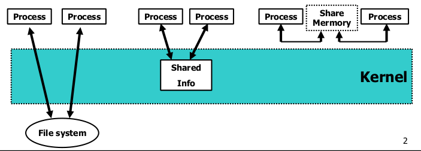

进程之间相互通信的技术——**IPC（InterPorcess Communication**）。

UNIX系统IPC类型细分有以下9种：

- **半双工管道**
- **FIFO**
- **全双工管道**
- **命名全双工管道**
- **消息队列**
- **信号量**
- **共享存储**
- **套接字 **
- **STREAMS**

前7种IPC通常限于同一台主机的各个进程间的IPC。

最后两种IPC，即套接字和STREAMS，是仅有的两种支持不同主机上各个进程间IPC的类型。

## 管道（Pipes）

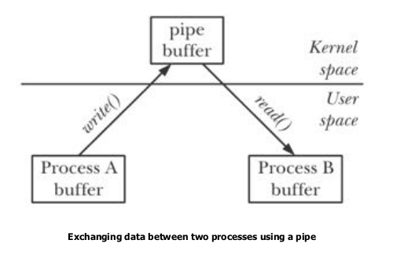

管道是UNIX系统IPC的最古老的形式，并且所有UNIX系统都提供此种通信机制。**管道有下面两种局限性：**

（1）**历史上，它们是半双工的（即数据只能在一个方向上流动**）。现在，某些系统提供全双工管道，但是为了最佳的可移植性，我们决不应预先假定系统使用此特性。

（2）**它们只能在具有公共祖先的进程之间使用。**通常，一个管道由一个进程创建，然后该进程调用fork，此后父、子进程之间就可应用该管道。

（FIFO没有第二种局限性，UNIX域套接字和命名流管道则没有这两种局限性。）

尽管有这两种局限性，半双工管道仍是最常用的IPC形式。每当你在管道线中键入一个由shell执行的命令序列时，shell为每一条命令单独创建一进程，然后将前一条命令进程的标准输出用管道与后一条命令的标准输入相连接。

**管道是由调用pipe函数而创建的：**

```c
#include <unistd.h>
int pipe(int filedes[2]);
// 返回值：若成功则返回0，若出错则返回-1
```

经由参数`filedes`返回的两个文件描述符：`filedes[0]`为读而打开，`filedes[1]`为写而打开。`filedes[1]`的输出是`filedes[0]`的输入。

POSIX.1允许实现支持全双工管道。对于这些实现，`filedes[0]`和`filedes[1]`以读/写方式打开。

有两种方式来描绘一个半双工管道，见下图。左半图显示了管道的两端在一个进程中相互连接，右半图则说明数据通过内核在管道中流动。

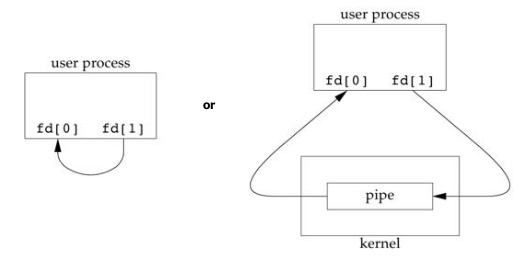

stat函数（见<http://www.cnblogs.com/nufangrensheng/p/3501385.html>）对管道的每一端都返回一个FIFO类型的文件描述符，可以用`S_ISFIFO()`宏来测试管道。

POSIX.1规定stat结构的st_size成员对于管道是未定义的。但是当fstat函数应用于管道读端的文件描述符时，很多系统在st_size中存放管道中可用于读的字节数。但是，这是不可移植的。

单个进程中的管道几乎没有任何用处。**通常，调用pipe的进程接着调用fork，这样就创建了从父进程到子进程（或反向）的IPC通道**。下图显示了这种情况。

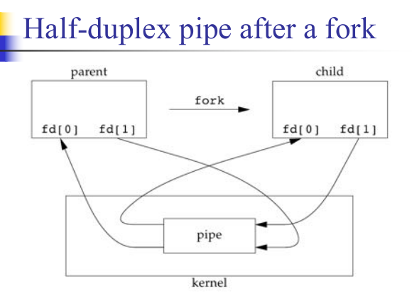

调用fork之后做什么取决于我们想要有的数据流的方向。**对于从父进程到子进程的管道，父进程关闭管道的读端（fd[0]），子进程则关闭写端（fd[1]）。**下图显示了在此之后描述符的安排。

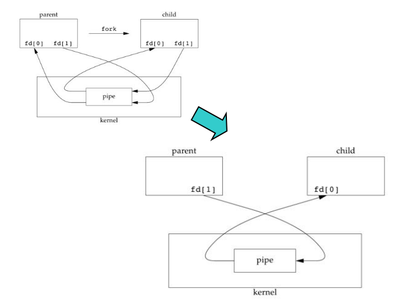

**为了构造从子进程到父进程的管道，父进程关闭fd[1]，子进程关闭fd[0]。**

**当管道的一端被关闭后，下列两条规则其作用：**

**（1）当读一个写端已被关闭的管道时，在所有数据都被读取后，read返回0，以指示达到了文件结尾处。（**从技术方面考虑，管道的写端还有进程时，就不会产生文件的结束。可以复制一个管道的描述符，使得有多个进程对它具有写打开文件描述符。但是，通常一个管道只有一个读进程、一个写进程。而对于一个单一的FIFO常常有多个写进程。）

**（2）如果写一个读端已被关闭的管道，则产生信号SIGPIPE。如果忽略该信号或者捕捉该信号并从其处理程序返回，则write返回-1，errno设置为EPIPE。**

**在写管道（或FIFO）时，常量PIPE_BUF规定了内核中管道缓冲区的大小。如果对管道调用write，而且要求写的字节数小于等于PIPE_BUF，则此操作不会与其他进程对同一管道（或FIFO）的write操作穿插进行（当然，其他进程要求写的字节数也都小于等于PIPE_BUF）。但是，若有多个进程同时写一个管道（或FIFO），而且有进程（一个或几个）要求写的字节数超过PIPE_BUF字节数时，则写操作的数据可能相互穿插。**用pathconf或fpathconf函数（见<http://www.cnblogs.com/nufangrensheng/p/3496323.html>中表6）可以确定PIPE_BUF的值。

程序清单15-1创建了一个从父进程到子进程的管道，并且父进程经由该管道向子进程传送数据。

**程序清单15-1 经由管道父进程向子进程传送数据**

```c
#include "apue.h"

int
main(void)
{
    int      n;
    int      fd[2];
    pid_t    pid;
    char     line[MAXLINE];

    if(pipe(fd) < 0)
        err_sys("pipe error");
    if((pid = fork()) < 0)
    {
        err_sys("fork error");
    }
    else if(pid > 0)    /* parent */
    {
        close(fd[0]);
        write(fd[1], "hello world\n", 12);
    }
    else    /* child */
    {
        close(fd[1]);
        n = read(fd[0], line, MAXLINE);
        write(STDOUT_FILENO, line, n);
    }
    exit(0);
}
```

在上面的例子中，直接对管道描述符调用read和write。更好的方法是将管道描述符复制为标准输入和标准输出。在此之后通常子进程执行另一个程序，该程序或者从标准输入（已创建的管道）读数据，或者将数据写至其标准输出（该管道）。

**实例**

试编写一个程序，其功能是每次一页显示已产生的输出。已经有很多UNIX系统实用程序具有分页功能，因此无需再构造一个新的分页程序，而是调用用户最喜爱的分页程序。为了避免先将所有数据写到一个临时文件中，然后在调用系统中有关程序显示该文件，我们希望将输出通过管道直接送到分页程序。为此，先创建一个管道，调用fork产生一个子进程，使子进程的标准输入成为管道的读端，然后调用exec，执行用户喜爱的分页程序。程序清单15-2显示了如何实现这些操作。（本例要求在命令行中有一个参数说明要显示文件的名称。通常，这种类型的程序要求在终端上显示的数据已经在存储器中。）

**程序清单15-2 将文件复制到分页程序**

```c
#include "apue.h"
#include <sys/wait.h>

#define DEF_PAGER    "/bin/more"    /* default pager program */

int
main(int argc, char *argv[])
{
    int      n;
    int      fd[2];
    pid_t    pid;
    char    *pager, *argv0;
    char     line[MAXLINE];
    FILE    *fp;

    if(argc != 2)
        err_quit("usage: a.out <pathname>");

    if((fp = fopen(argv[1], "r")) == NULL)
        err_sys("can't open %s", argv[1]);
    if(pipe(fd) < 0)
        err_sys("pipe error");

    if((pid = fork()) < 0)
    {
        err_sys("fork error");
    }
    else if(pid > 0)    /* parent */
    {
        close(fd[0]);    /* close read end */
        
        /* parent copies argv[1] to pipe */
        while(fgets(line, MAXLINE, fp) != NULL)
        {
            n = strlen(line);
            if(write(fd[1], line, n) != n)
                err_sys("write error to pipe");
        }
        if(ferror(fp))
            err_sys("fgets error");

        close(fd[1]);    /* close write end of pipe for reader */
        
        if(waitpid(pid, NULL, 0) < 0)
            err_sys("waitpid error");
        
        exit(0);    
    }
    else            /* child */
    {
        close(fd[1]);    /* close write end */
        if(fd[0] != STDIN_FILENO)
        {
            if(dup2(fd[0], STDIN_FILENO) != STDIN_FILENO)
                err_sys("dup2 error to stdin");
            close(fd[0]);    /* don't need this after dup2 */
        }
    
        /* get arguments for execl() */
        if((pager = getenv("PAGER")) == NULL)    
            pager = DEF_PAGER;
        if((argv0 = strrchr(pager, '/')) != NULL)
            argv0++;        /* step past rightmost slash */
        else
            argv0 = pager;        /* no slash in pager */
        
        if(execl(pager, argv0, (char *)0) < 0)
            err_sys("execl error for %s", pager);
    }
    exit(0);
}
```

在调用fork之前先创建一个管道。fork之后父进程关闭其读端，子进程关闭其写端。子进程然后调用dup2，使其标准输入成为管道的读端。当执行分页程序时，其标准输入将是管道的读端。

当我们将一个描述符复制到另一个时（在进程中，fd[0]复制到标准输入），应当注意在复制之前该描述符的值并不是所希望的值。如果该描述符已经具有所希望的值，并且我们先调用dup2，然后调用close则将关闭此进程中只有该单个描述符所代表的打开文件。（回忆<http://www.cnblogs.com/nufangrensheng/p/3498736.html>中所述，当dup2中的两个参数值相等时的操作。）

请注意，我们是如何使用环境变量PAGER试图获得用户分页程序名称的。如果这种操作没有成功，则使用系统默认值。这是**环境变量的常见用法**。

**实例**

回忆<http://www.cnblogs.com/nufangrensheng/p/3510306.html>中的5个函数：TELL_WAIT、TELL_PARENT、TELL_CHILD、WAIT_PARENT以及WAIT_CHILD。<http://www.cnblogs.com/nufangrensheng/p/3516427.html>中的程序清单10-17提供了一个使用信号的实现。程序清单15-3则是一个使用管道的实现。

**程序清单15-3 使父、子进程同步的例程**

```c
#include "apue.h"

static int pfd1[2], pfd2[2];

void
TELL_WAIT(void)
{
    if(pipe(pfd1) < 0 || pipe(pfd2) < 0)
        err_sys("pipe error");
}

void
TELL_PARENT(pid_t pid)
{
    if(write(pfd2[1], "c", 1) != 1)
        err_sys("write error");
}

void
WAIT_PARENT(void)
{
    char c;
    
    if(read(pfd1[0], &c, 1) != 1)
        err_sys("read error");

    if(c != 'p')
        err_quit("WAIT_PARENT: incorrect data");
}

void
TELL_CHILD(pid_t pid)
{
    if(write(pfd1[1], "p", 1) != 1)
        err_sys("write error");
}

void 
WAIT_CHILD(void)
{
    char c;
    
    if(read(pfd2[0], &c, 1) != 1)
        err_sys("read error");

    if(c != "c")
        err_quit("WAIT_CHILD: incorrect data");
}
```

如下图所示，在fork之前创建了两个管道。父进程在调用TELL_CHILD时，写一个字符“p”至上一个管道，子进程在调用TELL_PARENT时，经由下一个管道写一个字符“c”。**相应的WAIT_xxx函数调用read读这个字符，没有读到字符时阻塞（睡眠等待）**。

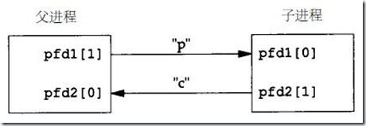

请注意，每一个管道都有一个额外的读取进程，这没有关系。也就是说，除了子进程从pfd1[0]读取，父进程也有上一个管道的读端。因为父进程并没有执行对该管道的读操作，所以这不会产生任何影响。

## popen和pclose函数

常见的操作是创建一个管道连接到另一个进程，然后读其输出或向其输入端发送数据，为此，标准I/O库提供了两个函数**popen和pclose。这两个函数实现的操作是：创建一个管道，调用fork产生一个子进程，关闭管道的不使用端，执行一个shell以运行命令，然后等待命令终止**。

```c
#include <stdio.h>

FILE *popen(const char *cmdstring, const char *type);
// 返回值：若成功则返回文件指针，若出错则返回NULL

int pclose(FILE *fp);
// 返回值：cmdstring的终止状态，若出错则返回-1
```

函数popen先执行fork，然后调用exec以执行cmdstring，并且返回一个标准I/O文件指针。如果type是“r”，则文件指针连接到cmdstring的标准输出（见图15.9）。

**fp相当于管道的fd[0], stdout相当于管道的fd[1].** 

**图15-10 执行fp = popen（cmdstring， “r”）函数的结果**

如果type是“w”，则文件指针连接到cmdstring的标准输入。

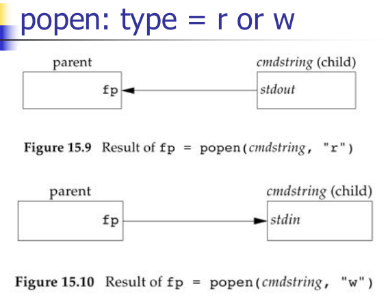

pclose函数关闭标准I/O流，等待命令执行结束，然后返回shell的终止状态。如果shell不能被执行，则pclose返回的终止状态与shell已执行exit（127）一样。

cmdstring由Bourne shell以下列方式执行：

```shell
sh -c cmdstring
```

这表示shell将扩展cmdstring中的任何特殊字符。 例如，可以使用：

```c
fp = popen("ls *.c", "r");
// 或者
fp = popen("cmd 2>&1", "r");
```

**实例**

**程序清单15-4 用popen向分页程序传送文件**

```c
#include "apue.h"
#include <sys/wait.h>

#define PAGER    "${PAGER:-more}"    /* environment variable, or default */

int
main(int argc, char *argv[])
{
    char    line[MAXLINE];
    FILE    *fpin, *fpout;

    if(argc != 2)
        err_quit("usage: a.out <pathname>");
    if((fpin = fopen(argv[1], "r")) == NULL)
        err_sys("can't open %s", argv[1]);

    if((fpout = popen(PAGER, "w")) == NULL)
        err_sys("popen error");

    /* copy argv[1] to pager */
    while(fgets(line, MAXLINE, fpin) != NULL)
    {
        if(fputs(line, fpout) == EOF)
            err_sys("fputs error to pipe");
    }
    if(ferror(fpin))
        err_sys("fgets error");
    if(pclose(fpout) == -1)
        err_sys("pclose error");

    exit(0);
}
```

使用popen减少了需要编写的代码量。

shell命令${PAGER:-more}的意思是：如果shell变量PAGER已经定义，且其值非空，则使用其值，否则使用字符串more。

**实例：popen和pclose函数**

程序清单15-5是我们编写的popen和pclose版本。

**程序清单15-5 popen和pclose函数**

```C
#include "apue.h"
#include <errno.h>
#include <fcntl.h>
#include <sys/wait.h>

/*
* Pointer to array allocated at run-time.
*/
static pid_t    *childpid = NULL;

/*
* From our open_max(), open_max（）函数见http://www.cnblogs.com/nufangrensheng/p/3496323.html中的程序清单2-4。
*/
static int maxfd;

FILE *
popen(const char *cmdstring, const char *type)
{
    int      i;
    int      pfd[2];
    pid_t    pid;
    FILE    *fp;
    
    /* only allow "r" or "w" */
    if((type[0] != 'r' &&  type[0] != 'w') || type[1] != 0)
    {
        errno = EINVAL;    /* required by POSIX */
        return(NULL);
    }
    
    if(childpid == NULL)    /* first time through */
    {
        /* allocate zerod out array for child pids */
        maxfd = open_max();
        if((childpid = calloc(maxfd, sizeof(pid_t))) == NULL)
            return(NULL);
    }
    
    if(pipe(pfd) < 0)
        return(NULL);    /* errno set by pipe() */


    if((pid = fork()) < 0)
    {
        return(NULL);    /* error set by fork() */
    }
    else if(pid == 0)
    {
        if(*type == 'r')
        {
            close(pfd[0]);
            if(pfd[1] != STDOUT_FILENO)
            {
                dup2(pfd[1], STDOUT_FILENO);
                close(pfd[1]);    
            }
        }
        else
        {
            close(pfd[1]);
            if(pfd[0] != STDIN_FILENO)
            {
                dup2(pfd[0], STDIN_FILENO);
                close(pfd[0]);
            }
        }
        
        /* close all descriptors in childpid[] */
        for(i=0; i < maxfd; i++)
            if(childpid[i] > 0)
                close(i);

        execl("/bin/sh", "sh", "-c", cmdstring, (char *)0);
        _exit(127);
    }

    /* parent continues... */
    if(*type == 'r')
    {
        close(pfd[1]);
        if((fp = fdopen(pfd[0], type)) == NULL)
            return(NULL);
    }
    else
    {
        close(pfd[0]);
        if((fp = fdopen(pfd[1], type)) == NULL)
            return(NULL);
    }
    
    childpid[fileno(fp)] = pid;    /* remeber child pid for this fd */
    return(fp);
}

int
pclose(FILE *fp)
{
    int      fd, stat;
    pid_t    pid;

    if(childpid == NULL)
    {
        errno = EINVAL;
        return(-1);    /* popen() has never been called */
    }
    
    fd = fileno(fp);
    if((pid = childpid[fd]) = 0)
    {
        errno = EINVAL;
        return(-1);    /*  fp wasn't opened by popen() */
    }

    childpid[fd] = 0;
    if(fclose(fp) == EOF)
        return(-1);

    while(waitpid(pid, &stat, 0) < 0)
        if(errno != EINTR)
            return(-1);    /* error other than EINTR from waitpid() */

    return(stat);        /* return child's termination status */
}

```

这里有许多需要考虑的细节：首先，每次调用popen时，应当记住所创建的子进程的进程ID，以及其文件描述符或FILE指针。我们选择在数组childpid中保存子进程ID，并用文件描述符作为其下标。于是，当以FILE指针作为参数调用pclose时，我们调用标准I/O函数fileno得到文件描述符，然后取得子进程ID，并用其作为参数调用waitpid。因为一个进程可能调用popen多次，所以在动态分配childpid数组时（第一次调用popen时），其数组长度应当是最大文件描述符数，于是该数组中可以存放与最大文件描述符数相同的子进程。

POSIX.1要求子进程 关闭在之前调用popen时打开且当前仍旧打开的所有I/O流。为此，在子进程中从头逐个检查childpid数组的各元素，关闭仍旧打开的任何描述符。

若pclose的调用者已经为信号SIGCHLD设置了一个信号处理程序，则pclose中的waitpid调用将返回一个EINTR。因为允许调用者捕捉此信号（或者任何其他可能中断waitpid调用的信号），所以当waitpid被一个捕捉到的信号中断时，我们只是再次调用waitpid。

注意，如果应用程序调用waitpid，并且获得popen所创建的子进程的终止状态，则在应用程序调用pclose时，其中将调用waitpid，它发现子进程已不再存在，此时返回-1，errno被设置为ECHILD。

注意，popen绝不应由设置用户ID或设置用户组ID程序调用。当它执行命令时，popen等同于：

```c
execl("/bin/sh", "sh", "-c", command, NULL);
```

它在从调用者继承的环境中执行shell，并由shell解释执行command。一个心怀不轨的用户可以操纵这种环境，使得shell能以设置ID文件模式所授予的提升了的权限以及非预期的方式执行命令。

popen特别适用于构造简单的过滤器程序，它变换运行命令的输入或输出。当命令希望构造它自己的管道线时，就是这种情形。

## 协同进程

UNIX系统过滤程序从标准输入读取数据，对其进行适当处理后写到标准输出。几个过滤程序通常在shell管道命令行中线性地连接。**当一个程序产生某个过滤程序的输入，同时又读取该过滤程序的输出时，则该过滤程序就成为协同进程（coprocess）。**

Korn shell提供了协同进程。Bourne shell、Bourne-again shell和C shell并没有提供按协同进程方式将进程连接起来的方法。协同进程通常在shell的后台运行，其标准输入和标准输出通过管道连接到另一个程序。

popen只提供连接到另一个进程的标准输入或标准输出的一个单向管道，而对于协同进程，则它有连接到另一个进程的两个单向管道——一个接到其标准输入，另一个则来自其标准输出。我们先要将数据写到其标准输入，经其处理后，再从其标准输出读取数据。

**实例**

进程线创建两个管道：一个是协同进程的标准输入，另一个是协同进程的标准输出。下图显示了这种安排。

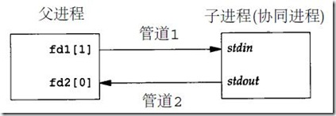

## FIFO

**FIFO有时被称为命名管道**。管道只能由相关进程使用，这些相关进程的共同祖先进程创建了管道。但是，**通过FIFO，不相关的进程也能交换数据**。

**FIFO是一种文件类型**。stat结构成员st_mode的编码指明文件是否是FIFO类型。可以用S_ISFIFO()宏对此进行测试。创建FIFO类似于创建文件。确实，FIFO的路径名存在于文件系统中。

```c
#include <sys/stat.h>
int mkfifo(const char *pathname, mode_t mode);
// 返回值：若成功则返回0，若出错则返回-1
```

`mkfifo`函数中`mode`参数的规格说明与open函数中的mode相同。

**一旦已经用mkfifo创建了一个FIFO，就可用open打开它。其实，一般的文件I/O函数（close、read、write、unlink等）都可用于FIFO。**

应用程序可以用mknod函数创建FIFO。POSIX.1原先并没有包括mknod函数，它首先提出了mkfifo。mknod现在已包括在XSI扩展中。在大多数系统中，mkfifo调用mknod创建FIFO。

POSIX.1也包括了对mkfifo（1）命令的支持。于是，用一条shell命令就可以创建一个FIFO，然后用一般的shell I/O重定向对其进行访问。

**当打开一个FIFO时，非阻塞标志（O_NONBLOCK）产生下列影响：**

- **在一般情况中（没有指定O_NONBLOCK），只读open要阻塞到某个其他进程为写而打开此FIFO。类似地，只写open要阻塞到某个其他进程为读而打开它。**
- **如果指定了O_NONBLOCK，则只读open立即返回。但是，如果没有进程已经为读而打开一个FIFO，那么只写open将出错返回-1，其errno是ENXIO。**

**类似于管道，若用write写一个尚无进程为读而打开的FIFO，则产生信号SIGPIPE。若某个FIFO的最后一个写进程关闭了该FIFO，则将为该FIFO的读进程产生一个文件结束标志。**

**一个给定的FIFO有多个写进程是很常见的。**这就意味着如果不希望多个进程所写的数据互相穿插，则需考虑原子写操作。正如对于管道一样，常量PIPE_BUF说明了可被原子地写到FIFO的最大数据量。

**FIFO有下面两种用途：**

**（1）FIFO由shell命令使用以便将数据从一条管道线传送到另一条，为此无需创建中间临时文件。**

**（2）FIFO用于客户进程-服务器进程应用程序中，以在客户进程和服务器进程之间传送数据。**

我们各用一个例子来说明这两种用途。

**实例：用FIFO复制输出流**

FIFO可被用于复制串行管道命令之间的输出流，于是也就不需要写数据到中间磁盘文件中（类似于使用管道以避免中间磁盘文件）。**管道只能用于进程间的线性连接，然而，因为FIFO具有名字，所以它可用于非线性连接**。

考虑这样一个操作过程，它需要对一个经过过滤的输入流进行两次处理。下图表示了这种安排。

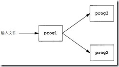

**上图对一个经过过滤的输入流进行两次处理**

使用FIFO以及UNIX系统程序tee（1），就可以实现这样的过程而无需使用临时文件。（tee程序将其标准输入同时复制到其标准输出以及其命令行中包含的命名文件中。）

```c
mkfifo fifo1
prog3 < fifo1 &
prog1 < infile | tee fifo1 | prog2
```

我们创建FIFO，然后在后台启动prog3，它从FIFO读数据。然后启动prog1，用tee将其输出发送到FIFO和prog2。下图显示了这种安排。

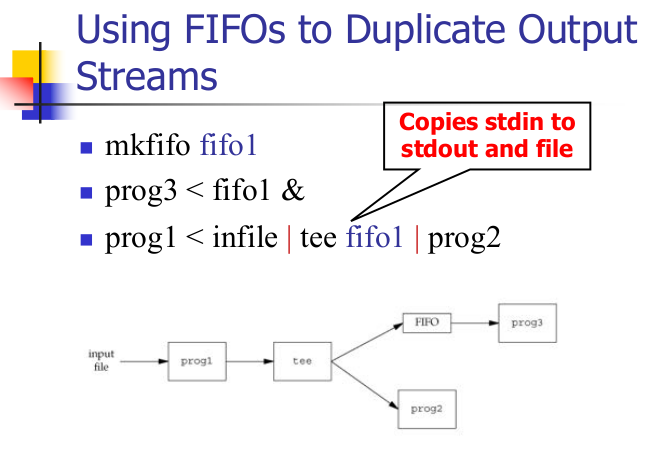

**实例：客户进程-服务器进程使用FIFO进行通信**

FIFO的另一个应用是在客户进程和服务器进程之间传送数据。如果有一个服务器进程，它与很多客户进程有关，则每个客户进程都可将其请求写到一个该服务器进程创建的众所周知的FIFO中（“众所周知”的意思是：所有需要与服务器进程联系的客户进程都知道该FIFO的路径名）。下图显示了这种安排。因为对于该FIFO有多个写进程，客户进程发送给服务器进程的请求其长度要小于PIPE_BUF字节。这就能避免客户多个write之间的交错。

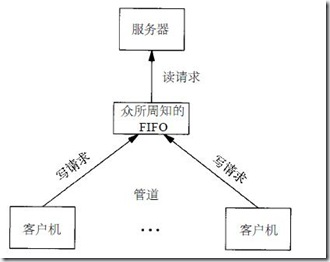

在这种类型的客户进程-服务器进程通信中使用FIFO的问题是：服务器进程如何将回答送回各个客户进程。不能使用单个FIFO，因为服务器进程会发出对各个客户进程请求的响应，而请求者却不可能知道什么时候去读才能恰如其分地读到对它的响应。一种解决方法是每个客户进程都在其请求中包含它的进程ID。然后服务器进程为每个客户进程创建一个FIFO，所使用的路径名是以客户进程的进程ID为基础的。例如，服务器进程可以用名字/tmp/serv1.XXXXX创建FIFO，其中XXXXX被替换成客户进程的进程ID。下图显示了这种安排。

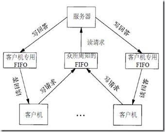

这种安排可以工作，但也有一些不足之处。其中之一是服务器进程不能判断一个客户进程是否崩溃终止，这就使得客户进程专用的FIFO会遗留在文件系统中。另一个不足之处是服务器进程必须捕捉SIGPIPE信号，因为客户进程在发送一个请求后没有读取响应就可能终止，于是留下一个只有写进程（服务器进程）而无读进程的客户进程专用FIFO。

按照图15-12中的安排，如果服务器进程以只读方式打开众所周知的FIFO（因为它只需读该FIFO），则每当客户进程数从1变成0时，服务器进程就将在FIFO中读到一个文件结束标记。为使服务器进程免于处理这种情况，一种常用的技巧是使服务器进程以读-写方式打开其FIFO。

## XSI IPC

XSI IPC源自于系统V的IPC功能。

有三种IPC我们称作**XSI IPC，即消息队列、信号量以及共享存储器**，它们之间有很多相似之处。

**1、标识符和键**

**每个内核中的IPC结构（消息队列、信号量或共享存储段）都用一个非负整数的标识符（identifier）加以引用**。例如，为了对一个消息队列发送或取消息，只需要知道其队列标识符。与文件描述符不同，IPC标识符不是小的整数。当一个IPC结构被创建，以后又被删除时，与这种结构相关的标识符连续加1，直到达到一个整型数的最大正值，然后又回转到0.

**标识符是IPC对象的内部名。**为使多个合作进程能够在同一IPC对象上会合，需要提供一个外部名方案。为此使用了键（key），每个IPC对象都与一个键相关联，于是**键就用作为该对象的外部名**。

无论何时创建IPC结构（调用msgget、semget或shmget），都应指定一个键，键的数据类型是基本系统数据类型key_t，通常在头文件<sys/types.h>中被定义为长整型。**键由内核变换成标识符**。

有多种方法使客户进程和服务器进程在同一IPC结构上会合：

（1）服务器进程可以指定键IPC_PRIVATE创建一个新IPC结构，将返回的标识符存放在某处（例如一个文件）以便客户进程取用。键IPC_PRIVATE保证服务器进程创建一个新IPC结构。这种技术的缺点是：服务器进程要将整型标识符写到文件中，此后客户进程又要读文件取得此标识符。

IPC_PRIVATE键也可以用于父、子进程关系。父进程指定IPC_PRIVATE创建一个新IPC结构，所返回的标识符在调用fork后可由子进程使用。接着，子进程又可将此标识符作为exec函数的一个参数传给一个新程序。

（2）在一个公用头文件中定义一个客户进程和服务器进程都认可的键。然后服务器进程指定此键创建一个新的IPC结构。这种方法的问题是该键可能已与一个IPC结构相结合，在此情况下，get函数（msgget、semget或shmget）出错返回。服务器进程必须处理这一错误，删除已存在的IPC结构，然后试着再创建它。

（3**）客户进程和服务器进程认同一个路径名和项目ID（项目ID是0-255之间的字符值），接着调用函数ftok将这两个值变换为一个键**。然后在方法（2）中使用此键。ftok提供的唯一服务就是由一个路径名和项目ID产生一个键。

```c
#include <sys/ipc.h>
key_t ftok(const char *path, int id);
// 返回值：若成功则返回键，若出错则返回（key_t）-1
```

**path参数必须引用一个现存文件**。当产生键时，只是用id参数的低8位。

ftok创建的键通常是下列方式构成的：按给定的路径名取得其stat结构，从该结构中取出部分st_dev和st_ino字段，然后再与项目ID组合起来。**如果两个路径名引用两个不同的文件，那么，对这两个路径名调用ftok通常返回不同的键。**但是，因为i节点号和键通常都存放在长整型中，于是创建键时可能会丢失信息（？）。这意味着，**如果使用同一项目ID，那么对于不同文件的两个路径名可能产生相同的键**。

**三个get函数（msgget、semget和shmget）都有两个类似的参数：一个key和一个整型flag。如若满足下列两个条件之一，则创建一个新的IPC结构（通常由服务器进程创建）：**

- **key是IPC_PRIVATE；**
- **key当前未与特定类型的IPC结构相结合，并且flag中指定了IPC_CREAT位。**

**为访问现存的队列（通常由客户进程进行），key必须等于创建该队列时所指定的键，并且不应指定IPC_CREAT。**

注意，为了访问一个现存队列，决不能指定IPC_PRIVATE作为键。因为这是一个特殊的键值，它总是用于创建一个新队列。为了访问一个用IPC_PRIVATE键创建的现存队列，一定要知道与该队列相结合的标识符，然后在其他IPC调用中（例如msgsnd和msgrvc）使用该标识符。

如果希望创建一个新的IPC结构，而且要确保不是引用具有同一标识符的一个现行IPC结构，那么必须在flag中同时指定IPC_CREAT和IPC_EXCL位。这样做了以后，如果IPC结构已经存在就会造成出错，返回EEXIST（这与指定了O_CREAT和O_EXCL标志的open相类似）。

**2、权限结构**

XSI IPC为每一个IPC结构设置了一个ipc_perm结构。该结构规定了权限和所有者。它至少包括下列成员：

```c
struct ipc_perm {
    uid_t    uid;     /* owner's effective user id */
    gid_t    gid;     /* owner's effective group id */
    uid_t    cuid;    /* creator's effective user id */
    gid_t    cgid;    /* creator's effective group id */
    mode_t   mode;    /* access modes */
    ...
};
```

每种实现在其ipc_perm结构中会包括另外一些成员。如欲了解你所用系统中它的完整定义，请参见<sys/ipc.h>。

在创建IPC结构时，对所有字段都赋初值。以后，**可以调用msgctl、semctl或shmctl修改uid、gid和mode字段**。为了改变这些值，调用进程必须是IPC结构的创建者或超级用户。更改这些字段类似于对文件调用chown和chmod。

mode字段的值类似于<http://www.cnblogs.com/nufangrensheng/p/3502097.html>中表4-5所示的值，但是**对于任何IPC结构都不存在执行权限**。另外，消息队列和共享存储使用术语读（read）和写（write），而信号量则使用术语读（read）和更改（alter）。下表中对每种IPC说明了6种权限。

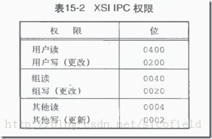

**3、结构限制**

三种形式的XSI IPC都有内置限制（built-in limit）。这些限制的大多数可以通过重新配置内核而加以更改。

在报告和修改限制方面，每种平台都提供它自己的方法。FreeBSD 5.2.1、Linux 2.4.22和Mac OS X 10.3提供了sysctl命令，用该命令观察和修改内核配置参数。Solaris9修改内核配置参数的方法是，修改文件/etc/system，然后重新启动。

在Linux中，你可以运行 ipcs -l以显示IPC相关的限制。

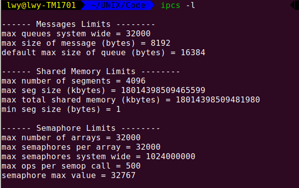

**4、优点和缺点**

**XSI IPC的主要问题是：IPC结构是在系统范围内起作用的，没有访问计数。**例如，如果进程创建了一个消息队列，在该队列中放入了几条消息，然后终止，但是消息队列及其内容并不会被删除。它们余留在系统中直至出现下述情况：由某个进程调用msgrcv或msgctl读消息或删除消息队列；或某个进程执行ipcrm（1）命令删除消息队列；或由正在再启动的系统删除消息队列。将此与管道相比，当最后一个访问管道的进程终止时，管道就被完全地删除了。对于FIFO而言，虽然当最后一个引用FIFO的进程终止时其名字仍保留在系统中，直至显示地删除它，但是留在FIFO中的数据却在此时全部被删除，于是也就徒有其名了。

**XSI IPC的另一个问题是：这些IPC结构在文件系统中没有名字。**我们不能用文件I/O和文件和目录章节中所述的函数来访问它们或修改它们的特性。为了支持它们不得不增加了十几条全新的系统调用（msgget、semop、shmat等）。我们不能用ls命令见到IPC对象，不能用rm命令删除它们，也不能用chmod命令更改它们的访问权限。于是，就不得不增加新的命令ipcs（1）和ipcrm（1）。

因为这些IPC不使用文件描述符，所以不能对它们使用多路转接I/O函数：select和poll。这就使得难于一次使用多个IPC结构，以及在文件或设备I/O中使用IPC结构。

下表对不同形式IPC的某些特征进行了比较。

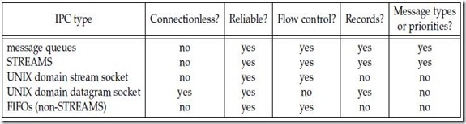

表中的“无连接”指的是无需先调用某种形式的打开函数就能发送消息的能力。正如前述，因为需要有某种技术以获得队列标识符，所以我们并不认为消息队列具有无连接特性。因为所有这些形式的IPC都限制在单主机上，所以它们都是可靠的。当消息通过网络传送时，丢失消息的可能性就要加以考虑。“流控制”指的是：如果系统资源（缓冲区）短缺或者如果接收进程不能再接收更多消息，则发送进程就要休眠。当流控制条件消失时，发送进程应自动被唤醒。

表中没有表示的一个特征是：IPC设施能否自动地为每个客户进程创建一个到服务器进程的唯一连接。STREAMS以及UNIX流套接字可以提供这种能力。

## 消息队列

**消息队列是消息的链接表**，存放在内核中并由消息队列标识符标识。在本节中，我们把消息队列简称为队列（queue），其标识符为队列ID（queue ID）。

**msgget用于创建一个新队列或打开一个现存的队列**。**msgsnd将新消息添加到队列尾端**。每个消息包含一个正长整型类型字段，一个非负长度以及实际数据字节（对应于长度），所有这些都在将消息添加到队列时，传送给msgsnd。**msgrcv用于从队列中取消息**。我们并不一定要以先进先出次序取消息，也可以按消息的类型字段取消息。

每个队列都有一个msgqid_ds结构与其相关联：

```c
struct msqid_ds {
    struct ipc_perm    msg_perm;      /* http://www.cnblogs.com/nufangrensheng/p/3561681.html */
    msgqnum_t          msg_qnum;      /* # of messages on queue */
    msglen_t           msg_qbytes;    /* max # of bytes no queue */
    pid_t              msg_lspid;     /* pid of last msgsnd() */
    pid_t              msg_lrpid;     /* pid of last msgrcv() */
    time_t             msg_stime;     /* last-msgsnd() time */
    time_t             msg_rtime;     /* last-msgrcv() time */
    time_t             msg_ctime;     /* last-change time */
    ...
};
```

此结构规定了队列的当前状态。结构中所示的各成员是由Single UNIX Specification定义的。具体实现可能包括标准中没有定义的另一些字段。

**调用的第一个函数通常是msgget，其功能是打开一个现存队列或创建一个新队列。**

```c
#include <sys/msg.h>
int msgget(key_t key, int flag);
// 返回值：若成功则返回消息队列ID，若出错则返回-1
```

http://www.cnblogs.com/nufangrensheng/p/3561681.html中标识符和键部分，说明了将key变换成一个标识符的规则，并且讨论是否创建一个新队列或访问一个现存队列。

当创建一个新队列时，初始化msqid_ds结构的下列成员：

- ipc_perm结构按<http://www.cnblogs.com/nufangrensheng/p/3561681.html>中权限结构所述进行初始化。该结构中mode成员按flag中的相应权限位设置。这些权限用<http://www.cnblogs.com/nufangrensheng/p/3561681.html>表15-2中的常量指定。
- msg_qnum、msg_lspid、msg_lrpid、msg_stime和msg_rtime都设置为0。
- msg_ctime设置为当前时间。
- msg_qbytes设置为系统限制值。

若执行成功，msgget返回非负队列ID。此后，该值就可被用于其他三个消息队列函数（msgsnd、msgrcv和msgctl）。

**msgctl函数对队列执行多种操作。**它和另外两个与信号量和共享存储有关的函数（semctl和shmctl）是XSI IPC的类似于ioctl的函数（亦即垃圾桶函数）。

```c
#include <sys/msg.h>
int msgctl(int msqid, int cmd, struct msqid_ds *buf);
// 返回值：若成功则返回0，若出错则返回-1
```

cmd参数说明对由msqid指定的队列要执行的命令：

IPC_STAT    取此队列的msqid_ds结构，并将它存放在buf指向的结构中。

IPC_SET      按由buf指定结构中的值，设置与此队列相关结构中的下列四个字段：msg_perm.uid、msg_perm.gid、msg_perm.mode和msg_qbytes。此命令只能由下列两种进程执行：一种是其有效用户ID等于msg_perm.cuid或msg_perm.uid；另一种是具有超级用户特权的进程。只有超级用户才能增加msg_qbytes的值。

IPC_RMID    从系统中删除该消息队列以及仍在该队列中的所有数据。这种删除立即生效。仍在使用这一消息队列的其他进程在它们下一次试图对此队列进行操作时，将出错返回EIDRM。此命令只能由下列两种进程执行：一种是其有效用户ID等于msg_perm.cuid或msg_perm.uid；另一种是具有超级用户特权的进程。

这三条命令（IPC_STAT、IPC_STAT和IPC_RMID）也可用于信号量和共享存储。

**调用msgsnd将数据放到消息队列中。**

```c
#include <sys/msg.h>
int msgsnd(int msqid, const void *ptr, size_t nbytes, int flag);
// 返回值：若成功则返回0，若出错则返回-1
```

**每个消息都由三部分组成，它们是：正长整型类型字段、非负长度（nbytes）以及实际数据字节（对应于长度）。消息总是放在队列尾端**。

ptr参数指向一个长整型数，它包含了正的整型消息类型，在其后紧跟着消息数据。（若nbytes是0，则无消息数据。）若发送的最长消息是512字节，则可定义下列结构：

```c
struct mymesg {
    long    mtype;         /* positive message type */
    char    mtext[512];    /* message data, of length nbytes */
};
```

于是，ptr就是一个指向mymesg结构的指针。接收者可以使用消息类型以非先进先出的次序取消息。

参数flag的值可以指定为IPC_NOWAIT。这类似于文件I/O的非阻塞I/O标志（见<http://www.cnblogs.com/nufangrensheng/p/3544997.html>）。若消息队列已满（或者是队列中的消息总数等于系统限制值，或队列中的字节总数等于系统限制值），则指定IPC_NOWAIT使得msgsnd立即出错返回EAGAIN。如果没有指定IPC_NOWAIT，则进程阻塞直到下述情况出现为止：有空间可以容纳要发送的消息；从系统中删除了此队列；或捕捉到一个信号，并从信号处理程序返回。在第二种情况下，返回EIDRM（“标识符被删除”）。最后一种情况则返回EINTR。

注意，对删除消息队列的处理不是很完善。因为对每个消息队列并没有设置一个引用计数器（对打开文件则有这种计数器），所以删除一个队列会造成仍在使用这一队列的进程在下次对队列进行操作时出错返回。信号量机制也以同样的方式处理其删除。相反，删除一个文件时，要等到使用该文件的最后一个进程关闭了它的文件描述符后，才能删除文件中的内容。

当msgsnd成功返回，与消息队列相关的msqid_ds结构得到更新，以表明发出该调用的进程ID（msg_lspid）、进行该调用的时间（msg_stime），并指示队列中增加了一条消息（msg_qnum）。

**msgrcv从队列中取用消息：**

```c
#include <sys/msg.h>
ssize_t msgrcv(int msqid, void *ptr, size_t nbytes, long type, int flag);
// 返回值：若成功则返回消息的数据部分的长度，若出错则返回-1
```

如同msgsnd中一样，ptr参数指向一个长整型数（返回的消息类型存放在其中），跟随其后的是存放实际消息数据的缓冲区。nbytes说明数据缓冲区的长度。若返回的消息大于nbytes，而且在flag中设置了MSG_NOERROR，则该消息被截短。（在这种情况下，不通知我们消息截短了，消息的截去部分被丢弃。）如果没有设置这一标志，而消息又太长，则出错返回E2BIG（消息仍留在队列中）。

**参数type使我们可以指定想要哪一种消息：**

**type == 0    返回队列中的第一个消息。**

**type > 0      返回队列中消息类型为type的第一个消息。**

**type < 0      返回队列中消息类型值小于或等于type绝对值的消息，如果这种消息有若干个，则取类型值最小的消息。**

type值非0用于以非先进先出次序读消息。例如，若应用程序对消息赋优先权，那么type就可以是优先权值。如果一个消息队列由多个客户进程和一个服务器进程使用，那么type字段可以用来包含客户进程的进程ID（只要进程ID可以存放在长整型中）。

可以指定flag值为IPC_NOWAIT，使操作不阻塞。这使得如果没有所指定类型的消息，则msgrcv返回-1，errno设置为ENOMSG。如果没有指定IPC_NOWAIT，则进程阻塞直至如下情况出现才终止：有了指定类型的消息；从系统中删除了此队列（出错则返回-1且errno设置为EIDRM）；或捕捉到一个信号并从信号处理程序返回（msgrcv返回-1，errno设置为EINTR）。

msgrcv成功执行时，内核更新与该消息队列相关联的msqid_ds结构，以指示调用者的进程ID（msg_lrpid）和调用时间（msg_rtime），并将队列中的消息数（msg_qnum）减1。

消息队列原来的实施目的是提供比一般IPC更高速度的进程通信方法，但现在与其他形式的IPC相比，在速度方面已经没有什么差别了。考虑到使用消息队列具有的问题（见<http://www.cnblogs.com/nufangrensheng/p/3561681.html>中优点和缺点部分），我们得出的结论是，**在新的应用程序中不应当再使用它们**。

## 信号量（Semaphores）

**信号量（semaphore**）与已经介绍过的IPC机构（管道、FIFO以及消息队列）不同。它**是一个计数器，用于多进程对共享数据对象的访问**。

**为了获得共享资源，进程需要执行下列操作：**

**（1）测试控制该资源的信号量。**

**（2）若此信号量的值为正，则进程可以使用该资源。进程将信号量值减1，表示它使用了一个资源单位。**

**（3）若此信号量的值为0，则进程进入休眠状态，直至信号量值大于0.进程被唤醒后，它返回至第（1）步。**

当进程不再使用由一个信号量控制的共享资源时，该信号量值增1。如果有进程正在休眠等待此信号量，则唤醒它们。

为了正确地实现信号量，信号量值的测试及减1操作应当是原子操作。为此，信号量通常是在内核中实现的。

**常用的信号量形式被称为二元信号量或双态信号量（binary semaphore）。它控制单个资源，初始值为1。**但是一般而言，信号量的初值可以是任一正值，该值说明有多少个共享资源单位可供共享应用。

遗憾的是，XSI的信号量与此相比要复杂得多。三种特性造成了这种不必要的复杂性：

（1）信号量并非是单个非负值，而必需将信号量定义为含有一个或多个信号量值的集合。当创建一个信号量时，要指定该集合中信号量值的数量。

（2）创建信号量（semget）与对其赋初值（semctl）分开。这是一个致命的弱点，因为不能原子地创建一个信号量集合，并且对该集合中的各个信号量值赋初值。

（3）即使没有进程正在使用各种形式的XSI IPC，它们仍然是存在的。有些程序在终止时并没有释放已经分配给它的信号量，所以我们不得不为这种程序担心。下面将要说明的undo功能就是假定要处理这种情况的。

内核为**每个信号量集合**设置了一个semid_ds结构：

```c
struct semid_ds {
    struct ipc_perm    sem_perm;    
    unsigned short     sem_nsems;    /* # of semaphores in set */
    time_t             sem_otime;    /* last-semop() time */
    time_t             sem_ctime;    /* last-change time */
    ...
};
```

Single UNIX Specification定义了上面所示的各字段，但是具体实现可在semid_ds结构中定义添加的成员。

**每个信号量**由一个无名结构表示，它至少包含下列成员：

```c
struct {
    unsigned short    semval;     /* semaphore value, always >= 0 */
    pid_t             sempid;     /* pid for last operation */
    unsigned short    semncnt;    /* # processes awaiting semval>curval */
    unsigned short    semzcnt;    /* # processes awaiting semval==0 */
};
```

**要获得一个信号量ID，要调用的第一个函数是semget。**

```c
#include <sys/sem.h>
int semget(key_t key, int nsems, int flag);
// 返回值：若成功则返回信号量ID，若出错则返回-1
```

http://www.cnblogs.com/nufangrensheng/p/3561681.html中标识符与键部分，说明了将key转换为标识符的规则，讨论了是否创建一个新集合，或是引用一个现存的集合。

nsems是该集合中的信号量数。如果是创建新集合（一般在服务器进程中），则必须指定nsems。如果引用一个现存的集合（一个客户进程），则将nsems指定为0。

创建一个新集合时，对semid_ds结构的下列成员赋初值：

- ipc_perm结构按<http://www.cnblogs.com/nufangrensheng/p/3561681.html>中权限结构所述进行初始化。该结构中mode成员按flag中的相应权限位设置。这些权限用<http://www.cnblogs.com/nufangrensheng/p/3561681.html>表15-2中的常量指定。
- sem_otime设置为0.
- sem_ctime设置为当前时间。
- sem_nsems设置为nsems。

**semctl函数包含了多种信号量操作。**

```c
#include < sys/sem.h>
int semctl(int semid, int semnum, int cmd, ... /* union semun arg */);
返回值：见下
```

注意，依赖于所请求的命令，第四个参数是可选的，如果使用该参数，则其类型是semun，它是多个特定命令参数的联合（union）：

```c
union semun {
    int                 val;      /* for SETVAL */
    struct semid_ds    *buf;      /* for IPC_STAT and IPC_SET */
    unsigned short     *array;    /* for GETALL and SETALL */
};
```

注意，这是一个联合，而非指向联合的指针。

**cmd参数指定下列10种命令中的一种，在semid指定的信号量集合上执行此命令。其中有5条命令（如下绿色背景所示）是针对一个特定的信号量值的，它们用semnum指定该信号量集合中的一个成员。semnum值在0和nsems-1之间（包括0和nsems-1）。**

IPC_STAT    对此集合取semid_ds结构，并存放在由arg.buf指向的结构中。

IPC_SET     按由arg.buf指向结构中的值设置与此集合相关结构中的下列三个字段值：sem_perm.uid、sem_perm.gid和sem_perm.mode。此命令只能由下列两种进程执行：一种是其有效用户ID等于sem_perm.cuid或sem_perm.uid的进程；另一种是具有超级用户特权的进程。

IPC_RMID    从系统中删除该信号量集合。这种删除是立即发生的。仍在使用此信号量集合的其他进程在它们下次试图对此信号量集合进行操作时，将出错返回EIDRM。此命令只能由下列两种进程执行：一种是其有效用户ID等于sem_perm.cuid或sem_perm.uid的进程；另一种是具有超级用户特权的进程。

GETVAL       返回成员semnum的semval值。

SETVAL       设置成员semnum的semval值。该值由arg.val指定。

GETPID       返回成员semnum的sempid值。

GETNCNT    返回成员semnum的semncnt值。

GETZCNT    返回成员semnum的semzcnt值。

GETALL       取该集合中所有信号量的值，并将它们存放在由arg.array指向的数组中。

SETALL       按arg.array指向的数组中的值，设置该集合中所有信号量的值。

对于除GETALL以外的所有GET命令，semctl函数都返回相应的值。其他命令的返回值为0.

**函数semop自动执行信号量集合上的操作数组，这是个原子操作。**

```c
#include <sys/sem.h>
int semop(int semid, struct sembuf semoparray[], size_t nops);
// 返回值：若成功则返回0，若出错则返回-1
```

参数semoparray是一个指针，它指向一个信号量操作数组，信号量操作由sembuf结构表示：

```c
struct sembuf {
    unsigned short    sem_num;         /* member # in set ( 0, 1, ..., nsems-1) */
    short             sem_op;          /* operation (negtive, 0, or positive) */
    short             sem_flag;        /* IPC_NOWAIT, SEM_UNDO */
};
```

参数nops规定该数组中操作的数量（元素数）。

对集合中每个成员的操作由相应的sem_op值规定。此值可以是负值、0或正值。

**（1）**最易于处理的情况是sem_op为正。这对应于进程释放占用的资源数。sem_op值加到信号量的值上。如果指定了undo标志（此标志对应于相应sem_flag成员的SEM_UNDO位），则也从该进程的此信号量调整值中减去sem_op。

**（2）**若sem_op为负，则表示要获取由该信号量控制的资源。

如若该信号量的值大于或等于sem_op的绝对值（具有所需的资源），则从信号量值中减去sem_op的绝对值。这保证信号量的结果值大于或等于0。如果指定了undo标志，则sem_op的绝对值也加到该进程的此信号量调整值上。

如果信号量值小于sem_op的绝对值（资源不能满足要求），则：

（a）若指定了IPC_NOWAIT，则semop出错返回EAGAIN。

（b）若未指定IPC_NOWAIT，则该信号量的semncnt值加1（因为调用进程将进入休眠状态），然后调用进程被挂起直至下列事件之一发生：

​     （i）此信号量变成大于或等于sem_op的绝对值（即某个进程已释放了某些资源）。此信号量的semncnt减1（因为已经结束等待），并且从信号量值中减去sem_op的绝对值。如果指定了undo标志，则sem_op的绝对值也加到该进程的此信号量调整值上。

​    （ii）从系统中删除了此信号量。在此情况下，函数出错则返回EIDRM。

​    （iii）进程捕捉到一个信号，并从信号处理程序返回。在此情况下，此信号量的semncnt值减1（因为调用进程不再等待），并且函数出错返回EINTR。

**（3）**若sem_op为0，这表示调用进程希望等待到该信号量值变成0。

如果信号量值当前是0，则此函数立即返回。

如果信号量值非0，则：

（a）若指定了IPC_NOWAIT，则出错返回EAGAIN。

（b）若未指定IPC_NOWAIT，则该信号量的semzcnt值加1（因为调用进程将进入休眠状态），然后调用进程被挂起，直至下列事件之一发生为止：

​      （i）此信号量值变成0。此信号量的semzcnt值减1（因为调用进程已经结束等待）。

​      （ii）从系统中删除了此信号量。在此情况下，函数出错返回EIDRM。

​      （iii）进程捕捉到一个信号，并从信号处理程序返回。在此情况下此信号量的semzcnt值减1（因为调用进程不再等待），并且函数出错返回EINTR。

**semop函数具有原子性，它或者执行数组中的所有操作，或者什么也不做。**

**exit时信号量调整**

正如前面提到的，如果在进程终止时，它占用了经由信号量分配的资源，那么就会成为一个问题。无论何时，只要为信号量操作指定了SEM_UNDO标志，然后分配资源（sem_op值小于0），那么内核就会记住对于该特定信号量，分配给调用进程多少资源（sem_op的绝对值）。当该进程终止时，不论自愿或者不自愿，内核都将检验该进程是否还有尚未处理的信号量调整值，如果有，则按调整值对相应信号量值进行处理。

如果用带有SETVAL或SETALL命令的semctl设置一信号量的值，则在所有进程中，对于该信号量的调整值都设置为0。

**实例：信号量与记录锁的耗时比较**

如果多个进程共享一个资源，则可使用信号量或记录锁。

若使用信号量，则先创建一个包含一个成员的信号量集合，然后对该信号量值赋初值1。为了分配资源，以sem_op为-1调用semop；为了释放资源，则以sem_op为+1调用semop。对每个操作都指定SEM_UNDO，以处理在未释放资源条件下进程终止的情况。

若使用记录锁，则先创建一个空文件，并且用该文件的第一个字节（无需存在）作为锁字节。为了分配资源，先对该字节获得一个写锁；释放该资源时，则对该字节解锁。记录锁的性质确保了当一个锁的属主进程终止时，内核会自动释放该锁。

在Linux上，记录锁与信号量锁相比，在时间上要多耗时约60%。

虽然记录锁慢于信号量锁，但如果只需要锁一个资源（例如共享存储段）并且不需要使用XSI信号量的所有花哨的功能，则宁可使用记录锁。理由是使用简易，且进程终止时系统会处理任何遗留下来的锁。

## 共享存储

**共享存储允许两个或更多进程共享一个给定的存储区**。因为数据不需要在客户进程和服务器进程之间复制，所以**这是最快的一种IPC**。使用共享存储时要掌握的唯一窍门是多个进程之间对一个给定存储区的同步访问。若服务器进程正在将数据放入共享存储区，则在它做完这一操作之前，客户进程不应当去取这些数据。通常，信号量被用来实现对共享存储访问的同步。（记录锁也可以用于这种场合。）

内核为每个共享存储段设置了一个shmid_ds结构。

```c
struct shmid_ds {
    struct ipc_perm    shm_perm;    
    size_t             shm_segsz;       /* size of segment in bytes */
    pid_t              shm_lpid;        /* pid of last shmop() */
    pid_t              shm_cpid;        /* pid of creator */
    shmatt_t           shm_nattch;      /* number of current attaches */
    time_t             shm_atime;       /* last-attach time */
    time_t             shm_dtime;       /* last-detach tiime */
    time_t             shm_ctime;       /* last-change time */
    ...
};

```

（按照支持共享存储段的需要，每种实现会在shmid_ds结构中增加其他成员。）

shmatt_t类型定义为不带符号整型，它至少与unsigned short一样大。

 **为获得一个共享存储标识符，调用的第一个函数通常是shmget**。

```c
#include <sys/shm.h>
int shmget(key_t key, size_t size, int flag);
// 返回值：若成功则返回共享存储ID，若出错则返回-1
```

<http://www.cnblogs.com/nufangrensheng/p/3561681.html>中标识符和键部分，说明了将key变换为标识符的规则，讨论了是否创建一个新集合，或是引用一个现存集合。

当创建一个新段时，初始化shmid_ds结构的下列成员：

- ipc_perm结构按<http://www.cnblogs.com/nufangrensheng/p/3561681.html>中权限结构所述进行初始化。该结构中mode成员按flag中的相应权限位设置。这些权限用<http://www.cnblogs.com/nufangrensheng/p/3561681.html>表15-2中的常量指定。
- shm_lpid、shm_nattach、shm_atime、以及shm_dtime都设置为0。
- shm_ctime设置为当前时间。
- shm_segsz设置为请求的长度（size）。

参数size是该共享存储段的长度（单位：字节）。实现通常将其向上取为系统页长的整数倍。但是，若应用指定的size值并非系统页长的整数倍，那么最后一页的余下部分是不可使用的。如果正在创建一个新段（一般是在服务器进程中），则必须指定其size。如果正在引用一个现存的段（一个客户进程），则将size指定为0。当创建一新段时，段内的内容初始化为0。

**shmctl函数对共享存储段执行多种操作。**

```c
#include <sys/shm.h>
int shmctl(int shmid, int cmd, struct shmid_ds *buf);
// 返回值：若成功则返回0，若出错则返回-1
```

cmd参数指定下列5中命令中一种，使其在shmid指定的段上执行。

IPC_STAT    取此段的shmid_ds结构，并将它存放在由buf指向的结构中。

IPC_SET      按buf指向结构中的值设置与此段相关结构中的下列三个字段：shm_perm.uid、shm_perm.gid以及shm_perm.mode。此命令只能由下列两种进程执行：一种是其有效用户ID等于shm_perm.cuid或shm_perm.uid的进程；另一种是具有超级用户特权的进程。

IPC_RMID    从系统中删除该共享存储段。因为每个共享存储段有一个连接计数（shmid_ds结构中的shm_nattach字段），所以除非使用该段的最后一个进程终止或与该段脱节，否则不会实际上删除该存储段。不管此段是否仍在使用，该段标识符立即被删除，所以不能再用shmat与该段连接。此命令只能由下列两种进程执行：一种是其有效用户ID等于shm_perm.cuid或shm_perm.uid的进程，另一种是具有超级用户特权的进程。

Linux和Solaris提供了下列另外两种命令，但它们并非Single UNIX Specification的组成部分：

SHM_LOCK        将共享存储段锁定在内存中。此命令只能由超级用户执行。

SHM_UNLOCK    解锁共享存储段。此命令只能由超级用户执行。

**一旦创建了一个共享存储段，进程就可调用shmat将其连接到它的地址空间中。**

```c
#include <sys/shm.h>
void *shmat(int shmid, const void *addr, int flag);
// 返回值：若成功则返回指向共享存储的指针，若出错则返回-1
```

共享存储段连接到调用进程的哪个地址上与addr参数以及在flag中是否指定SHM_RND位有关。

- 如果addr为0，则此段连接到由内核选择的第一个可用地址上。这是推荐的使用方式。
- 如果addr非0，并且没有指定SHM_RND，则此段连接到addr所指定的地址上。
- 如果addr非0，并且指定了SHM_RND，则此段连接到（addr-（addr mod ulus SHMLBA））所表示的地址上。SHM_RND命令的意思是“取整”。SHMLBA的意思是“低边界地址倍数”，它总是2的乘方。该算式是将地址向下取最近1个SHMLBA的倍数。

除非只计划在一种硬件上运行应用程序（这在当今是不大可能的），否则不应指定共享段所连接到的地址。所以一般应指定addr为0，以便由内核选择地址。

如果在flag中指定了SHM_RDONLY位，则以只读方式连接此段。否则以读写方式连接此段。

shmat的返回值是该段所连接的实际地址，如果出错则返回-1。如果shmat成功执行，那么内核将使该共享存储段shmid_ds结构中的shm_nattach计数器值加1.

**当对共享存储段的操作已经结束时，则调用shmdt脱接该段**。注意，这并不从系统中删除其标识符以及数据结构。该标识符仍然存在，直至某个进程（一般是服务器进程）调用shmctl（带命令IPC_RMID）特地删除它。

```c
#include <sys/shm.h>
int shmdt(void *addr);
// 返回值：若成功则返回0，若出错则返回-1
```

addr参数是以前调用shmat时的返回值。如果成功，shmdt将使相关shmid_ds结构中的shm_nattach计数器值减1。

**实例**

内核将以addr=0连接的共享存储段放在什么位置上与系统密切相关。程序清单15-11打印以写信息，它们与特定系统将各种不同类型的数据放在什么位置有关。

**程序清单15-11 打印各种不同类型的数据所存放的位置**

```c
#include "apue.h"
#include <sys/shm.h>

#define ARRAY_SIZE    40000
#define MALLOC_SIZE    100000
#define SHM_SIZE    100000
#define SHM_MODE    0600    /* user read/write */

char    array[ARRAY_SIZE];    /* uninitialized data = bss */

int 
main(void)
{
    int     shmid;
    char    *ptr, *shmptr;
    
    printf("array[] from %lx to %lx\n", (unsigned long)&array[0], 
        (unsigned long)&array[ARRAY_SIZE]);
    printf("stack aound %lx\n", (unsigned long)&shmid);
    
    if((ptr = malloc(MALLOC_SIZE)) == NULL)
        err_sys("malloc error");
    printf("malloced from %lx to %lx\n", (unsigned long)ptr, 
        (unsigned long)ptr+MALLOC_SIZE);

    if((shmid = shmget(IPC_PRIVATE, SHM_SIZE, SHM_MODE)) < 0)
        err_sys("shmget error");
    if((shmptr = shmat(shmid, 0, 0)) == (void *)-1)
        err_sys("shmat error");
    printf("shared memory attched from %lx to %lx\n",
        (unsigned long)shmptr, (unsigned long)shmptr+SHM_SIZE);

    if(shmctl(shmid, IPC_RMID, 0) < 0)
        err_sys("shmctl error");

    exit(0);
}
```

本人系统上运行此程序，根据输出结果可以描绘存储区大致分布，发现它与<http://www.cnblogs.com/nufangrensheng/p/3508169.html>中的图7-3中所示的典型存储区布局类似。

<http://www.cnblogs.com/nufangrensheng/p/3559664.html>中曾说明mmap函数可将一个文件的若干部分映射至进程地址空间。这在概念上类似与用shmat XSI IPC函数连接一共享存储段。两者之间的主要区别是：用mmap映射的存储段是与文件相关联的，而XSI共享存储段则并无这种关联。

**实例：/dev/zero的存储映射**

共享存储可由不相关的进程使用。但如果进程是相关的，则某些实现提供了一种不同的技术。

**在读设备/dev/zero时，该设备是0字节的无限资源。它也接收写向它的任何数据。但又忽略这些数据**。我们对此设备作为IPC的兴趣在于，当对其进行存储映射时，它具有一些特殊的性质：

- 创建一个无名（unnamed）存储区，其长度是mmap的第二个参数，将其向上取整为系统的最近页长。
- 存储区都初始化为0.
- 如果多个进程的共同祖先进程对mmap指定了MAP_SHARED标志，则这些进程可共享此存储区。

**程序清单15-12 在父、子进程间使用/dev/zero存储映射I/O的IPC**

```c
#include "apue.h"
#include <fcntl.h>
#include <sys/mman.h>

#define NLOOPS    1000
#define SIZE      sizeof(long);    /* size of shared memory area */

static int
update(long *ptr)
{
    return((*ptr)++);    /* return value before increment */
}

int
main(void)
{
    int      fd, i, counter;
    pid_t    pid;    
    void     *area;

    if((fd = open("/dev/zero", O_RDWR)) < 0)
        err_sys("open error");
    if((area = mmap(0, SIZE, PROT_READ | PROT_WRITE, MAP_SHARED, fd, 0)) == MAP_FAILED)
        err_sys("mmap error");
    close(fd);    /* can close /dev/zero now that it's mapped */

TELL_WAIT();

    if((pid = fork()) < 0)
    {
        err_sys("fork error");
    }
    else if(pid > 0)    /* parent */
    {
        for(i=0; i<NLOOPS; i+=2)
        {
            if((counter = update((long *)area)) != i)
                err_quit("parent: expected %d, got %d", i, counter);

            TELL_CHILD(pid);
            WAIT_CHILD();
        }
    }
    else
    {
        for(i = 1; i < NLOOPS + 1; i += 2)
        {
            WAIT_PARENT();

            if((counter = update((long *)area)) != i)
                err_quit("child: expected %d, got %d", i, counter);
            TELL_PARENT(getppid());
        }
    }
    exit(0);

}
```

它打开此/dev/zero设备，然后指定长整型的长度调用mmap。注意，一旦存储区映射成功，就关闭此设备。然后，进程创建一个子进程。因为在调用mmap时指定了MAP_SHARED，所以一个进程写到存储映射区的数据可由另一个进程见到。（如果已指定MAP_PRIVATE，则此示例程序不能工作）

然后，父、子进程交替运行，使用<http://www.cnblogs.com/nufangrensheng/p/3510306.html>中的同步函数各自对共享存储映射区中的长整型数加1。存储映射区由mmap初始化为0。父进程先对它进行增1操作，使其成为1，然后子进程对其进程增1操作，使其成为2，然后父进程使其成为3......注意，当在update函数中对长整型值增1时，因为增加的是其值，而不是指针，所以必须使用括号。

以上述方式使用/dev/zero的优点是：在调用mmap创建映射区之前，无需存在一个实际文件。映射/dev/zero自动创建一个指定长度的映射区。这种技术的缺点是：它只在相关进程间起作用。但在相关进程之间使用线程可能更为简单、有效。注意，无论使用哪一种技术，都需对共享数据进行同步访问。

**实例：匿名存储映射**

很多实现提供了一种类似于/dev/zero的设施，称为匿名存储映射。为了使用这种功能，在调用mmap时指定MAP_ANON标志，并将文件描述符指定为-1。结果得到的区域是匿名的（因为它并不通过一个文件描述符与一个路径名相结合），并且创建一个可与后代进程共享的存储区。

注意，Linux为此定义了MAP_ANONYMOUS标志，并将MAP_ANON标志定义为与它相同的值以改善应用的可移植性。

为使程序清单15-12所示的程序应用这种特征，对它做了三处修改：一是删除了对于/dev/zero的open语句；二是删除了对于fd的close语句；三是将mmap调用修改成：

```c
if((area = mmap(0, SIZE, PROT_READ | PROT_WRITE, MAP_ANON | MAP_SHARED, -1, 0)) == MAP_FAILED)
```

的形式。在此调用中，指定了MAP_ANON标志，并将文件描述符取为-1。程序的其余部分则没有改变。

最后两个例子说明了在多个相关进程之间如何使用共享存储段。如果在无关进程之间使用共享存储段，那么有两种替换的方法。其一是应用程序使用XSI共享存储函数；另一种是使用mmap将同一文件映射至它们的地址空间，为此使用MAP_SHARED标志

## POSIX 信号量

**POSIX信号量接口，意在解决XSI信号量接口的几个不足之处：**

- POSIX信号量接口相比于XSI信号量接口，允许**更高性能**的实现。
- POSIX信号量接口**简单易用**：没有信号量集，其中一些接口模仿了我们熟悉的文件系统操作。
- POSIX信号量**删除时的处理**更加合理。XSI信号量被删除后，使用该信号量标识符的操作将会出错返回，并将errno设置为EIDRM。而对于POSIX信号量，操作可以继续正常执行，直到对该信号量的最后一个引用被释放。

**POSIX信号量有两种形式可供选用：有名和无名。它们的区别在于，如何被创建和销毁，其他方面则完全相同。**无名信号量只存在于内存中，并且规定能够访问该内存的进程才能够使用该内存中的信号量。这就意味着，无名信号量只能被这样两种线程使用：（1）来自同一进程的各个线程（2）来自不同进程的各个线程，但是这些进程映射了相同的内存范围到自己的地址空间。相反，有名信号量则是通过名字访问，因此，来自于任何进程的线程，只要知道该有名信号量的名字都可以访问。

**调用sem_open函数可以创建一个新的有名信号量，或打开一个现存的有名信号量。**

```c
#include <semaphore.h>
sem_t *sem_open(const char *name, int oflag, ... /* mode_t mode, unsigned int value */ );
// 返回值：若成功则返回指向信号量的指针，若出错则返回SEM_FAILED
```

如果使用一个现存的有名信号量，我们只需指定两个参数：信号量名和oflag（oflag取0）。把oflag设置为O_CREAT标志时，如果指定的信号量不存在则新建一个有名信号量；如果指定的信号量已经存在，那么打开使用，无其他额外操作发生。

如果我们指定O_CREAT标志，那么就需要提供另外两个参数：mode和value。mode用来指定谁可以访问该信号量。它可以取打开文件时所用的权限位的取值（参考<http://www.cnblogs.com/nufangrensheng/p/3502097.html>中表4-5）。最终赋予信号量的访问权限，是被调用者文件创建屏蔽字所修改过的（<http://www.cnblogs.com/nufangrensheng/p/3502328.html>）。然而，注意通常只有读写权限对我们有用，但是接口不允许在我们打开一个现存的信号量时指定打开模式（mode）。实现通常以读写打开信号量。

value参数用来指定信号量的初始值。它可取值为：0-SEM_VALUE_MAX。

如果我们想要确保我们在创建一个新的信号量，可以把oflag参数设置为：O_CREAT|O_EXCL。如果信号量已经存在的话，这会导致sem_open调用失败。

为了提高移植性，我们在选择信号量名字的时候，必须遵循一定的约定：

- 名字的首字符必须是斜杠（/）。
- 除首字符外，名字中不能再包含其他斜杠（/）。
- 名字的最长长度由实现定义，不应超过_POSIX_NAME_MAX个字符。

sem_open函数返回一个信号量指针，该指针可供其他对该信号量进行操作的函数使用。使用完成后，**调用sem_close函数释放与信号量相关的资源**。

```c
#include <semaphore.h>
int sem_close(sem_t *sem);
// 返回值：若成功则返回0，出错返回-1
```

如果进程还没有调用sem_close就已经退出，那么内核会自动关闭该进程打开的所有信号量。注意，这并不会影响信号量值的状态——例如，如果我们增加了信号量的值，我们退出后这个值不会改变。同样，如果我们调用了sem_close，信号量值也不会受到影响。POSIX信号量机制中并没有如同XSI信号量中的SEM_UNDO标志。

**调用sem_unlink函数来销毁一个有名信号量。**

```c
#include <semaphore.h>
int sem_unlink(const char *name);
// 返回值：若成功则返回0，出错则返回-1
```

sem_unlink函数移除信号量的名字。如果当前没有打开的对该信号量的引用，那么就销毁它。否则，销毁被推迟到最后一个打开的引用被关闭。

与XSI信号量不同，我们只能对POSIX信号量的值进行加1或减1。对信号量值减1，就类似于对一个二值信号量加锁或请求一个与计数信号量相关的资源。

注意，POSIX信号量并没有区分信号量类型。使用二值信号量还是计数信号量，取决于我们如果对信号进行初始化和使用。如果信号量值只能取0和1，那么它就是一个二值信号量。当一个二值信号量值为1，我们则说它未加锁；若它的值为0，则说它已加锁。

**调用sem_wait或sem_trywait函数，请求一个信号量（对信号量值执行减1操作）。**

```c
#include <semaphore.h>
int sem_trywait(sem_t *sem);
int sem_wait(sem_t *sem);
// 两个函数返回值：若成功则返回0，出错则返回-1
```

如果信号量计数为0，这时如果调用sem_wait函数，将会阻塞。直到成功对信号量计数减1或被一个信号中断，sem_wait函数才会返回。我们可以使用sem_trywait函数以避免阻塞。当我们调用sem_trywait函数时，如果信号量计数为0，sem_trywait会返回-1，并将errno设置为EAGAIN。

**第三种方法是可以阻塞一段有限的时间，这时我们使用sem_timedwait函数**。

```c
#include <semaphore.h>
#include <time.h>

int sem_timedwait(sem_t *restrict sem, const struct timespec *restrict tsptr);
// 返回值：若成功则返回0，出错则返回-1
```

tsptr参数指定了希望等待的绝对时间。如果信号量可以被立即减1，那么超时也无所谓，即使你指定了一个已经过去的时间，试图对信号量减1的操作也会成功。如果直到超时，还不能对信号量计数减1，那么sem_timedwait函数将会返回-1，并将errno设置为ETIMEDOUT。

**调用sem_post函数对信号量值加1。这类似于对一个二值信号量解锁或释放一个与计数信号量有关的资源。**

```c
#include <semaphore.h>
int sem_post(sem_t *sem);
// 返回值：若成功则返回0，出错则返回-1
```

当我们调用sem_post的时，如果此时有因为调用sem_wait或sem_timedwait而阻塞的进程，那么该进程将被唤醒，并且刚刚被sem_post加1的信号量计数紧接着又被sem_wait或sem_timedwait减1。

如果我们想要在一个单一进程内使用POSIX信号量，那么使用无名信号量会更加简单。无名信号量只是创建和销毁有所改变，其他完全和有名信号量一样。我们**调用sem_init函数创建一个无名信号量。**

```c
#include <semaphore.h>
int sem_init(sem_t *sem, int pshared, unsigned int value);
// 返回值：若成功则返回0，出错返回-1
```

pshared参数指示我们是否要在多进程之间使用该无名信号量。如果要在多个进程之间使用，则将pshared设置为非0值。value参数指定信号量的初始值。

另外，我们需要声明一个sem_t类型的变量，并把它的地址传给sem_init，以便对该变量进行初始化。如果我们要在两个进程之间使用该无名信号量，我们需要确保sem参数指向这两个进程共享的内存范围内。

**我们可以调用sem_destroy函数来销毁用完的无名信号量。**

```c
#include <semaphore.h>
int sem_destroy(sem_t *sem);
// 返回值：若成功则返回0，出错则返回-1
```

调用sem_destroy后我们将不能再以sem为参数调用任何信号量函数，除非我们再次使用sem_init对sem进行初始化。

我们可以调用sem_getvalue函数来获取信号量值。

```c
#include <semaphore.h>
int sem_getvalue(sem_t *sem, int *restrict valp);
// 返回值：若成功则返回0，出错则返回-1
```

如果sem_getvalue执行成功，信号量的值将存入valp指向的整型变量中。但是，需要小心，我们刚读出来的信号量值可能会改变（因为我们随时可能会使用该信号量值）。如果不采取额外的同步机制的话，sem_getvalue函数仅仅用来调试。

**实例**

回忆<http://www.cnblogs.com/nufangrensheng/p/3523623.html>的表12-4，Single UNIX Specification并没有定义当一个线程锁定了一个normal类型的mutex，而另外一个线程试图对此mutex进行解锁会发生什么（对应于表12-4中“不占用时解锁”栏）。但是对于error-checking类型和recursive类型的mutex，在这种情况下则会出错。因为二值信号量可以像互斥量（mutex）一样使用，我们可以使用信号量创建我们自己的锁原语（primitive）来提供互斥。

假定我们要创建自己的锁：它可以被一个线程加锁，而被另外一个线程解锁。我们的锁结构可以如下：

```c
struct slock {
    sem_t    *semp;
    char     name[_POSIX_NAME_MAX];
};
```

程序清单15-35显示了一种基于信号量的互斥原语的实现。

**程序清单15-35 使用POSIX信号量的互斥**

```c
#include "slock.h"
#include <stdlib.h>
#include <stdio.h>
#include <unistd.h>
#include <error.h>

struct slock *
s_alloc()
{
    struct slock *sp;
    static int    cnt;
    
    if((sp = malloc(sizeof(struct slock))) == NULL)
        return(NULL);
    do
    {
        snprintf(sp->name, sizeof(sp->name), "/%ld.%d", (long)getpid(),
            cnt++);
        sp->semp =sem_open(sp->name, O_CREAT|O_EXCL, S_IRWXU, 1);
    }
    while((sp->semp == SEM_FAILED) && (errno == EEXIST));
    if(sp->semp == SEM_FAILED)
    {
        free(sp);
        return(NULL);
    }
    sem_unlink(sp->name);
    return(sp);
}

void
s_free(struct slock *sp)
{
    sem_close(sp->semp);
    free(sp);
}

int 
s_lock(struct slock *sp)
{
    return(sem_wait(sp->semp));
}

int
s_trylock(struct slock *sp)
{
    return(sem_trywait(sp->semp));
}

int
s_unlock(struct slock *sp)
{
    return(sem_post(sp->semp));
}
```

我们基于进程ID和计数counter创建一个名字。我们无需使用互斥量对counter加以保护，因为如果两个相互竞争的线程同时调用s_alloc并且分配了相同的名字，但是使用O_EXCL标志调用sem_open时只会有一个调用成功，而另一个以EEXIST出错返回，这时我们只需重新调用一次就行了。注意，我们在打开信号量后随即销毁它。这样其他进程就不能再访问它，而且简化了进程结束时的清理工作。

